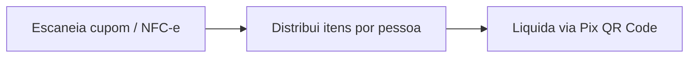
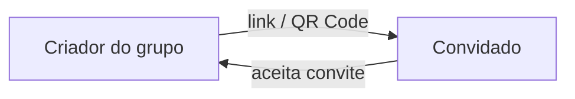
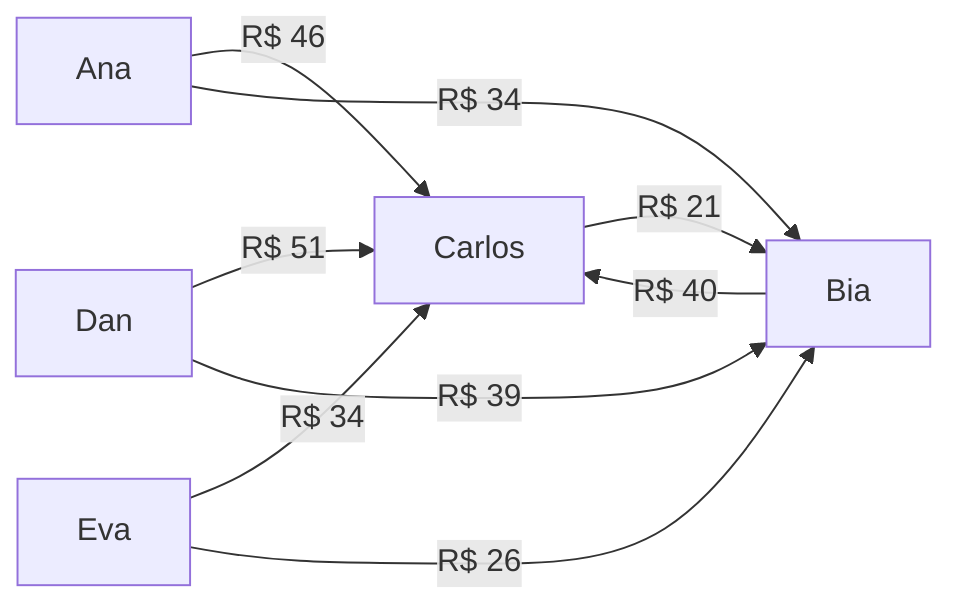
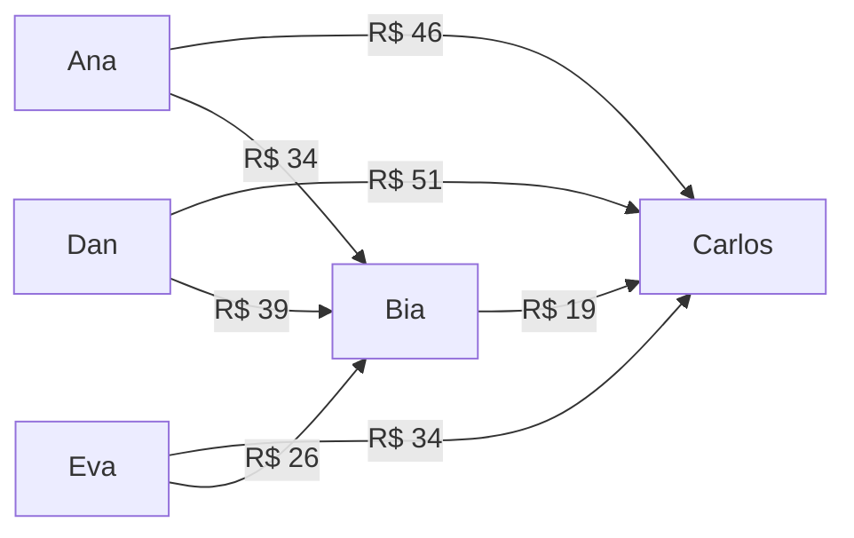
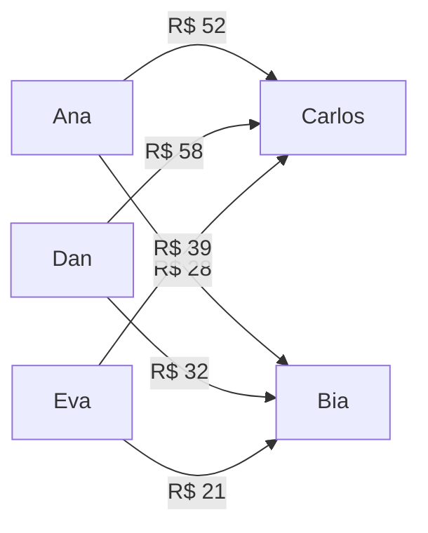
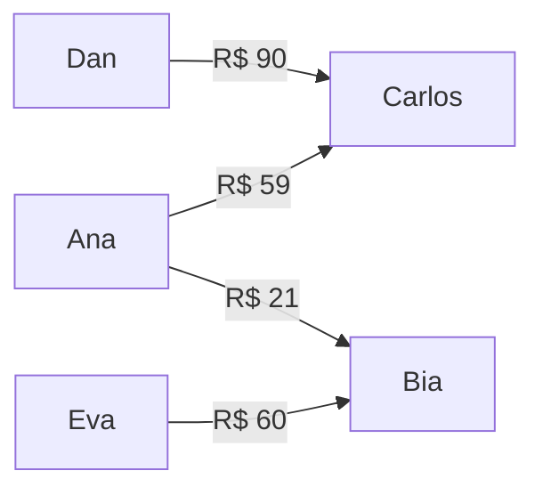

<p align="center">
  
</p>

<p align="center">
  Racha a conta com a galera e liquida via Pix em segundos.
</p>

<p align="center">
  <a href="https://www.dividimos.ai">Web</a> &middot;
  <a href="https://play.google.com/store/apps/details?id=ai.dividimos.app">Android (WIP)</a>
</p>

---

O Splitwise virou pago. E mesmo quando era grátis, nunca entendeu o Brasil: não gera Pix, não lê NFC-e, não sabe o que é couvert, e cobra em dólar. A gente queria algo que funcionasse do jeito que a galera realmente racha conta aqui &mdash; escaneia o cupom, distribui os itens, gera o QR Code Pix e pronto.

Dividimos é open source, feito por quem racha conta pra quem racha conta. Sem assinatura, sem paywall, sem monetização em cima do seu Pix.

## Funcionalidades



### Entrada de dados

- **Leitura de NFC-e** &mdash; Escaneia o QR da nota fiscal eletrônica e extrai itens, valores e estabelecimento automaticamente
- **OCR de cupom** &mdash; Tira foto do cupom térmico e interpreta abreviações de PDV, formatação brasileira e itens agrupados
- **Dois modos de conta** &mdash; Itemizada (restaurante com itens por pessoa) ou valor único (Uber, Airbnb, etc.)

### Divisão

- **Divisão flexível** &mdash; Igual, por porcentagem (com sliders visuais) ou valor fixo por pessoa
- **Multi-pagador** &mdash; Registre quem pagou quanto quando mais de uma pessoa cobriu a conta
- **Taxa de serviço** &mdash; Percentual ou valor fixo, distribuído proporcionalmente ao consumo

### Liquidação

- **QR Code Pix** &mdash; Geração de BR Code EMV com Copia e Cola para liquidação instantânea
- **Simplificação de dívidas** &mdash; Minimiza o número de transferências com visualização passo a passo
- **Liquidação com confirmação** &mdash; Devedor registra pagamento, credor confirma. Saldo atualiza atomicamente

### Social



- **Grupos com confirmação mútua** &mdash; Convide por @handle ou link de convite. O membro precisa aceitar
- **Links de convite** &mdash; Gere um link ou QR Code pra compartilhar no WhatsApp, Telegram, etc. Deep link abre direto no app
- **Claim links** &mdash; Adicione convidados sem conta no app. Eles recebem um link pra reivindicar sua parte e pagar via Pix
- **Sync em tempo real** &mdash; Supabase Realtime mantém todos os participantes atualizados

### Segurança

- **Encryption at rest** &mdash; Chaves Pix criptografadas com AES-256-GCM, decriptadas apenas no servidor
- **Row-Level Security** &mdash; Todas as tabelas do Supabase com RLS. Dados isolados por grupo/usuário
- **Sem enumeração** &mdash; Descoberta de usuários apenas por @handle exato. Sem busca ou listagem

## Stack

| Camada | Tecnologia |
|--------|------------|
| Framework | Next.js 16 (App Router) |
| UI | React 19, Tailwind CSS v4, shadcn/ui, Framer Motion |
| Estado | Zustand |
| Backend | Supabase (PostgreSQL + Auth + Realtime) |
| Auth | Google OAuth (web), Google Credential Manager (Android nativo) |
| Deploy | Vercel (frontend), Supabase (banco de dados) |
| Mobile | Capacitor 8 (Android) |
| Linguagem | TypeScript 5 |

## Estrutura

```
src/
├── app/                    # Páginas (Next.js App Router)
│   ├── page.tsx            # Landing page
│   ├── demo/               # Demo pública (sem auth)
│   ├── auth/               # Google OAuth + onboarding
│   ├── app/                # Shell autenticado
│   │   ├── bill/new/       # Wizard de criação de conta
│   │   ├── bill/[id]/      # Detalhe + liquidação
│   │   ├── groups/         # Gestão de grupos
│   │   └── profile/        # Configurações + chave Pix
│   └── api/
│       ├── pix/generate/   # Geração de QR Pix (server-side)
│       └── users/lookup/   # Busca exata por @handle
├── components/
│   ├── bill/               # Steps do wizard + resumo
│   ├── settlement/         # Modal QR, grafo de dívidas
│   └── ui/                 # Primitivos shadcn/ui
├── stores/
│   └── bill-store.ts       # Zustand store
├── lib/
│   ├── crypto.ts           # AES-256-GCM (server-only)
│   ├── pix.ts              # EMV BR Code + CRC16-CCITT
│   ├── simplify.ts         # Algoritmo de simplificação de dívidas
│   ├── currency.ts         # Formatação BRL (centavos inteiros)
│   ├── capacitor/          # Bridge nativo (Android/iOS)
│   └── supabase/           # Clientes + sync
├── hooks/                  # React hooks
└── types/                  # Tipos do domínio + banco
android/                    # Projeto nativo Android (Capacitor)
supabase/
└── migrations/             # Schema PostgreSQL + RLS
```

## Como funciona

### Criação de conta

1. Escolha o tipo &mdash; itemizada ou valor único
2. Adicione título, estabelecimento, data
3. Adicione participantes por @handle
4. Entre os itens ou o valor total
5. Distribua o consumo ou escolha um método de divisão
6. Selecione quem pagou e quanto
7. Revise e crie

### Liquidação e simplificação de dívidas

O app modela as dívidas como um [grafo dirigido](https://en.wikipedia.org/wiki/Directed_graph) ponderado, onde cada aresta representa uma transferência pendente. O pipeline de simplificação reduz o número de arestas (transferências Pix) em quatro etapas.

#### Etapa 1 &mdash; Arestas brutas

`computeRawEdges` gera uma aresta para cada par (consumidor &rarr; pagador), proporcional ao consumo e à contribuição de cada pagador. Taxas de serviço percentuais são distribuídas proporcionalmente ao consumo individual; taxas fixas são divididas igualmente.

#### Etapa 2 &mdash; Cancelamento de pares reversos

Procura pares de arestas antiparalelas (A &rarr; B e B &rarr; A) e as substitui por uma única aresta com o saldo líquido. Isso só se aplica quando duas pessoas devem uma à outra simultaneamente &mdash; por exemplo, quando ambas são pagadoras parciais e consumidoras ao mesmo tempo.

#### Etapa 3 &mdash; [Redução transitiva](https://en.wikipedia.org/wiki/Transitive_reduction)

Se existe uma cadeia A &rarr; B &rarr; C, o intermediário B é eliminado: A passa a dever direto pra C pelo valor mínimo da cadeia. Equivale a resolver o [problema de fluxo](https://en.wikipedia.org/wiki/Network_flow_problem) no caminho, removendo nós de passagem. O algoritmo itera até não restar nenhuma cadeia colapsável.

#### Etapa 4 &mdash; Minimização por saldo líquido

`netAndMinimize` descarta o grafo intermediário e recalcula do zero: soma todas as entradas e saídas de cada participante para obter o saldo líquido. Depois, pareia devedores com credores usando um [algoritmo guloso](https://en.wikipedia.org/wiki/Greedy_algorithm) ordenado por valor decrescente &mdash; o maior devedor paga o maior credor, e assim por diante. Isso produz o número mínimo de transferências.

---

#### Exemplo completo

Jantar de R$ 350. Carlos pagou R$ 200, Bia pagou R$ 150. Cinco pessoas consumiram:

| Pessoa | Consumo | Deve pra Carlos (57%) | Deve pra Bia (43%) |
|--------|---------|----------------------|-------------------|
| Ana | R$ 80 | R$ 46 | R$ 34 |
| Dan | R$ 90 | R$ 51 | R$ 39 |
| Eva | R$ 60 | R$ 34 | R$ 26 |
| Bia | R$ 70 | R$ 40 | &mdash; |
| Carlos | R$ 50 | &mdash; | R$ 21 |

**Após etapa 1** &mdash; arestas brutas (8 arestas):



Carlos e Bia são pagadores mas também consumiram:

- Carlos deve R$ 21 pra Bia (pela parte que ela pagou)
- Bia deve R$ 40 pro Carlos (pela parte que ele pagou)

Esse é um par reverso legítimo: duas arestas em direções opostas entre os mesmos nós.

**Após etapa 2** &mdash; cancelamento do par reverso B &harr; C (7 arestas):

- Bia &rarr; Carlos = R$ 40
- Carlos &rarr; Bia = R$ 21
- Saldo líquido: Bia &rarr; Carlos = R$ 19

Duas arestas viram uma:



**Após etapa 3** &mdash; colapso de cadeias (7 &rarr; 6 arestas):

Três cadeias transitivas passam pela Bia:

- Ana &rarr; Bia &rarr; Carlos
- Dan &rarr; Bia &rarr; Carlos
- Eva &rarr; Bia &rarr; Carlos

O fluxo de R$ 19 que Bia deve pro Carlos é absorvido pelo que ela recebe dos outros.
Parte do pagamento de Ana, Dan e Eva é redirecionado direto pro Carlos, eliminando Bia como intermediária:



Bia agora é credora pura (só recebe).
Carlos é credor puro (só recebe).
Sem mais cadeias colapsáveis.

**Após etapa 4** &mdash; minimização por saldo líquido (4 arestas):

Saldos finais de cada participante:

| Pessoa | Saldo |
|--------|-------|
| Dan | -90 (deve) |
| Ana | -80 (deve) |
| Eva | -60 (deve) |
| Bia | +81 (recebe) |
| Carlos | +149 (recebe) |

Pareamento guloso &mdash; maior devedor com maior credor:

1. Dan (-90) paga R$ 90 a Carlos (+149) &rarr; Carlos fica +59
2. Ana (-80) paga R$ 59 a Carlos (+59) &rarr; Carlos zerado. Ana fica -21
3. Ana (-21) paga R$ 21 a Bia (+81) &rarr; Ana zerada. Bia fica +60
4. Eva (-60) paga R$ 60 a Bia (+60) &rarr; ambos zerados



**Resultado: 8 arestas &rarr; 4 transferências Pix.**

Cada passo intermediário é registrado com as arestas removidas e adicionadas, alimentando a visualização paginada no app. Cada participante gera um QR Code Pix para pagar sua parte direto.

## Licença

Privado. Todos os direitos reservados.
