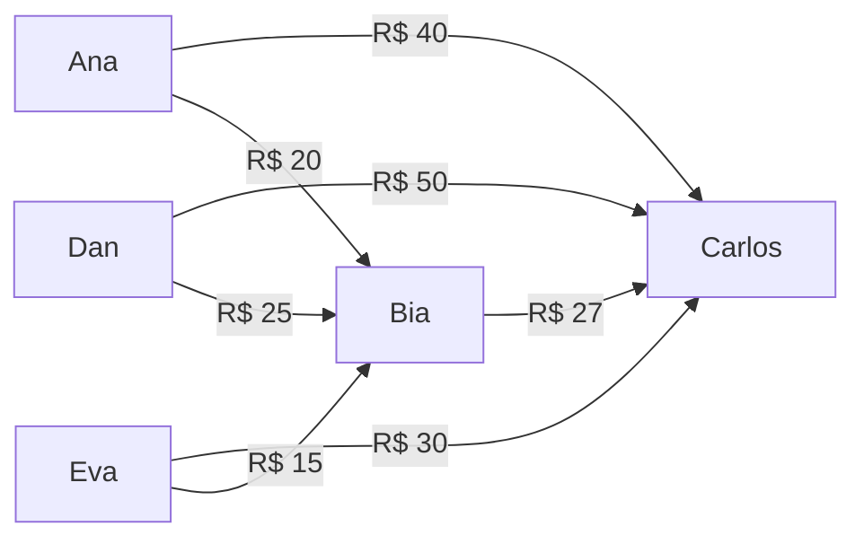
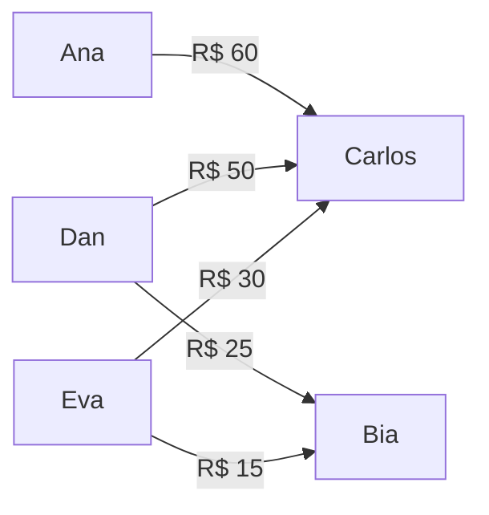
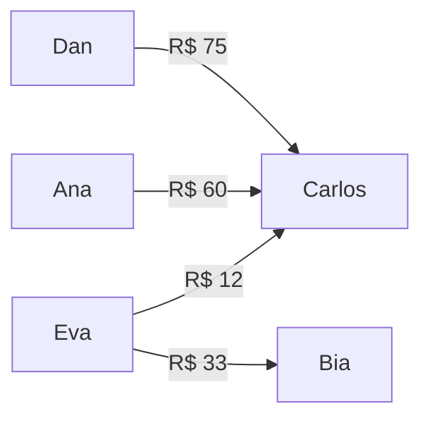

<p align="center">
  
</p>

<p align="center">
  Racha a conta com a galera e liquida via Pix em segundos.
</p>

<p align="center">
  <a href="https://www.dividimos.ai">Web</a> &middot;
  <a href="https://play.google.com/store/apps/details?id=ai.dividimos.app">Android (WIP)</a>
</p>

---

Escaneie uma nota fiscal ou digite o valor total, distribua os itens entre as pessoas e liquide via QR Code Pix. Sem ficar calculando no grupo do WhatsApp.

## Funcionalidades

- **Dois modos de conta** &mdash; Itemizada (nota de restaurante com itens por pessoa) ou valor único (Uber, Airbnb, etc.)
- **Divisão flexível** &mdash; Igual, por porcentagem (com sliders visuais) ou valor fixo por pessoa
- **Multi-pagador** &mdash; Registre quem pagou quanto quando mais de uma pessoa cobriu a conta
- **Taxa de serviço** &mdash; Percentual ou valor fixo aplicado automaticamente
- **QR Code Pix** &mdash; Geração de BR Code EMV com Copia e Cola para liquidação instantânea
- **Simplificação de dívidas** &mdash; Minimiza transferências com visualização passo a passo
- **Sync em tempo real** &mdash; Supabase Realtime mantém todos os participantes atualizados
- **Grupos** &mdash; Crie grupos, convide por @handle, divida contas entre membros aceitos
- **Seguro** &mdash; Chaves Pix criptografadas com AES-256-GCM em repouso, descriptografadas apenas no servidor

## Stack

| Camada | Tecnologia |
|--------|------------|
| Framework | Next.js 16 (App Router) |
| UI | React 19, Tailwind CSS v4, shadcn/ui, Framer Motion |
| Estado | Zustand |
| Backend | Supabase (PostgreSQL + Auth + Realtime) |
| Auth | Google OAuth (web), Google Credential Manager (Android nativo) |
| Deploy | Vercel (frontend), Supabase (banco de dados) |
| Mobile | Capacitor 8 (Android) |
| Linguagem | TypeScript 5 |

## Começando

### Requisitos

- Node.js 22+
- Um projeto [Supabase](https://supabase.com) (região São Paulo recomendada)

### Setup

```bash
git clone https://github.com/tprei/dividimos.git
cd dividimos
npm install
```

Crie `.env.local`:

```env
NEXT_PUBLIC_SUPABASE_URL=https://seu-projeto.supabase.co
NEXT_PUBLIC_SUPABASE_ANON_KEY=sua-anon-key
SUPABASE_SERVICE_ROLE_KEY=sua-service-role-key
PIX_ENCRYPTION_KEY=<string hex de 64 caracteres>
```

Gere a chave de criptografia:

```bash
openssl rand -hex 32
```

Aplique as migrações:

```bash
supabase db push --linked
```

Inicie o servidor de desenvolvimento:

```bash
npm run dev
```

Acesse [http://localhost:3000](http://localhost:3000).

## Estrutura

```
src/
├── app/                    # Páginas (Next.js App Router)
│   ├── page.tsx            # Landing page
│   ├── demo/               # Demo pública (sem auth)
│   ├── auth/               # Google OAuth + onboarding
│   ├── app/                # Shell autenticado
│   │   ├── bill/new/       # Wizard de criação de conta
│   │   ├── bill/[id]/      # Detalhe + liquidação
│   │   ├── groups/         # Gestão de grupos
│   │   └── profile/        # Configurações + chave Pix
│   └── api/
│       ├── pix/generate/   # Geração de QR Pix (server-side)
│       └── users/lookup/   # Busca exata por @handle
├── components/
│   ├── bill/               # Steps do wizard + resumo
│   ├── settlement/         # Modal QR, grafo de dívidas
│   └── ui/                 # Primitivos shadcn/ui
├── stores/
│   └── bill-store.ts       # Zustand store
├── lib/
│   ├── crypto.ts           # AES-256-GCM (server-only)
│   ├── pix.ts              # EMV BR Code + CRC16-CCITT
│   ├── simplify.ts         # Algoritmo de simplificação de dívidas
│   ├── currency.ts         # Formatação BRL (centavos inteiros)
│   ├── capacitor/          # Bridge nativo (Android/iOS)
│   └── supabase/           # Clientes + sync
├── hooks/                  # React hooks
└── types/                  # Tipos do domínio + banco
android/                    # Projeto nativo Android (Capacitor)
supabase/
└── migrations/             # Schema PostgreSQL + RLS
```

## Como funciona

### Criação de conta

1. Escolha o tipo &mdash; itemizada ou valor único
2. Adicione título, estabelecimento, data
3. Adicione participantes por @handle
4. Entre os itens ou o valor total
5. Distribua o consumo ou escolha um método de divisão
6. Selecione quem pagou e quanto
7. Revise e crie

### Liquidação e simplificação de dívidas

O app computa um grafo direcionado de dívidas e o simplifica para minimizar o número de transferências Pix. O pipeline tem quatro etapas, aplicadas em sequência.

#### Etapa 1 &mdash; Arestas brutas

`computeRawEdges` gera uma aresta direcionada para cada par (consumidor &rarr; pagador), proporcional ao quanto cada pessoa consumiu e ao quanto cada pagador cobriu. Se houve taxa de serviço percentual, distribui proporcionalmente ao consumo de cada pessoa. Taxa fixa é dividida igualmente.

#### Etapa 2 &mdash; Cancelamento de pares reversos

Se A deve R$ 30 pra B e B deve R$ 10 pra A, as duas arestas se cancelam parcialmente. Resultado: A deve R$ 20 pra B. Uma transferência a menos.

#### Etapa 3 &mdash; Colapso de cadeias

Se A deve pra B e B deve pra C, o intermediário B é removido. A passa a dever direto pra C pelo valor da cadeia. O algoritmo percorre todas as cadeias transitivas até não haver mais intermediários.

#### Etapa 4 &mdash; Minimização por saldo líquido

`netAndMinimize` calcula o saldo final de cada participante (total recebido &minus; total devido) e pareia devedores com credores usando um algoritmo guloso ordenado por valor decrescente. Isso garante o menor número possível de transferências.

---

#### Exemplo completo

Jantar de R$ 300. Carlos pagou R$ 200, Bia pagou R$ 100. Cinco pessoas consumiram valores diferentes.

**Após etapa 1** &mdash; arestas brutas (7 arestas):



Bia é pagadora (recebe dos outros) mas também deve R$ 27 pro Carlos. Isso cria pares reversos.

**Após etapa 2** &mdash; cancelamento de pares reversos (6 arestas):

Ana deve R$ 20 pra Bia, mas parte disso compensa o que Bia deve pro Carlos. O par Bia &harr; Carlos (R$ 27 vs R$ 0) é eliminado. Os R$ 27 que Bia devia são absorvidos pelo que ela recebe.


**Após etapa 3** &mdash; colapso de cadeias (6 &rarr; 5 arestas):

Ana &rarr; Bia &rarr; Carlos: Ana deve R$ 20 pra Bia, e Bia deve saldo pro Carlos. Parte do fluxo é redirecionado: Ana paga direto pro Carlos.



**Após etapa 4** &mdash; minimização por saldo líquido (4 arestas):

```
Saldos finais:
  Dan  = -75  (deve)
  Ana  = -60  (deve)
  Eva  = -45  (deve)
  Bia  = +33  (recebe)
  Carlos = +147  (recebe)
```

Pareamento guloso &mdash; maior devedor com maior credor:



**Resultado: 7 arestas &rarr; 4 transferências Pix.** Cada passo é registrado em `SimplificationStep` para a visualização paginada no app, mostrando exatamente quais arestas foram removidas e adicionadas.

Cada participante gera um QR Code Pix para pagar sua parte direto.

### Segurança

- Chaves Pix **criptografadas em repouso** (AES-256-GCM) e **descriptografadas apenas no servidor**
- Row-Level Security em todas as tabelas do Supabase
- Descoberta de usuários apenas por **@handle exato** &mdash; sem busca ou enumeração
- Geração de QR exige co-participação autenticada na conta

## Comandos

```bash
npm run dev              # Servidor de desenvolvimento
npm run build            # Build de produção
npm run lint             # ESLint
npm run test             # Testes unitários
npm run test:integration # Testes de integração
```

### Android

```bash
npx cap sync android                  # Sincronizar projeto Android
npm run cap:assets                    # Gerar ícones e splash screens
cd android && ./gradlew assembleDebug # Build debug APK
```

## Convenções

- Todo dinheiro é **centavos inteiros** &mdash; nunca ponto flutuante
- Todo texto visível ao usuário é **português (pt-BR)**
- Supabase usa `gen_random_uuid()`, não `uuid_generate_v4()`

## Licença

Privado. Todos os direitos reservados.
