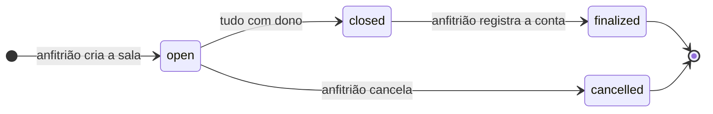
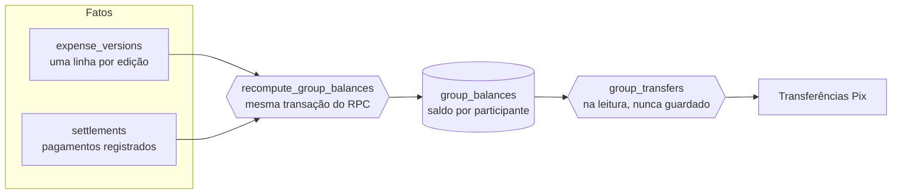
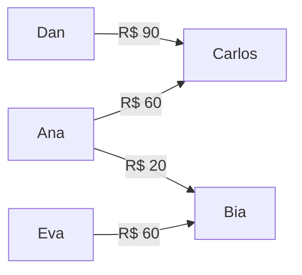
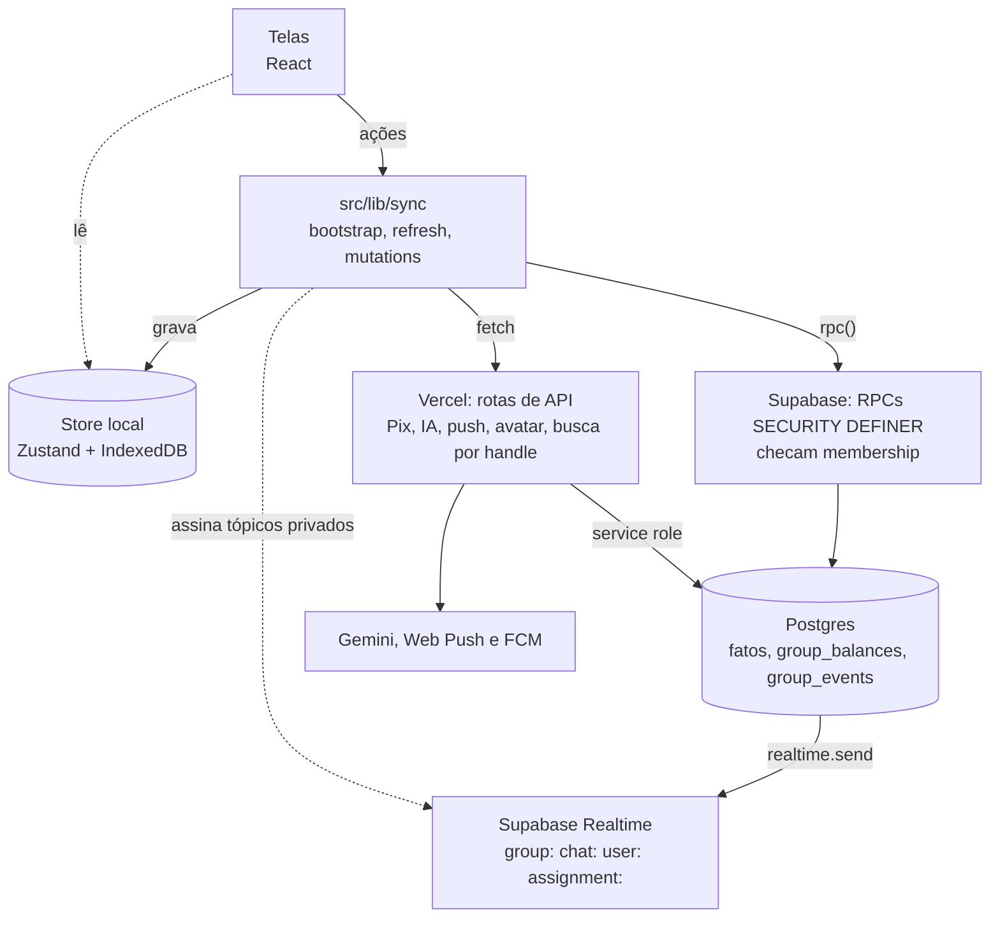
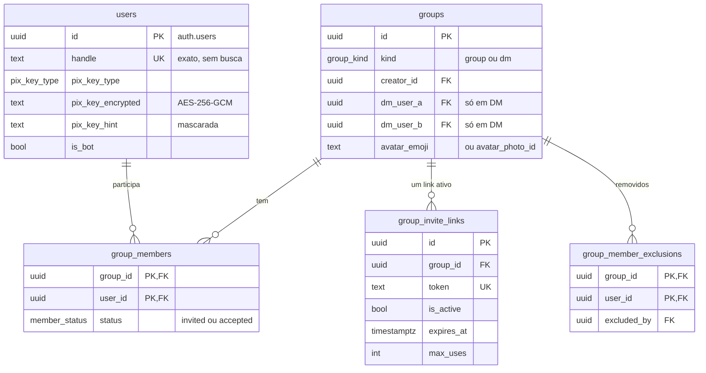
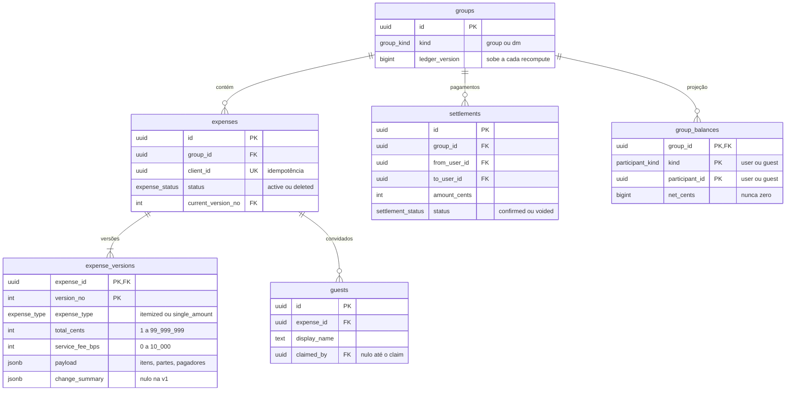
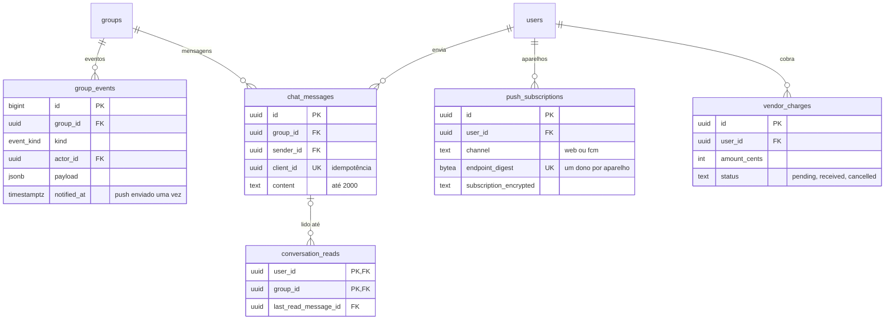
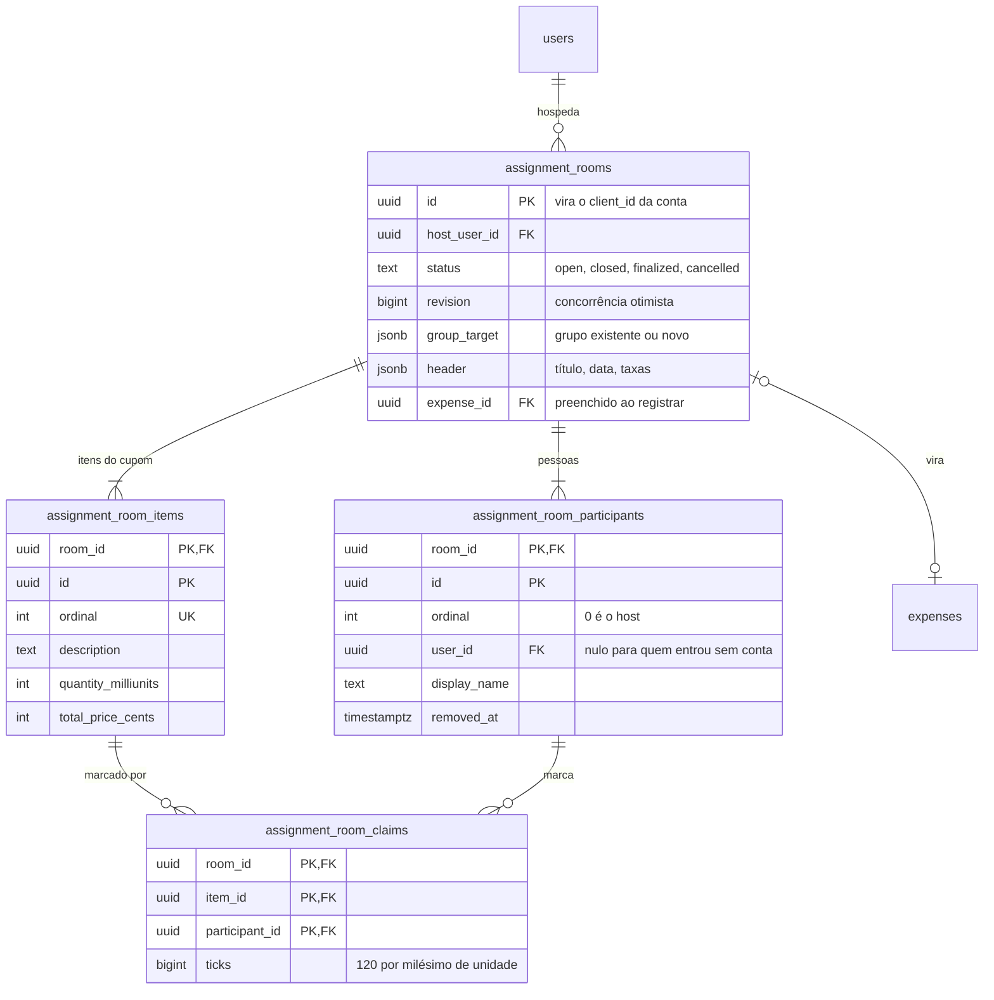
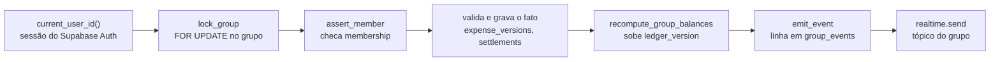

<p align="center">
  
</p>

<p align="center">
  Lê a nota, cada um marca o que comeu, e a galera paga no Pix pelo app do banco.
</p>

<p align="center">
  <a href="https://www.dividimos.ai">Web</a> &middot;
  <a href="https://play.google.com/store/apps/details?id=ai.dividimos.app">Android (WIP)</a>
</p>

<p align="center">
  <a href="https://github.com/tprei/dividimos/actions/workflows/ci.yml"></a>
  <a href="https://github.com/tprei/dividimos/actions/workflows/android.yml"></a>
  <a href="https://vercel.com/tprei/dividimos"></a>
</p>

---

O Splitwise virou pago. E mesmo quando era grátis, nunca entendeu o Brasil: não gera Pix, não lê cupom fiscal, não sabe o que é couvert, e cobra em dólar. A gente queria algo que funcionasse do jeito que a galera racha conta aqui: tira foto do cupom, cada um marca o que consumiu, o app gera o QR Code Pix e pronto.

Dividimos é código aberto, feito por quem racha conta pra quem racha conta. Sem assinatura, sem paywall, sem monetização em cima do seu Pix.

[Como funciona](#como-funciona) &middot; [Funcionalidades](#funcionalidades) &middot; [Como o saldo fecha](#como-o-saldo-fecha) &middot; [Arquitetura](#arquitetura) &middot; [Modelo de dados](#modelo-de-dados) &middot; [Desenvolvimento local](#desenvolvimento-local)

## Como funciona

<p align="center">
  
</p>

Não tem cupom? Dá pra falar a conta ou digitar do jeito que vier. A divisão pode ser feita por quem criou a conta, no wizard, ou por cada pessoa no próprio celular, numa sala de itens.

## Funcionalidades

### Entrada de dados

- **Foto do cupom.** A IA lê a foto do cupom fiscal ou da NFC-e impressa: itens, quantidade, preço unitário, total da linha e a taxa de serviço, quando ela vem impressa em percentual. O app confere a soma em centavos antes de abrir a revisão.
- **Por voz.** Em **Falar conta**, você diz "Uber com João, 25 reais" e recebe um rascunho editável. No Android usa o reconhecimento de fala nativo; no navegador, a Web Speech API.
- **Por texto, no chat.** O modo IA da conversa entende "pizza 80 com João" e monta a conta.
- **Dois tipos de conta.** **Valor único** (um total pra dividir: Uber, Airbnb, mercado) ou **Vários itens** (cada um paga o que consumiu).
- **Contatos do celular.** Adicione gente direto da agenda no Android e nos navegadores com Contact Picker. Os contatos não saem do aparelho.

| Tipo | Passos do wizard |
|------|------------------|
| Valor único | Participantes &rarr; Valor e divisão &rarr; Quem pagou |
| Vários itens | Participantes &rarr; Itens &rarr; Quem consumiu &rarr; Quem pagou |

Participantes junta nome da conta, data, grupo e quem participa. Depois de escanear, a revisão da nota oferece **Dividir manualmente** (vai pro wizard de vários itens) ou **Criar sala de divisão**.

### Sala de itens

A sala é o jeito de dividir um cupom sem passar o celular de mão em mão. O anfitrião escaneia, cria a sala e mostra o QR Code. Cada pessoa entra pelo próprio celular e marca o que consumiu.

- **Entra quem tem o link.** Quem tem conta entra com o próprio nome. Quem não tem digita um nome e vincula a conta depois. Cabem até 50 pessoas.
- **Frações de item.** Dá pra marcar o item inteiro, metade, um terço ou uma quantidade exata. Cada item mostra quanto ainda resta até a sala ficar com **Tudo com dono**.
- **Ao vivo.** Cada marcação aparece pra todo mundo na hora.
- **O anfitrião fecha e registra.** Ele fecha a sala, revisa, escolhe quem pagou e registra a conta num grupo existente ou num grupo novo. Quem entrou com conta recebe convite pro grupo. Quem entrou sem conta vira convidado e pode reivindicar a parte depois.
- **A sala acompanha a conta.** Depois de registrada, a conta mostra a sala em **Por item**, **Por pessoa** e **Histórico**, e edições na conta chegam em quem está com a sala aberta.


```mermaid
stateDiagram-v2
    direction LR
    [*] --> open: anfitrião cria a sala
    open --> closed: tudo com dono
    closed --> finalized: anfitrião registra a conta
    open --> cancelled: anfitrião cancela
    finalized --> [*]
    cancelled --> [*]
```

### Divisão

- **Por item ou pela conta toda.** Igual, porcentagem (com sliders) ou valor fixo por pessoa.
- **Ajuste que se resolve.** Mudou a parte de alguém, o resto se redistribui. O centavo que sobra vai pros primeiros da lista.
- **Quantidade quebrada.** Até três casas decimais por item: 1,5 kg de picanha, meia pizza.
- **Vários pagadores.** Registre quem pagou quanto quando mais de uma pessoa cobriu a conta.
- **Taxa de serviço e couvert.** A taxa de serviço em percentual é distribuída na proporção do consumo. Taxas fixas, como couvert, são divididas igualmente.

### Liquidação

- **QR Code Pix.** BR Code EMV com Copia e Cola, gerado no servidor com a chave de quem recebe. Dá pra pagar só uma parte.
- **Poucas transferências.** **Quem paga quem** cruza o maior devedor com o maior credor até zerar o grupo, com no máximo uma transferência a menos que o número de pessoas com saldo.
- **Registrar pagamento.** Quem pagou ou quem recebeu registra, e o saldo atualiza na hora. Errou? **Desfazer** no feed, no chat ou no detalhe do pagamento.
- **Lembrar.** Um toque manda um push pra quem te deve. Um lembrete por pessoa a cada 24h no grupo, e só se a dívida com você existir.
- **Cobrar rápido.** Cobrança Pix avulsa, sem grupo: digita o valor, compartilha o QR e marca **Pagamento recebido** quando cair. O histórico fica em **Cobranças**.

### Grupos, convites e convidados

- **Confirmação mútua.** Convide por `@handle`. A pessoa já pode entrar nas contas, mas só vê saldos e conversa do grupo depois de aceitar.
- **Link e QR de convite.** Um link ativo por grupo, com validade e limite de usos opcionais. No Android, o link abre direto no app. Dá pra disparar o convite no WhatsApp pra vários contatos de uma vez.
- **Convidados sem conta.** Coloque alguém na conta só pelo nome. Um link ou QR de claim guarda a parte até a pessoa criar conta, e aí o saldo passa pra ela.
- **Leitor de convite.** **Entrar em sala** abre um leitor que reconhece QR de sala, de grupo, de perfil e de convidado.
- **Página do grupo.** Avatar com emoji ou foto, **Gastos do grupo** com o total e a parte de cada um, e as abas **Saldos**, **Contas** e **Membros**.
- **Sair e remover.** Só sai do grupo quem está com saldo zerado. O criador remove membros, e quem foi removido não volta sozinho por link.

### Conversas

- **Conversas 1-a-1.** Mensagens diretas com o saldo entre vocês no topo e cards de sistema para contas e pagamentos. Conversa nova também precisa de aceite.
- **Ações sem sair do chat.** **Nova cobrança** e **Dividir conta** (igual, % ou fixo) direto na conversa. O botão **Pagar** ou **Cobrar** abre o Pix com o saldo entre vocês e registra o pagamento.
- **Perfil público.** `dividimos.ai/u/<handle>`, com QR Code pra compartilhar. Quem abre pode **Dividir uma conta** ou **Enviar mensagem**.

### Atividade e notificações

- **Feed de atividade.** Tudo que aconteceu nos seus grupos, agrupado por dia.
- **Push.** Web Push e notificação nativa no Android para contas, pagamentos, lembretes e mudanças no grupo. Cada categoria liga e desliga nas configurações.
- **Histórico de edições.** Cada edição de conta vira uma versão nova, com o resumo do que mudou. Excluir uma conta é reversível.
- **Busca.** Grupos e contas são buscados no aparelho; pessoas, também pelo `@handle` exato no servidor.

### App

- **Abre sem esperar a rede.** As telas leem um store local salvo em IndexedDB. O service worker serve o app do cache e mostra uma página offline quando não há conexão.
- **PWA e Android.** Instalável no navegador. O app Android usa Capacitor, com login Google nativo, câmera, fala e contatos.
- **Tema.** Claro, escuro ou o do sistema.
- **Tour guiado.** Na primeira sessão, um tour apresenta **Seu saldo**, **Ações rápidas**, **Quem deve o quê** e a navegação.
- **Bots verificados.** Contas de plataforma ganham o selo **Bot verificado**, e grupos só de bots ganham selo dourado. Só o servidor liga essa marca.

### Segurança

- **Chave Pix cifrada.** AES-256-GCM em repouso, decifrada só no servidor. O cliente só vê a chave mascarada. As inscrições de push também ficam cifradas.
- **Pix só pra quem tem a receber.** `/api/pix/generate` só usa a chave de outra pessoa se ela for credora de quem pede numa transferência do grupo, e até o valor devido. As recusas de autorização voltam todas com o mesmo 403, pra ninguém descobrir quem tem chave ou quem deve a quem.
- **Acesso só via RPC.** RLS habilitado em todas as tabelas, sem políticas e sem grants para `anon`/`authenticated`. O navegador só chama funções `SECURITY DEFINER`, que checam membership (ou o token da sala, pra quem entrou sem conta). Só as rotas do servidor usam a service role.
- **Sem enumeração.** Usuários são encontrados só por `@handle` exato, por uma rota do servidor com rate limit.
- **Tokens guardados como hash.** Os tokens de claim, de entrada na sala e de membro da sala ficam no banco só como SHA-256. Claim e entrada valem 7 dias; o de membro vale 30 dias e renova com o uso.
- **Rate limit que falha fechado.** Contadores no Postgres limitam IA, Pix, push e busca por usuário. Se o limitador cai, a rota responde 503 em vez de liberar.

## Como o saldo fecha

O banco guarda os fatos financeiros e um saldo por participante. Nunca transferências prontas.


```mermaid
flowchart LR
    subgraph fatos[Fatos]
        ev["expense_versions<br/>uma linha por edição"]
        st["settlements<br/>pagamentos registrados"]
    end
    rc{{"recompute_group_balances<br/>mesma transação do RPC"}}
    gb[("group_balances<br/>saldo por participante")]
    gt{{"group_transfers<br/>na leitura, nunca guardado"}}
    pix["Transferências Pix"]
    ev --> rc
    st --> rc
    rc --> gb --> gt --> pix
```

- **Fatos.** `expense_versions` (uma linha por edição, com o `payload` completo e um `change_summary`) e `settlements` (pagamentos registrados). Nada mais é fato financeiro.
- **Projeção.** `group_balances` tem uma linha por `(grupo, tipo, participante)` com o `net_cents` assinado: positivo recebe, negativo deve. Saldo zero não vira linha. Convidados sem conta entram com `kind = 'guest'` e carregam saldo até alguém reivindicar.
- **A projeção nunca é escrita à mão.** Todo RPC que mexe no dinheiro (criar, editar, excluir ou restaurar conta, registrar ou desfazer pagamento, claim de convidado, recusar convite com contas no meio) chama `recompute_group_balances(group)` na mesma transação e refaz os saldos a partir dos fatos. Ou o fato e a projeção entram juntos, ou nada entra.
- **Transferências saem na leitura.** `group_transfers(group)` em SQL e `transfersFromBalances` em TypeScript rodam o mesmo pareamento guloso de dois ponteiros sobre os saldos, com teste de paridade em 200 ledgers aleatórios.

#### Exemplo

Jantar de R$ 350. Carlos pagou R$ 200, Bia pagou R$ 150, e cinco pessoas consumiram.

| Pessoa | Pagou | Consumiu | Saldo |
|--------|------:|---------:|--------------------:|
| Carlos | 200 | 50 | +150 (recebe) |
| Bia | 150 | 70 | +80 (recebe) |
| Dan | 0 | 90 | -90 (deve) |
| Ana | 0 | 80 | -80 (deve) |
| Eva | 0 | 60 | -60 (deve) |

Sem simplificar, cada consumidor deve a cada pagador na proporção do que ele pagou (57% Carlos, 43% Bia). Isso dá 8 dívidas cruzadas, incluindo Carlos e Bia devendo um pro outro. O saldo de cada um é só o que pagou menos o que consumiu, então essas dívidas cruzadas nunca viram linha no banco.

Na leitura, o pareamento ordena devedores e credores uma vez e cruza o maior devedor com o maior credor:

1. Dan (-90) paga R$ 90 a Carlos (+150). Carlos fica com +60.
2. Ana (-80) paga R$ 60 a Carlos. Carlos zera, Ana fica com -20.
3. Ana paga R$ 20 a Bia (+80). Bia fica com +60.
4. Eva (-60) paga R$ 60 a Bia. Todo mundo zera.


```mermaid
graph LR
    D[Dan] -->|R$ 90| C[Carlos]
    A[Ana] -->|R$ 60| C
    A -->|R$ 20| B[Bia]
    E[Eva] -->|R$ 60| B
```

**8 dívidas cruzadas viram 4 Pix.** Cada transferência abre um QR Code com o valor certo, e todas saem dos saldos na hora da leitura.

## Arquitetura


```mermaid
flowchart TB
    telas["Telas<br/>React"] -->|ações| sync["src/lib/sync<br/>bootstrap, refresh, mutations"]
    telas -.->|lê| store[("Store local<br/>Zustand + IndexedDB")]
    sync -->|grava| store
    sync -->|fetch| api["Vercel: rotas de API<br/>Pix, IA, push, avatar, busca por handle"]
    sync -->|"rpc()"| rpc["Supabase: RPCs SECURITY DEFINER<br/>checam membership"]
    sync -.->|assina tópicos privados| rt["Supabase Realtime<br/>group: chat: user: assignment:"]
    api -->|service role| pg[("Postgres<br/>fatos, group_balances, group_events")]
    rpc --> pg
    pg -->|realtime.send| rt
    api --> ext["Gemini, Web Push e FCM"]
```

- **Local-first.** Telas leem o store (`src/stores/app-store.ts`) e nunca chamam o Supabase. Toda a rede mora em `src/lib/sync/`: um snapshot no login (`bootstrap_overview`), mutations otimistas que desfazem por entrada se o RPC falhar, e `refreshGroup` pra reconciliar.
- **O banco decide.** Validação, membership, dinheiro e concorrência (`expected_version_no`, `stale_version`) ficam nos RPCs. As rotas de API do Next.js existem só pro que precisa de segredo: chave Pix, Gemini, push, avatar e busca por `@handle`.
- **O banco avisa.** Os RPCs (e um trigger em `expenses`, pras salas) chamam `realtime.send` em tópicos privados. Nenhuma tabela está na publicação do Realtime.

| Tópico | Eventos | Quem escuta e o que faz |
|--------|---------|-------------------------|
| `group:<id>` | `ledger`, `chat_activity` | Membros aceitos. Dispara um `refreshGroup`; no `ledger`, só se a `ledger_version` ou o evento for novo. |
| `chat:<id>` | `message` | Quem está com a conversa aberta. A mensagem entra direto no store. |
| `user:<id>` | `membership` | O próprio usuário. Convite ou DM novo dispara um novo bootstrap. |
| `assignment:<sala>:<chave>` | `assignment`, `access_changed` | Quem tem o link da sala, com ou sem conta. A chave é aleatória e troca quando alguém é removido. Refaz a leitura da sala quando a `revision` sobe. |

- **Notificações.** Todo RPC financeiro ou de membros grava uma linha em `group_events`. Ela alimenta o feed, os cards do chat e o push: o cliente que agiu manda o id pra `/api/notify`, que reivindica a linha uma vez (`notified_at`) e dispara Web Push (VAPID) e FCM respeitando as categorias de cada pessoa.
- **IA.** `/api/receipt/ocr`, `/api/voice/parse` e `/api/chat/parse` chamam Gemini 2.5 Flash-Lite com saída em JSON Schema. O texto do usuário entra delimitado como dado, e o resultado passa pelos mesmos decoders de dinheiro do resto do app antes de virar rascunho.

## Modelo de dados

São 20 tabelas no schema `public`, todas com RLS e sem acesso direto. Os diagramas mostram as colunas que importam pra entender o domínio. O schema completo está em `supabase/migrations/` e os tipos gerados em `src/types/database.ts`.

#### Pessoas, grupos e convites

Conversas 1-a-1 são linhas de `groups` com `kind = 'dm'` e o par `(dm_user_a, dm_user_b)` único. Por isso chat, eventos e saldos funcionam igual em grupo e em DM.


```mermaid
erDiagram
    users ||--o{ group_members : "participa"
    groups ||--o{ group_members : "tem"
    groups ||--o{ group_invite_links : "um link ativo"
    groups ||--o{ group_member_exclusions : "removidos"

    users {
        uuid id PK "auth.users"
        text handle UK "exato, sem busca"
        pix_key_type pix_key_type
        text pix_key_encrypted "AES-256-GCM"
        text pix_key_hint "mascarada"
        bool is_bot
    }
    groups {
        uuid id PK
        group_kind kind "group ou dm"
        uuid creator_id FK
        uuid dm_user_a FK "só em DM"
        uuid dm_user_b FK "só em DM"
        text avatar_emoji "ou avatar_photo_id"
    }
    group_members {
        uuid group_id PK, FK
        uuid user_id PK, FK
        member_status status "invited ou accepted"
    }
    group_invite_links {
        uuid id PK
        uuid group_id FK
        text token UK
        bool is_active
        timestamptz expires_at
        int max_uses
    }
    group_member_exclusions {
        uuid group_id PK, FK
        uuid user_id PK, FK
        uuid excluded_by FK
    }
```

#### Núcleo financeiro


```mermaid
erDiagram
    groups ||--o{ expenses : "contém"
    expenses ||--|{ expense_versions : "versões"
    expenses ||--o{ guests : "convidados"
    groups ||--o{ settlements : "pagamentos"
    groups ||--o{ group_balances : "projeção"

    groups {
        uuid id PK
        group_kind kind "group ou dm"
        bigint ledger_version "sobe a cada recompute"
    }
    expenses {
        uuid id PK
        uuid group_id FK
        uuid client_id UK "idempotência"
        expense_status status "active ou deleted"
        int current_version_no FK
    }
    expense_versions {
        uuid expense_id PK, FK
        int version_no PK
        expense_type expense_type "itemized ou single_amount"
        int total_cents "1 a 99_999_999"
        int service_fee_bps "0 a 10_000"
        jsonb payload "itens, partes, pagadores"
        jsonb change_summary "nulo na v1"
    }
    guests {
        uuid id PK
        uuid expense_id FK
        text display_name
        uuid claimed_by FK "nulo até o claim"
    }
    settlements {
        uuid id PK
        uuid group_id FK
        uuid from_user_id FK
        uuid to_user_id FK
        int amount_cents
        settlement_status status "confirmed ou voided"
    }
    group_balances {
        uuid group_id PK, FK
        participant_kind kind PK "user ou guest"
        uuid participant_id PK "user ou guest"
        bigint net_cents "nunca zero"
    }
```

#### Conversas, eventos e push


```mermaid
erDiagram
    groups ||--o{ group_events : "eventos"
    groups ||--o{ chat_messages : "mensagens"
    users ||--o{ chat_messages : "envia"
    users ||--o{ push_subscriptions : "aparelhos"
    users ||--o{ vendor_charges : "cobra"
    chat_messages |o--o{ conversation_reads : "lido até"

    group_events {
        bigint id PK
        uuid group_id FK
        event_kind kind
        uuid actor_id FK
        jsonb payload
        timestamptz notified_at "push enviado uma vez"
    }
    chat_messages {
        uuid id PK
        uuid group_id FK
        uuid sender_id FK
        uuid client_id UK "idempotência"
        text content "até 2000"
    }
    conversation_reads {
        uuid user_id PK, FK
        uuid group_id PK, FK
        uuid last_read_message_id FK
    }
    push_subscriptions {
        uuid id PK
        uuid user_id FK
        text channel "web ou fcm"
        bytea endpoint_digest UK "um dono por aparelho"
        text subscription_encrypted
    }
    vendor_charges {
        uuid id PK
        uuid user_id FK
        int amount_cents
        text status "pending, received, cancelled"
    }
```

#### Sala de itens


```mermaid
erDiagram
    users ||--o{ assignment_rooms : "hospeda"
    assignment_rooms ||--|{ assignment_room_items : "itens do cupom"
    assignment_rooms ||--|{ assignment_room_participants : "pessoas"
    assignment_room_items ||--o{ assignment_room_claims : "marcado por"
    assignment_room_participants ||--o{ assignment_room_claims : "marca"
    assignment_rooms |o--o| expenses : "vira"

    assignment_rooms {
        uuid id PK "vira o client_id da conta"
        uuid host_user_id FK
        text status "open, closed, finalized, cancelled"
        bigint revision "concorrência otimista"
        jsonb group_target "grupo existente ou novo"
        jsonb header "título, data, taxas"
        uuid expense_id FK "preenchido ao registrar"
    }
    assignment_room_items {
        uuid room_id PK, FK
        uuid id PK
        int ordinal UK
        text description
        int quantity_milliunits
        int total_price_cents
    }
    assignment_room_participants {
        uuid room_id PK, FK
        uuid id PK
        int ordinal "0 é o host"
        uuid user_id FK "nulo para quem entrou sem conta"
        text display_name
        timestamptz removed_at
    }
    assignment_room_claims {
        uuid room_id PK, FK
        uuid item_id PK, FK
        uuid participant_id PK, FK
        bigint ticks "120 por milésimo de unidade"
    }
```

| Contexto | Tabela | Papel |
|----------|--------|-------|
| Pessoas | `users` | Perfil, `@handle`, chave Pix cifrada e mascarada, preferências de notificação, `is_bot` |
| | `push_subscriptions` | Um dispositivo por linha (`web` ou `fcm`), inscrição cifrada |
| Grupos | `groups` | Grupos e DMs, avatar (emoji ou foto), `ledger_version` |
| | `group_members` | Convite e aceite (`invited`, `accepted`) |
| | `group_member_exclusions` | Quem foi removido e não volta sozinho |
| | `group_invite_links` | Link de convite: um ativo por grupo, validade e limite de usos |
| Dinheiro | `expenses` | Identidade da conta, status, versão atual, chave de acesso do cupom contra duplicata |
| | `expense_versions` | **Fato.** Uma linha por edição, com total, taxas e `payload` |
| | `settlements` | **Fato.** Pagamentos registrados, `confirmed` ou `voided` |
| | `group_balances` | **Projeção.** Saldo líquido por participante, refeito a cada RPC financeiro |
| | `guests` | Convidados sem conta de uma conta, até o claim |
| Sala de itens | `assignment_rooms` | Sala, status, alvo do grupo e revisão |
| | `assignment_room_items` | Linhas do cupom, imutáveis depois de criadas |
| | `assignment_room_participants` | Quem está na sala, com ou sem conta |
| | `assignment_room_claims` | Quanto de cada item cada pessoa marcou |
| Conversas e eventos | `chat_messages` | Mensagens de grupo e DM |
| | `conversation_reads` | Até onde cada pessoa leu |
| | `group_events` | Feed, cards do chat e fila de push |
| Avulsos | `vendor_charges` | Cobrar rápido, fora do ledger de grupo |
| | `rate_limit_counters` | Janelas fixas por bucket e usuário |

Além das tabelas, a view `current_expense_participants` explode a versão atual de cada conta ativa em uma linha por participante; é dela que o recompute tira os saldos. O schema `guest_credentials` guarda os hashes dos tokens de claim e de sala, e o tópico de Realtime de cada sala. O bucket privado `group-avatars` guarda as fotos de grupo, com até 1 MB.

## RPCs

Toda leitura e escrita do app passa por uma função Postgres chamada via `supabase.rpc()`. A migration inicial revoga `EXECUTE` de `public`, `anon` e `authenticated` em todas as funções, e cada RPC ganha seu `GRANT` explícito. São 59 funções pra `authenticated`, 8 abertas também pra `anon` (salas de itens e prévias de convite e de claim), 11 só pra `service_role` (chamadas pelas rotas de API) e o resto são helpers internos e triggers, sem grant nenhum.

Todo RPC que mexe no ledger (contas e liquidações) segue a mesma ordem, na mesma transação:


```mermaid
flowchart LR
    a["current_user_id()<br/>sessão do Supabase Auth"] --> c["lock_group<br/>FOR UPDATE no grupo"]
    c --> b["assert_member<br/>checa membership"]
    b --> d["valida e grava o fato<br/>expense_versions, settlements"]
    d --> e["recompute_group_balances<br/>sobe ledger_version"]
    e --> f["emit_event<br/>linha em group_events"]
    f --> g["realtime.send<br/>tópico do grupo"]
```

- **`SECURITY DEFINER` com `search_path = public`.** A função roda como dona das tabelas, então a checagem de membership dentro dela é a única porta. RLS está ligado sem nenhuma policy.
- **Idempotência.** `create_expense`, `create_expense_with_group` e `send_message` recebem um `p_client_id`, e `record_settlement` um `p_operation_id`. Repetir a chamada devolve o que já foi gravado em vez de duplicar, o que torna seguro o retry do cliente offline.
- **Concorrência otimista.** `edit_expense` recebe `p_expected_version_no`; as mutations da sala recebem `p_expected_revision`. Se alguém gravou antes, o RPC falha com `stale_version` e o cliente refaz a leitura.
- **Erros com código.** Toda falha é `RAISE EXCEPTION` com `ERRCODE = 'P0001'` e uma mensagem estável (`not_a_member`, `stale_version`, `outstanding_balance`, `duplicate_receipt`, `room_closed`...). `codeFromMessage` em `src/lib/sync/errors.ts` converte a mensagem num `LedgerErrorCode` tipado.
- **Respostas decodificadas.** No cliente, `rpc(name, args, decode)` em `src/lib/sync/client.ts` tipa nome e argumentos pelos tipos gerados (`src/types/database.ts`) e passa o JSON de volta por um decoder antes de chegar no store. Resposta fora do formato vira `invalid_wire`.

| Contexto | RPCs | Quem chama |
|----------|------|------------|
| Leitura | `bootstrap_overview`, `get_group_overview`, `get_group_expenses`, `get_expense_context`, `get_settlement`, `get_my_expenses`, `get_activity`, `get_conversation`, `get_vendor_charges` | `src/lib/sync/bootstrap.ts` e `refresh.ts` |
| | `get_my_profile` | `src/lib/auth.ts` |
| Contas | `create_expense`, `create_expense_with_group`, `edit_expense`, `delete_expense`, `restore_expense` | `src/lib/sync/mutations.ts` |
| Liquidação | `record_settlement`, `void_settlement`, `send_nudge` | `mutations-group.ts` |
| Grupos e convites | `create_group`, `invite_member`, `accept_invitation`, `decline_invitation`, `remove_member`, `leave_group`, `delete_group`, `create_invite_link`, `deactivate_invite_link`, `preview_invite_link`, `join_via_link`, `get_or_create_dm` | `mutations-group.ts`, `/join/[token]` |
| Convidados | `create_guest_claim_token`, `revoke_guest_claim_token`, `resolve_guest_claim_token`, `claim_guest` | `mutations-group.ts`, `/claim` |
| Perfil | `complete_onboarding`, `update_profile` | `src/app/auth/onboard/actions.ts`, `mutations-group.ts` |
| Conversas | `send_message`, `mark_read` | `mutations.ts` |
| Cobrar rápido | `record_vendor_charge`, `confirm_vendor_charge`, `cancel_vendor_charge` | `mutations-group.ts` |
| Sala de itens | `create_assignment_room`, `get_assignment_room`, `join_assignment_room`, `refresh_assignment_room_member`, `set_assignment_room_claim`, `remove_assignment_room_participant`, `rotate_assignment_room_join`, `claim_assignment_room_guest`, `close_assignment_room`, `cancel_assignment_room`, `finalize_assignment_room`, `get_assignment_room_completion` | `src/lib/sync/assignment-rooms.ts` |
| Só servidor | `lookup_user_by_handle`, `set_group_avatar`, `claim_push_subscription`, `increment_rate_limit`, `cleanup_expired_rate_limit_counters` | Rotas de API com service role |

Os helpers internos também moram nas migrations: `recompute_group_balances` e `group_transfers` (a projeção e a minimização), `validate_expense_payload` (a mesma regra de dinheiro de `src/lib/expense-money.ts`), `effective_expense_payload`, os `ledger_*_json` que montam as respostas, e `broadcast_group`/`broadcast_user`/`broadcast_assignment_room` que chamam `realtime.send`. As rotas de API com service role leem algumas tabelas direto (`/api/pix/generate`, `/api/notify`), porque o service role ignora RLS; nenhum código de cliente faz isso.

## Stack

| Camada | Tecnologia |
|--------|------------|
| Framework | Next.js 16 (App Router), proxy em `src/proxy.ts` |
| UI | React 19, Tailwind CSS v4, shadcn/ui, Framer Motion |
| Estado | Zustand 5 (local-first, persistido em IndexedDB) |
| Backend | Supabase: Postgres, Auth, Realtime e Storage, com acesso só via RPCs `SECURITY DEFINER` |
| Auth | Google OAuth (web), Google Credential Manager via `@capgo/capacitor-social-login` (Android) |
| IA | Gemini 2.5 Flash-Lite via `@google/genai`: cupom, voz e texto |
| Push | Web Push (VAPID) e FCM HTTP v1 |
| Mobile | Capacitor 8 (Android; iOS por enquanto como PWA) |
| Testes | Vitest 4, React Testing Library, fast-check, Playwright |
| Deploy | Vercel (frontend), Supabase em `sa-east-1` (banco) |
| Linguagem | TypeScript 5 |

## Estrutura

```
src/
├── proxy.ts                    # Sessão Supabase, rotas públicas, /manutencao
├── app/                        # Rotas (Next.js App Router)
│   ├── page.tsx                # Landing
│   ├── auth/                   # Login Google, retorno do popup, onboarding (handle + chave Pix)
│   ├── app/                    # Shell autenticado (pré-renderizado, servido cache-first pelo service worker)
│   │   ├── page.tsx            # Início: saldo, ações rápidas, quem deve o quê
│   │   ├── bill/new/           # Wizard de conta
│   │   ├── bill/[id]/          # Detalhe da conta, versões, sala de itens
│   │   ├── bills/              # Contas e cobranças
│   │   ├── charges/            # Histórico do Cobrar rápido
│   │   ├── groups/             # Grupos: saldos, contas, membros, conversa
│   │   ├── conversations/      # Conversas 1-a-1
│   │   ├── activity/           # Feed de atividade
│   │   ├── search/             # Busca: grupos e contas no aparelho, pessoas por @handle
│   │   ├── scan-invite/        # Leitor de QR: sala, grupo, perfil, convidado
│   │   ├── profile/            # Perfil e chave Pix
│   │   └── settings/           # Tema, push, categorias, confirmações
│   ├── room/[roomId]/          # Sala de itens (pública, entra por link)
│   ├── claim/                  # Claim de convidado
│   ├── join/[token]/           # Link de convite de grupo
│   ├── u/[handle]/             # Perfil público
│   ├── manutencao/             # Aviso quando app e banco estão em versões incompatíveis
│   ├── privacy/  terms/        # Páginas legais
│   └── api/
│       ├── pix/generate/       # Copia e Cola com a chave de outra pessoa (só em dívida real)
│       ├── pix/generate-self/  # Copia e Cola com a própria chave (Cobrar rápido)
│       ├── receipt/ocr/        # Foto do cupom → itens (Gemini)
│       ├── voice/parse/        # Fala transcrita → rascunho (Gemini)
│       ├── chat/parse/         # Texto do chat → rascunho (Gemini)
│       ├── notify/             # Claim de group_events + fan-out de push
│       ├── push/               # subscribe, unsubscribe, status
│       ├── groups/[groupId]/avatar/  # Emoji ou foto do grupo
│       ├── users/lookup/       # Busca exata por @handle
│       └── dev/login/          # Login programático (só dev e test)
├── components/                 # UI por domínio (bill, assignment-room, settlement, chat, group, …) + ui/ (shadcn)
├── stores/
│   ├── app-store.ts            # Estado local-first (Zustand + IndexedDB)
│   ├── app-selectors.ts        # Derivados: transferências, dívidas, convites
│   ├── bill-store.ts           # Rascunho do wizard
│   └── assignment-room-store.ts  # Salas abertas e conexão (não persiste)
├── lib/
│   ├── sync/                   # Toda a rede: bootstrap, refresh, realtime, mutations, salas
│   ├── ledger/                 # Decoders, saldos, transferências mínimas, suites de integração
│   ├── push/                   # Web Push, FCM, fan-out por dispositivo
│   ├── capacitor/              # Pontes nativas: login, câmera, fala, contatos, deep link
│   ├── supabase/               # Clientes browser/server/admin e sessão do proxy
│   ├── expense-money.ts        # Dono único do teto e da fórmula de taxa
│   ├── assignment-room-*.ts    # Dinheiro, quantidade, QR e projeção da sala
│   ├── receipt-ocr.ts          # Parser de cupom (voice- e chat-expense-parser.ts seguem o mesmo molde)
│   ├── llm-prompt-safety.ts    # Texto do usuário tratado como dado
│   ├── rate-limit.ts           # Buckets por usuário, falha fechado
│   ├── crypto.ts               # AES-256-GCM (só servidor)
│   ├── pix.ts                  # EMV BR Code + CRC16-CCITT
│   └── currency.ts             # BRL em centavos inteiros
├── hooks/                      # React hooks
├── types/                      # Tipos do domínio e do banco
└── test/                       # Setup e helpers dos testes de integração
e2e/                            # Playwright: synthetic/ (jornadas), flows/, seed-helper.ts
supabase/
├── migrations/                 # Migrations ordenadas, fonte da verdade do banco
├── config.toml                 # Config do Supabase local
├── seed.sql                    # Dados de desenvolvimento
├── migrations-reset-manifest.json  # Autoriza a troca revisada da sequência inicial
└── security-allowlist.json     # Exceções revisadas do verificador de segurança
scripts/                        # dev-setup, cap-dev, verificadores de migration, repórter do ambient
android/                        # Projeto nativo Android (Capacitor)
public/sw.js                    # Service worker
agent-guidance/                 # Guias para agentes: migrations, TypeScript, stacked diffs, mudanças visuais
```

## Orientação rápida

- `src/app/` é o App Router do Next.js 16. Fluxos principais: landing (`page.tsx`), auth (`auth/`), o shell autenticado (`app/`, pré-renderizado e servido cache-first pelo `public/sw.js`) e os destinos de link públicos `room/`, `claim/`, `join/` e `u/`.
- `src/proxy.ts` é o proxy do Next 16. Renova a sessão do Supabase via `src/lib/supabase/middleware.ts`, libera as rotas públicas, responde 503 quando a verificação de auth está fora do ar e manda quem está logado pra `/manutencao` quando o banco e o app estão em versões financeiramente incompatíveis.
- `src/app/auth/` faz login com um ID token do Google: redirect de página inteira na web (`popup/` é a página pra onde o Google volta) e `@capgo/capacitor-social-login` no Android. `continue/` decide se precisa de onboarding, e `onboard/` coleta o handle e a chave Pix. Sem telefone, sem 2FA.
- `src/app/api/` guarda só o que precisa de segredo: chaves Pix (`pix/generate`, `pix/generate-self`), Gemini (`receipt/ocr`, `voice/parse`, `chat/parse`), push (`notify`, `push/*`), fotos de grupo (`groups/[groupId]/avatar`) e busca por handle (`users/lookup`), além do `dev/login`, que só existe em dev. As outras rotas checam a sessão, e a maioria aplica rate limit por usuário via `src/lib/rate-limit.ts`.
- `src/stores/app-store.ts` é Zustand + `persist` sobre `src/lib/idb-storage.ts`. Guarda o snapshot do bootstrap, grupos, listas e detalhes de contas, pagamentos, atividade, cobranças e conversas. `app-selectors.ts` deriva transferências, dívidas e convites. As telas leem o store; nunca consultam o Supabase.
- `src/lib/sync/` é todo o acesso à rede: `client` (chamada de RPC tipada e `LedgerError`), `bootstrap` (snapshot `bootstrap_overview`), `refresh` (`refreshGroup` e as outras leituras agrupadas), `realtime` (tópicos privados `group:`, `chat:` e `user:`), `auth` (listener de sessão), `mutations` (escritas otimistas de conta, pagamento e chat, com rollback por entrada e reconciliação via `refreshGroup`), `mutations-group` (grupos, convites, perfil, lembretes, claims de convidado, cobranças), `assignment-rooms` e `assignment-room-realtime` (salas e o tópico `assignment:`), mais transportes finos pra Pix, push, parsing com IA e avatar de grupo.
- `src/lib/ledger/` tem a decodificação do que vem da rede (`decode*.ts`), os textos de atividade e chat (`describeEvent` em `event-copy.ts`), as linhas de dívida da UI (`debt-rows.ts`), a aplicação de deltas de saldo (`apply.ts`), as transferências (`transfers.ts`: `transfersFromBalances`) e a maior parte das suites `*.integration.test.ts` dos RPCs.
- `src/lib/assignment-room-*.ts` é a matemática pura da sala: distribuição do dinheiro (`assignment-room-money.ts`), quantidades marcadas em ticks (`assignment-room-quantity.ts`), o QR de entrada (`assignment-room-qr.ts`) e a projeção da sala no cliente (`assignment-room-projection.ts`). `src/components/assignment-room/` desenha a tela de entrada, o quadro, os controles do anfitrião e a revisão.
- `src/lib/receipt-ocr.ts`, `voice-expense-parser.ts` e `chat-expense-parser.ts` chamam o Gemini com JSON Schema. `llm-prompt-safety.ts` trata o texto do usuário como dado e remove caracteres invisíveis; `llm-errors.ts` troca as falhas do provedor por mensagens genéricas em PT-BR. `process-receipt-scan.ts` comprime a foto e confere o dinheiro antes da tela de revisão abrir.
- `src/lib/push/` envia as notificações: `notify-user.ts` distribui por aparelho e limpa inscrições mortas, `web-push.ts` e `fcm.ts` são os dois canais, e `event-notification.ts` escolhe a categoria e o texto.
- `src/lib/crypto.ts` é o AES-256-GCM só de servidor, pra chaves Pix e inscrições de push. Nunca importe em componente de cliente.
- `src/lib/pix.ts` gera o BR Code EMV com CRC16-CCITT, além de validar e mascarar chaves.
- `src/lib/currency.ts` mantém todo o dinheiro em centavos inteiros: `formatBRL` pra exibir, `parseSafeMinorUnitCents` pra entrada. `src/lib/expense-money.ts` é o único dono de `MAX_EXPENSE_CENTS` e da fórmula da taxa de serviço.
- `src/components/bill/` é o wizard de conta (seletor de tipo, participantes, itens, editores de divisão, pagadores, revisão da nota). `src/components/settlement/` tem o modal de QR Pix e o grafo de dívidas. `src/components/shared/user-avatar.tsx` é o avatar redondo com a foto do Google ou as iniciais.
- `src/types/ledger.ts` tem os tipos que vêm dos RPCs (`Me`, `GroupSnapshot`, `GroupMember`, `BalanceRow`, `Transfer`, `ExpensePayload`, `ExpenseVersion`). `src/types/assignment-room.ts` tem os tipos da sala. `src/types/index.ts` tem os tipos de UI (`User`, `Expense`, `DebtEdge`); `User` carrega `pixKeyHint`, nunca a chave crua.
- `supabase/migrations/` guarda as migrations SQL em ordem: tabelas, grants, RPCs, realtime, triggers e mudanças posteriores. `supabase/config.toml` tem a configuração do projeto local e `supabase/seed.sql`, os dados de desenvolvimento.

## Desenvolvimento local

```bash
./scripts/dev-setup.sh       # detecta Docker → Supabase local; sem Docker, remoto
npm run dev                  # sobe o servidor de dev
```

**Com Docker** (Supabase local completo): o script roda `supabase start` e escreve o `.env.local`.

**Sem Docker** (Supabase remoto): defina `SUPABASE_URL`, `SUPABASE_ANON_KEY` e `SUPABASE_SERVICE_ROLE_KEY` antes de rodar o script; sem elas, ele escreve valores de exemplo e só as páginas públicas funcionam.

**Chave de criptografia**: o `PIX_ENCRYPTION_KEY` é reaproveitado entre execuções. O que já está cifrado no banco (chaves Pix e inscrições de push) só abre com a chave que cifrou, então o script nunca gera uma nova por cima de um `.env.local` existente. Se a chave de lá estiver faltando ou malformada, o script para; `--reset-encryption-key` gera outra e abandona o que estava cifrado.

**Parsing com IA**: cupom, voz e chat precisam de `GEMINI_API_KEY`. Sem ela, essas rotas respondem 503 e o resto do app funciona.

**Supabase CLI**: fixada em `devDependencies` e executada de `node_modules/.bin`, na mesma versão que a CI instala. O script se recusa a rodar se a versão não bater, e cada job da CI também confere, então local e CI nunca divergem.

**Migrations**: o SQL em `supabase/migrations/` é a fonte da verdade do banco. Nunca edite, renomeie ou apague uma migration que já entrou na `main` ou foi aplicada num banco compartilhado. Crie uma migration nova com timestamp pra cada mudança e rode `supabase db reset --local` pra repetir o histórico inteiro localmente. As declarações antigas em `supabase/schemas/` e o snapshot `supabase/schema.sql` foram aposentados e não entram no desenvolvimento nem na CI.

**Sem nenhuma variável de ambiente**: o proxy degrada sem quebrar. As páginas públicas abrem, e as protegidas redirecionam pra `/`.

### Supabase remoto (sem Docker)

Sem Docker, use um projeto Supabase remoto. Defina as variáveis antes de rodar o script:

```bash
export SUPABASE_URL=https://<project-ref>.supabase.co
export SUPABASE_ANON_KEY=<sua-anon-key>
export SUPABASE_SERVICE_ROLE_KEY=<sua-service-role-key>

./scripts/dev-setup.sh       # lê as variáveis e escreve o .env.local
npm run dev
```

Em hosts que expõem secrets como variáveis de ambiente, como o Fly.io, o script lê do mesmo jeito.

### Login programático (só em dev)

Precisa de duas condições: `NODE_ENV=development` (ou `test`) **e** `DEV_LOGIN_SECRET` com algum valor. Quem chama manda o mesmo valor no header `x-dev-login-secret`, e só e-mails `@test.dividimos.local` são aceitos.

```bash
curl -X POST http://localhost:3000/api/dev/login \
  -H 'Content-Type: application/json' \
  -H 'x-dev-login-secret: seu-segredo-local' \
  -d '{"email": "alice@test.dividimos.local"}'
```

O endpoint cria o usuário se ele não existir, e a resposta seta os cookies de sessão. Produção nunca define `DEV_LOGIN_SECRET`, então a rota responde 404 mesmo se o `NODE_ENV` estiver errado.

## Comandos

```bash
npm run dev                     # Servidor de dev
npm run build                   # Build de produção (confere os tipos)
npm run lint                    # ESLint (--max-warnings 0)

npm run test                    # Testes unitários uma vez
npm run test:watch              # Testes unitários em watch
npm run test:integration        # Testes de integração (precisa de supabase start)
npm run test:all                # Unitários + integração
npm run test:soak               # Unitários com as propriedades em 5.000 execuções
npm run test:soak:integration   # Integração com as propriedades em 150 execuções

npm run test:synthetic          # E2E sintético com Playwright (Desktop Chrome)
npm run test:synthetic:mobile   # Mesma suite no iPhone 13 (WebKit) + Pixel 5
npm run test:synthetic:ui       # Suite sintética no modo UI do Playwright (também :headed, :ios, :android)
npm run test:e2e                # Todos os projetos do Playwright (também :ui, :headed, :debug)
npm run test:ambient            # Sondas ambient contra um deploy (Vitest)
npm run test:ambient:web        # Sondas ambient no navegador (Playwright)

npm run check:migrations        # Checagens de segurança das migrations novas nos caminhos passados
npm run db:assert-ref           # Falha se o Supabase não estiver linkado ao projeto de produção
supabase migration new <nome>   # Cria uma migration nova com timestamp
supabase db reset --local       # Repete todas as migrations commitadas

npm run cap:dev:android         # Emulador Android apontando pro servidor de dev
npm run cap:sync                # Copia os assets web e os plugins pro projeto nativo
npm run cap:assets              # Regera ícones e splash nativos
npm run icons                   # Regera os ícones do PWA
./scripts/dev-setup.sh          # Setup local num comando
```

## Configuração de produção

O que é preciso configurar pra remontar a produção, sem valores. Os valores ficam só na Vercel, no GitHub e no dashboard do Supabase.

- **Supabase** (região `sa-east-1`). Auth só com o provedor Google, `site_url = https://www.dividimos.ai`; a lista de redirects fica em Dashboard > Authentication > URL Configuration. Assinatura de JWT: ES256 em uso; a chave HS256 legada continua ativa porque `e2e/seed-helper.ts` gera sessões HS256 pros testes sintéticos (`mintAccessToken`).
- **Google OAuth**: um client id web no projeto do GCP, usado no login web e no Android.
- **Firebase**: um app Android pro FCM.
- **Variáveis de ambiente na Vercel**: `NEXT_PUBLIC_SUPABASE_URL`, `NEXT_PUBLIC_SUPABASE_ANON_KEY`, `SUPABASE_SERVICE_ROLE_KEY`, `PIX_ENCRYPTION_KEY`, `FCM_PROJECT_ID`, `FCM_SERVICE_ACCOUNT_EMAIL`, `FCM_PRIVATE_KEY`, `NEXT_PUBLIC_VAPID_PUBLIC_KEY`, `VAPID_PRIVATE_KEY`, `VAPID_SUBJECT`, `GEMINI_API_KEY`. `DEV_LOGIN_SECRET` nunca é definido em produção.
- **Secrets do GitHub Actions**: `GOOGLE_SERVICES_JSON`, `ANDROID_KEYSTORE_BASE64`, `KEYSTORE_STORE_PASSWORD`, `KEYSTORE_KEY_ALIAS`, `KEYSTORE_KEY_PASSWORD`, `DEV_LOGIN_SECRET` (só pro sintético da CI).

### Aplicando mudanças no banco

Depois que uma migration revisada chega na `main`, uma pessoa aplica a partir de um checkout linkado à produção:

```bash
npm run db:assert-ref                  # falha se o link não for o projeto de produção; o erro explica como linkar
supabase db push --linked --dry-run    # leia o plano
supabase db push --linked              # aplica
```

`supabase db push` aplica as migrations que ainda não estão no histórico do projeto de destino. Ele não troca um banco existente pela sequência do reset. Pra uma troca intencional de época de migrations, use um projeto Supabase novo ou restaurado e isolado, repita o diretório inteiro de migrations nele, confira o catálogo e a suite de integração, e só então aponte o deploy pra esse projeto. Nunca rode a sequência inicial aposentada e a nova no mesmo banco. Agentes nunca rodam esses comandos.

### Monitoramento sintético

Validação sintética agendada contra o deploy de produção, a cada 30 minutos (`.github/workflows/ambient.yml`).

- Secrets do repositório no GitHub Actions: `AMBIENT_SUPABASE_URL`, `AMBIENT_SUPABASE_ANON_KEY`, `AMBIENT_SUPABASE_SERVICE_ROLE_KEY`, `AMBIENT_SUPABASE_JWT_SECRET`.
- Variáveis do repositório no GitHub Actions: `AMBIENT_BASE_URL`, `AMBIENT_GOOGLE_CLIENT_ID`.
- A chave JWT HS256 legada continua ativa porque as sessões geradas dependem dela.
- Secrets opcionais: `ALERT_TELEGRAM_BOT_TOKEN` (token do bot que avisa quando o ambient falha; sem ele o aviso no Telegram fica desligado e o repórter só mantém a issue `synthetic-prod`) e `ALERT_TELEGRAM_CHAT_ID` (chat que recebe o aviso quando uma execução fica vermelha ou se recupera).

## CI

Os workflows ficam em `.github/workflows/`. O `CONTRIBUTING.md` detalha cada checagem. Nos PRs, um push novo cancela os runs do push anterior que ainda estão na fila ou rodando (`concurrency` agrupado pelo número do PR); pushes na `main` nunca são cancelados.

| Workflow | Quando | O que checa |
|----------|--------|-------------|
| `ci.yml` | PR, push na `main` | Testes unitários, `tsc --noEmit`, lint, build de produção, testes dos scripts |
| `integration.yml` | PR, push na `main` | `npm run test:integration` contra um Supabase local novo |
| `synthetic.yml` | PR, push na `main` | Sintéticos Playwright contra Supabase local e um build de produção, no Desktop Chrome, iPhone 13 (WebKit) e Pixel 5; dois shards, cada um com os três projetos |
| `migrations.yml` | PR | Segurança das migrations novas, replay num banco independente, verificação da época confiável, suite de contrato de integração, invariantes de segurança do banco e `src/types/database.ts` regerado |
| `migration-history.yml` | PR, push na `main` | Migrations aplicadas ficam congeladas; as novas precisam de timestamp único e posterior |
| `android.yml` | PR que mexe em `android/`, `capacitor.config.ts`, `package*.json` ou no próprio workflow; push na `main` | Compilação debug nos PRs, sem secrets; AAB release assinado no push na `main` |
| `soak.yml` | Toda noite | Testes de propriedade do ledger com muitas execuções e seed nova; uma falha abre a issue `soak-failure` com a seed |
| `ambient.yml` | A cada 30 min | Sondas sintéticas contra produção; veja [Monitoramento sintético](#monitoramento-sintético) |
| `retarget-stack.yml` | PR mergeado | Reaponta os PRs filhos de um stack pra base do PR mergeado |

### Secrets do build Android (`.github/workflows/android.yml`)

Pull requests que mexem no Android (mesmos caminhos da tabela acima) só compilam um build debug, sem secrets de assinatura. Pushes na `main` geram um AAB release assinado com o projeto Android nativo do Capacitor.

**Secrets obrigatórios do job de release**:
- `ANDROID_KEYSTORE_BASE64`: keystore de release (`.jks`) em Base64
- `KEYSTORE_STORE_PASSWORD`: senha do keystore
- `KEYSTORE_KEY_ALIAS`: alias da chave
- `KEYSTORE_KEY_PASSWORD`: senha do alias
- `GOOGLE_SERVICES_JSON`: `google-services.json` em Base64, pro FCM e o login Google. O job de release falha sem ele.

**versionCode**: usa `github.run_number` (sempre crescente), com `versionName` `1.0.<run_number>`. Pra publicar na Play Store, vale trocar por versionamento por tag.

**Saída do build**: AAB assinado enviado como artefato (`app-release-<run_number>`), guardado por 7 dias.

### Ciclo de desenvolvimento mobile

A WebView do Capacitor carrega o servidor de dev rodando, não um export estático, então o `npm run dev` precisa estar de pé em outro terminal.

```bash
npm run cap:dev:android                                  # emulador, host em 10.0.2.2
scripts/cap-dev.sh android --device --run                # aparelho via USB; redireciona a porta 3000 com adb reverse
LAN_IP=192.168.0.14 scripts/cap-dev.sh android --device  # aparelho via Wi-Fi, abre o Android Studio
```

Precisa do JDK 21 e do platform-tools do Android SDK no `PATH`. Inspecione a WebView pelo Chrome do desktop em `chrome://inspect`. Depois de mudar o `capacitor.config.ts` ou o manifest, rode `npx cap sync android` e recompile; compilar não prova que o teclado se comporta.

O iOS nativo não está inicializado neste repositório: não existe diretório `ios/`, e `scripts/cap-dev.sh ios` se recusa com essa mensagem em vez de gerar um projeto não verificado. O iOS é coberto pelo PWA no Safari e pelo projeto sintético WebKit.

## Testes

O Dividimos tem três camadas de teste: **unitários**, **integração** e **sintéticos (E2E)**. O `TESTING.md` é o guia detalhado das três. Mudanças de UI também exigem verificação visual no navegador; agentes seguem `agent-guidance/VISUAL_CHANGES.md`.

Os testes unitários usam Vitest com React Testing Library e ficam ao lado do código, com sufixo `.test.ts`/`.test.tsx`.

- **Configuração**: `vitest.config.mts` com ambiente happy-dom e os paths do tsconfig.
- **Setup**: `src/test/setup.ts` traz os matchers do jest-dom e um mock do Framer Motion.
- **Propriedades**: invariantes do ledger e do dinheiro rodam como propriedades do fast-check; `PROPERTY_RUNS` define o número de execuções.

Os testes de integração rodam contra um Supabase local de verdade. As suites de RPC ficam em `src/lib/ledger/*.integration.test.ts`; rotas de API (`src/app/api/**`), o rate limiter (`src/lib/rate-limit*.integration.test.ts`) e invariantes gerais do ledger (`src/test/ledger-invariants.integration.test.ts`) têm as suas.

- **Configuração**: `vitest.integration.config.mts` com ambiente node, timeout de 30s e execução sequencial.
- **Setup**: `src/test/integration-setup.ts` conecta com a service role e apaga os usuários de teste depois de cada execução.
- **Helpers**: `src/test/integration-helpers.ts` tem `createTestUser`, `createTestUsers`, `authenticateAs`, `createGroup`, `createGroupWithMembers`, `createExpense`, `withPg` (acesso direto via `pg`) e `expectRpcError`. `src/test/fixtures.ts` monta payloads e objetos.
- **Rodando localmente**:

```bash
supabase db reset
npm run test:integration
```

- **Escrevendo testes de integração**: use o sufixo `.integration.test.ts` e envolva em `describe.skipIf(!isIntegrationTestReady)` pra pular quando faltarem as variáveis. O comportamento do SQL é coberto inteiro por essas suites em TypeScript.

**Mudança de migration com lógica precisa de teste de integração.** Todo RPC, tópico de realtime, trigger ou constraint novo ou alterado em `supabase/migrations/` precisa de cobertura de comportamento em `*.integration.test.ts`: caminho feliz, recusa pra quem não é membro e os casos de borda que o SQL protege (locks, validação, checagem de membership). O replay e as checagens de segurança provam que o SQL aplica e que as permissões são seguras; não substituem teste de comportamento.

Os testes sintéticos (`e2e/synthetic/*.spec.ts`) percorrem jornadas reais pela UI, rotas de API, auth e banco, com dados semeados por teste via `SeedHelper`.

## Conceitos-chave

**Autenticação**: Google OAuth via Supabase Auth. Sem telefone, sem 2FA. No primeiro login, o trigger `on_auth_user_created` cria o perfil com um handle derivado do e-mail. O onboarding termina quando a pessoa confirma o handle e cadastra a chave Pix.

**Segurança da chave Pix**: as chaves são cifradas com AES-256-GCM (`src/lib/crypto.ts`) antes de gravar, e a chave crua nunca chega no cliente. O Copia e Cola é gerado no servidor por `POST /api/pix/generate` (chave de outra pessoa, só numa transferência real de `transfersFromBalances` e até o valor devido) e `POST /api/pix/generate-self` (a sua própria chave). A coluna `pix_key_hint` guarda a versão mascarada pra exibir. Tipos de chave: `cpf`, `email`, `phone`, `random`.

**Descoberta de usuários**: sem listagem. A pessoa é adicionada pelo `@handle` exato, pra evitar enumeração. `GET /api/users/lookup` chama o RPC `lookup_user_by_handle`, que só a service role executa, casa o handle completo de quem já fez onboarding e expõe só id, handle, nome, avatar e a marca de bot.

**Grupos e DMs**: convite por `@handle`, e o membro precisa aceitar (confirmação mútua). Membros aceitos e convidados podem estar numa conta, mas só os aceitos leem saldos, contas e chat do grupo; quem está convidado recebe um snapshot reduzido. Todo RPC garante isso checando membership. Uma conversa 1-a-1 é uma linha de `groups` com `kind = 'dm'`, então chat, eventos e saldos funcionam igual nos dois.

**Cliente local-first**: as telas leem o store Zustand (`src/stores/app-store.ts`, salvo em IndexedDB via `src/lib/idb-storage.ts`) e nunca consultam o Supabase direto. Toda a rede mora em `src/lib/sync/`: um snapshot de bootstrap no login, mutations otimistas que desfazem por entrada se falharem e reconciliam com `refreshGroup`, e broadcasts de realtime nos tópicos privados `group:`, `chat:`, `user:` e `assignment:`. `/app/**` é um shell estático pré-renderizado, servido cache-first pelo `public/sw.js`.

**Modelo de conta (inspirado no Splitwise)**: toda conta pertence a um grupo. Dois tipos: `single_amount` (um total dividido entre os participantes) e `itemized` (itens atribuídos por pessoa). Os passos do wizard saem do tipo da conta.

**Ciclo de vida da conta: ativa ⇄ excluída**:
1. **Ativa**: `create_expense` grava a versão 1; `edit_expense` acrescenta uma linha em `expense_versions` (`payload` completo + `change_summary`) e sobe o `current_version_no`. As mutations mandam `expected_version_no`; se não bater, o RPC recusa com `stale_version` em vez de sobrescrever uma edição concorrente, e o cliente mostra um erro de "recarregue e tente de novo".
2. **Excluída**: `delete_expense` faz soft delete (`status = 'deleted'`); `restore_expense` traz de volta. Todas as versões continuam no histórico; nada é apagado.

**Fatos e projeção do ledger**: `expense_versions` e `settlements` são os únicos fatos financeiros. `group_balances` é uma projeção com uma linha por `(grupo, tipo, participante)` e `net_cents` assinado (positivo = a pessoa tem a receber; saldo zero não vira linha). Todo RPC que mexe no ledger chama `recompute_group_balances(group)` na mesma transação. Veja [Como o saldo fecha](#como-o-saldo-fecha).

**Pagamentos**: quem pagou ou quem recebeu registra o pagamento (`record_settlement`), que leva os dois saldos em direção a zero na hora e é idempotente por `operation_id`. Qualquer um dos dois pode desfazer (`void_settlement`), e os saldos voltam.

**Transferências na leitura**: `group_transfers(group)` em SQL e `transfersFromBalances` em TypeScript tiram as transferências dos saldos com o mesmo algoritmo guloso de dois ponteiros (maior devedor paga maior credor), com teste de paridade em 200 ledgers aleatórios. Usa no máximo uma transferência a menos que o número de saldos diferentes de zero; é uma heurística, não um mínimo garantido.

**Salas de itens**: uma sala prepara um cupom escaneado. O anfitrião cria a sala com os itens e um token de entrada; quem tem o link entra (`join_assignment_room`, logado ou como convidado com nome) e recebe um token de membro. As marcações ficam em ticks (120 por milésimo de unidade), então metade, um terço e quantidades exatas dividem sem arredondar. Cada marcação manda a `revision` esperada do item, e as ações do anfitrião mandam a da sala, então uma corrida falha com `stale_version`. `close_assignment_room` exige todos os itens com dono. `finalize_assignment_room` refaz o payload canônico a partir das marcações, exige que o payload do cliente seja idêntico, convida pro grupo de destino quem entrou com conta e cria a conta usando o id da sala como `client_id`. Quem entrou sem conta reivindica a parte depois com `claim_assignment_room_guest`.

**Notificações (por eventos)**: toda ação financeira ou de membros grava uma linha em `group_events`, que alimenta o feed de atividade, os cards de sistema do chat e o push. O cliente manda o id do evento pra `/api/notify`, que reivindica a linha uma vez (`notified_at`) e distribui por tipo, com o texto de `describeEvent` e as categorias de cada pessoa. Lembretes passam por `send_nudge`, que confere se o alvo deve pra quem lembra em `group_transfers` e aplica um intervalo de 24h por quem lembra e alvo no grupo (`nudge_cooldown`), contando só os lembretes entregues.

**Dinheiro**: sempre centavos inteiros no store, nos tipos e no banco, com teto de `MAX_EXPENSE_CENTS = 99_999_999` por conta. Nunca ponto flutuante em conta; `src/lib/expense-money.ts` é o único dono do teto e da fórmula da taxa. `formatBRL` converte pra exibição. Toda igualdade de item, parte, pagador e taxa é exata (sem tolerância de centavo).

**Distribuição da taxa**: a taxa de serviço é guardada em pontos-base inteiros (`service_fee_bps` na versão da conta, de 0 a 10.000), calculada com arredondamento half-up não negativo de `subtotal * basisPoints / 10_000` e distribuída na proporção do consumo de itens. Taxas fixas são em centavos, divididas igualmente entre todos os participantes.

Fluxo de contribuição e regras de revisão estão no `CONTRIBUTING.md`. Regras pra agentes, no `AGENTS.md`.

## Licença

Privado. Todos os direitos reservados.
