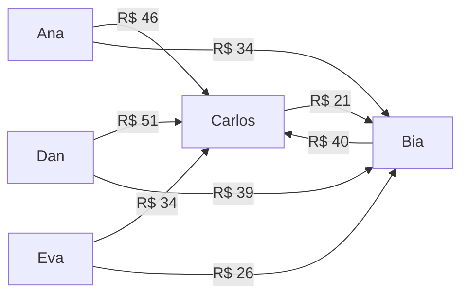
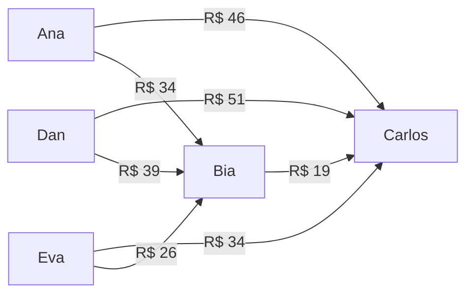
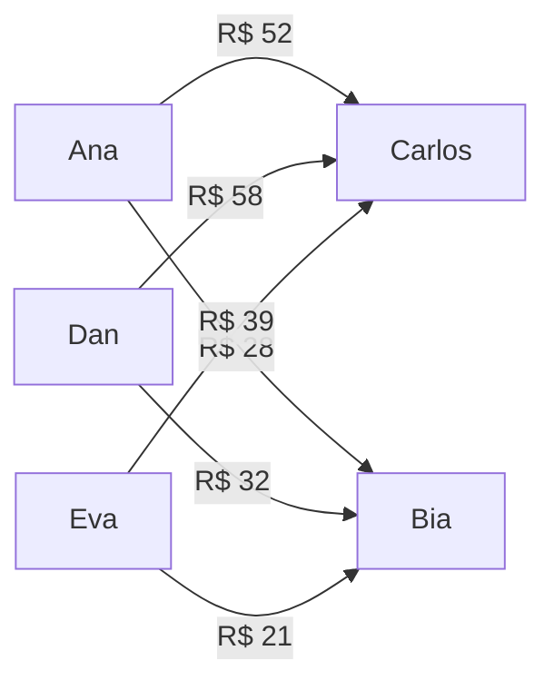
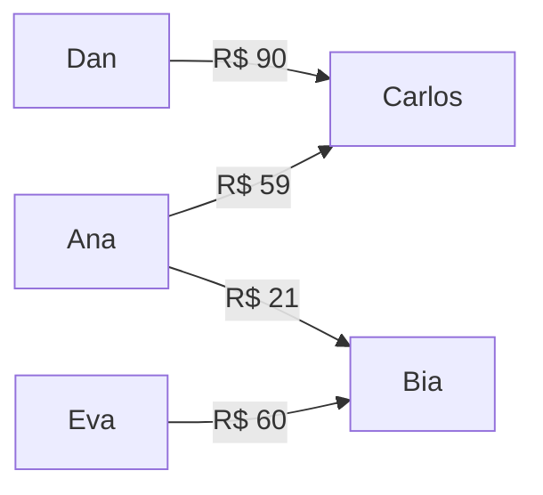

<p align="center">
  
</p>

<p align="center">
  Racha a conta com a galera e liquida via Pix em segundos.
</p>

<p align="center">
  <a href="https://www.dividimos.ai">Web</a> &middot;
  <a href="https://www.dividimos.ai/demo">Demo</a> &middot;
  <a href="https://play.google.com/store/apps/details?id=ai.dividimos.app">Android (WIP)</a>
</p>

<p align="center">
  
  <a href="https://vercel.com/tprei/dividimos"></a>
</p>

---

O Splitwise virou pago. E mesmo quando era grátis, nunca entendeu o Brasil: não gera Pix, não lê NFC-e, não sabe o que é couvert, e cobra em dólar. A gente queria algo que funcionasse do jeito que a galera realmente racha conta aqui &mdash; escaneia o cupom, distribui os itens, gera o QR Code Pix e pronto.

Dividimos é código aberto, feito por quem racha conta pra quem racha conta. Sem assinatura, sem paywall, sem monetização em cima do seu Pix.

## Funcionalidades


```mermaid
flowchart LR
    A[Escaneia cupom / NFC-e] --> B[Distribui itens por pessoa] --> C[Liquida via Pix QR Code]
```

### Entrada de dados

- **Leitura de NFC-e** &mdash; Escaneia o QR da nota fiscal eletrônica e extrai itens, valores e estabelecimento automaticamente
- **OCR de cupom** &mdash; Tira foto do cupom térmico e interpreta abreviações de PDV, formatação brasileira e itens agrupados
- **Entrada por linguagem natural (IA)** &mdash; Digita "jantar 120 dividido em 4" e a IA extrai valor, itens e participantes como rascunho editável
- **Entrada por voz** &mdash; Fala a despesa no celular (reconhecimento nativo) e a IA monta o rascunho
- **Dois modos de conta** &mdash; Itemizada (restaurante com itens por pessoa) ou valor único (Uber, Airbnb, etc.)

### Divisão

- **Divisão flexível** &mdash; Igual, por porcentagem (com sliders visuais) ou valor fixo por pessoa
- **Multi-pagador** &mdash; Registre quem pagou quanto quando mais de uma pessoa cobriu a conta
- **Taxa de serviço** &mdash; Percentual ou valor fixo, distribuído proporcionalmente ao consumo

### Liquidação

- **QR Code Pix** &mdash; Geração de BR Code EMV com Copia e Cola para liquidação instantânea
- **Simplificação de dívidas** &mdash; Minimiza o número de transferências com visualização passo a passo
- **Liquidação com confirmação** &mdash; Devedor registra pagamento, credor confirma. Saldo atualiza atomicamente
- **Cobrar Rápido** &mdash; Gere uma cobrança Pix avulsa (sem grupo) e acompanhe o status no histórico

### Chat e cobrança

- **Conversas 1-a-1** &mdash; Mensagens diretas entre usuários com saldo líquido no cabeçalho e cards de sistema para despesas e liquidações
- **Criação inline** &mdash; Crie rachadinho, cobrança ou liquidação direto na conversa sem sair do chat

### Social


```mermaid
flowchart LR
    A[Criador do grupo] -->|link / QR Code| B[Convidado]
    B -->|aceita convite| A
```

- **Grupos com confirmação mútua** &mdash; Convide por @handle ou link de convite. O membro precisa aceitar
- **Links de convite** &mdash; Gere um link ou QR Code pra compartilhar no WhatsApp, Telegram, etc. Deep link abre direto no app
- **Claim links** &mdash; Adicione convidados sem conta no app. Eles recebem um link pra reivindicar sua parte e pagar via Pix
- **Perfil público** &mdash; `dividimos.ai/u/@handle` é uma página compartilhável que permite iniciar uma conversa
- **Sync em tempo real** &mdash; Supabase Realtime mantém todos os participantes atualizados

### App e notificações

- **PWA instalável** &mdash; Instale no navegador com ícone, splash screen e modo offline básico
- **Push notifications** &mdash; Notificações Web Push e nativas (Android) para cobranças, liquidações e convites
- **Onboarding guiado** &mdash; Tour interativo na primeira sessão apresentando saldo, ações rápidas e liquidação

### Segurança

- **Encryption at rest** &mdash; Chaves Pix criptografadas com AES-256-GCM, decriptadas apenas no servidor
- **Row-Level Security** &mdash; Todas as tabelas do Supabase com RLS. Dados isolados por grupo/usuário
- **Sem enumeração** &mdash; Descoberta de usuários apenas por @handle exato. Sem busca ou listagem

## Stack

| Camada | Tecnologia |
|--------|------------|
| Framework | Next.js 16 (App Router) |
| UI | React 19, Tailwind CSS v4, shadcn/ui, Framer Motion |
| Estado | Zustand |
| Backend | Supabase (PostgreSQL + Auth + Realtime) |
| Auth | Google OAuth (web), Google Credential Manager (Android nativo) |
| Deploy | Vercel (frontend), Supabase (banco de dados) |
| Mobile | Capacitor 8 (Android; iOS em breve) |
| IA | Parsing de linguagem natural, voz e OCR de cupom |
| Linguagem | TypeScript 5 |

## Estrutura

```
src/
├── app/                    # Páginas (Next.js App Router)
│   ├── page.tsx            # Landing page
│   ├── demo/               # Demo pública (sem auth)
│   ├── auth/               # Google OAuth + onboarding
│   ├── app/                # Shell autenticado
│   │   ├── bill/new/       # Wizard de criação de conta
│   │   ├── bill/[id]/      # Detalhe + liquidação
│   │   ├── groups/         # Gestão de grupos
│   │   └── profile/        # Configurações + chave Pix
│   └── api/
│       ├── pix/generate/   # Geração de QR Pix (server-side)
│       └── users/lookup/   # Busca exata por @handle
├── components/
│   ├── bill/               # Steps do wizard + resumo
│   ├── settlement/         # Modal QR, grafo de dívidas
│   └── ui/                 # Primitivos shadcn/ui
├── stores/
│   └── bill-store.ts       # Zustand store
├── lib/
│   ├── crypto.ts           # AES-256-GCM (server-only)
│   ├── pix.ts              # EMV BR Code + CRC16-CCITT
│   ├── simplify.ts         # Algoritmo de simplificação de dívidas
│   ├── currency.ts         # Formatação BRL (centavos inteiros)
│   ├── capacitor/          # Bridge nativo (Android/iOS)
│   └── supabase/           # Clientes + sync
├── hooks/                  # React hooks
└── types/                  # Tipos do domínio + banco
android/                    # Projeto nativo Android (Capacitor)
supabase/
└── migrations/             # Schema PostgreSQL + RLS
```

## Como funciona

### Criação de conta

1. Escolha o tipo &mdash; itemizada ou valor único
2. Adicione título, estabelecimento, data
3. Adicione participantes por @handle
4. Entre os itens ou o valor total
5. Distribua o consumo ou escolha um método de divisão
6. Selecione quem pagou e quanto
7. Revise e crie

### Liquidação e simplificação de dívidas

O app modela as dívidas como um [grafo dirigido](https://en.wikipedia.org/wiki/Directed_graph) ponderado, onde cada aresta representa uma transferência pendente. O pipeline de simplificação reduz o número de arestas (transferências Pix) em quatro etapas.

#### Etapa 1 &mdash; Arestas brutas

`computeRawEdges` gera uma aresta para cada par (consumidor &rarr; pagador), proporcional ao consumo e à contribuição de cada pagador. Taxas de serviço percentuais são distribuídas proporcionalmente ao consumo individual; taxas fixas são divididas igualmente.

#### Etapa 2 &mdash; Cancelamento de pares reversos

Procura pares de arestas antiparalelas (A &rarr; B e B &rarr; A) e as substitui por uma única aresta com o saldo líquido. Isso só se aplica quando duas pessoas devem uma à outra simultaneamente &mdash; por exemplo, quando ambas são pagadoras parciais e consumidoras ao mesmo tempo.

#### Etapa 3 &mdash; [Redução transitiva](https://en.wikipedia.org/wiki/Transitive_reduction)

Se existe uma cadeia A &rarr; B &rarr; C, o intermediário B é eliminado: A passa a dever direto pra C pelo valor mínimo da cadeia. Equivale a resolver o [problema de fluxo](https://en.wikipedia.org/wiki/Network_flow_problem) no caminho, removendo nós de passagem. O algoritmo itera até não restar nenhuma cadeia colapsável.

#### Etapa 4 &mdash; Minimização por saldo líquido

`netAndMinimize` descarta o grafo intermediário e recalcula do zero: soma todas as entradas e saídas de cada participante para obter o saldo líquido. Depois, pareia devedores com credores usando um [algoritmo guloso](https://en.wikipedia.org/wiki/Greedy_algorithm) ordenado por valor decrescente &mdash; o maior devedor paga o maior credor, e assim por diante. Isso produz o número mínimo de transferências.

---

#### Exemplo completo

Jantar de R$ 350. Carlos pagou R$ 200, Bia pagou R$ 150. Cinco pessoas consumiram:

| Pessoa | Consumo | Deve pra Carlos (57%) | Deve pra Bia (43%) |
|--------|---------|----------------------|-------------------|
| Ana | R$ 80 | R$ 46 | R$ 34 |
| Dan | R$ 90 | R$ 51 | R$ 39 |
| Eva | R$ 60 | R$ 34 | R$ 26 |
| Bia | R$ 70 | R$ 40 | &mdash; |
| Carlos | R$ 50 | &mdash; | R$ 21 |

**Após etapa 1** &mdash; arestas brutas (8 arestas):


```mermaid
graph LR
    A[Ana] -->|R$ 46| C[Carlos]
    A -->|R$ 34| B[Bia]
    D[Dan] -->|R$ 51| C
    D -->|R$ 39| B
    E[Eva] -->|R$ 34| C
    E -->|R$ 26| B
    B -->|R$ 40| C
    C -->|R$ 21| B
```

Carlos e Bia são pagadores mas também consumiram:

- Carlos deve R$ 21 pra Bia (pela parte que ela pagou)
- Bia deve R$ 40 pro Carlos (pela parte que ele pagou)

Esse é um par reverso legítimo: duas arestas em direções opostas entre os mesmos nós.

**Após etapa 2** &mdash; cancelamento do par reverso B &harr; C (7 arestas):

- Bia &rarr; Carlos = R$ 40
- Carlos &rarr; Bia = R$ 21
- Saldo líquido: Bia &rarr; Carlos = R$ 19

Duas arestas viram uma:


```mermaid
graph LR
    A[Ana] -->|R$ 46| C[Carlos]
    A -->|R$ 34| B[Bia]
    D[Dan] -->|R$ 51| C
    D -->|R$ 39| B
    E[Eva] -->|R$ 34| C
    E -->|R$ 26| B
    B -->|R$ 19| C
```

**Após etapa 3** &mdash; colapso de cadeias (7 &rarr; 6 arestas):

Três cadeias transitivas passam pela Bia:

- Ana &rarr; Bia &rarr; Carlos
- Dan &rarr; Bia &rarr; Carlos
- Eva &rarr; Bia &rarr; Carlos

O fluxo de R$ 19 que Bia deve pro Carlos é absorvido pelo que ela recebe dos outros.
Parte do pagamento de Ana, Dan e Eva é redirecionado direto pro Carlos, eliminando Bia como intermediária:


```mermaid
graph LR
    A[Ana] -->|R$ 52| C[Carlos]
    A -->|R$ 28| B[Bia]
    D[Dan] -->|R$ 58| C
    D -->|R$ 32| B
    E[Eva] -->|R$ 39| C
    E -->|R$ 21| B
```

Bia agora é credora pura (só recebe).
Carlos é credor puro (só recebe).
Sem mais cadeias colapsáveis.

**Após etapa 4** &mdash; minimização por saldo líquido (4 arestas):

Saldos finais de cada participante:

| Pessoa | Saldo |
|--------|-------|
| Dan | -90 (deve) |
| Ana | -80 (deve) |
| Eva | -60 (deve) |
| Bia | +81 (recebe) |
| Carlos | +149 (recebe) |

Pareamento guloso &mdash; maior devedor com maior credor:

1. Dan (-90) paga R$ 90 a Carlos (+149) &rarr; Carlos fica +59
2. Ana (-80) paga R$ 59 a Carlos (+59) &rarr; Carlos zerado. Ana fica -21
3. Ana (-21) paga R$ 21 a Bia (+81) &rarr; Ana zerada. Bia fica +60
4. Eva (-60) paga R$ 60 a Bia (+60) &rarr; ambos zerados


```mermaid
graph LR
    D[Dan] -->|R$ 90| C[Carlos]
    A[Ana] -->|R$ 59| C
    A -->|R$ 21| B[Bia]
    E[Eva] -->|R$ 60| B
```

**Resultado: 8 arestas &rarr; 4 transferências Pix.**

Cada passo intermediário é registrado com as arestas removidas e adicionadas, alimentando a visualização paginada no app. Cada participante gera um QR Code Pix para pagar sua parte direto.

---

## Quick orientation

- `src/app/` — Next.js 16 App Router pages. Main flows: landing (`page.tsx`), demo (`demo/`), auth (`auth/`), app shell (`app/`)
- `src/app/auth/` — Google OAuth sign-in, callback route handler, onboarding (handle + Pix key). No phone or 2FA.
- `src/app/app/groups/` — Groups with mutual confirmation (invite/accept flow)
- `src/app/api/pix/generate/` — Server-side Pix Copia e Cola generation (decrypts key server-side)
- `src/app/api/users/lookup/` — Exact @handle lookup for authenticated users
- `src/stores/bill-store.ts` — Zustand store for the expense wizard. Manages draft creation, item management, splits, payer tracking, and client-side debt preview via `computeLedger()`
- `src/lib/supabase/expense-actions.ts` — CRUD via the expense-graph RPCs: `saveExpenseDraft` (`save_expense_draft_graph`), `loadExpense`, `deleteExpense`, `listGroupExpenses`
- `src/lib/supabase/expense-rpc.ts` — Wraps `activate_saved_expense` and `load_expense_graph_snapshot`. Activation is CAS-guarded by `graph_revision` and atomically updates `balances`
- `src/lib/supabase/settlement-actions.ts` — Balance queries, `recordSettlement` (pending), `confirmSettlement` (RPC), settlement history
- `src/lib/supabase/expense-mappers.ts` — Row → TypeScript type mappers for all expense tables
- `src/lib/crypto.ts` — Server-only AES-256-GCM encryption for Pix keys. Never import from client components
- `src/lib/pix.ts` — EMV BR Code generation with CRC16-CCITT, plus key validation and masking
- `src/lib/simplify.ts` — Debt simplification algorithm for display. `computeRawEdges` generates proportional edges, `simplifyDebts` reduces them with step recording for visualization
- `src/lib/currency.ts` — All money is integer centavos. `formatBRL` for display, `decimalToCents` for input
- `src/hooks/use-auth.ts` — Client-side hook for current authenticated user profile
- `src/components/bill/` — Expense wizard components (type selector, item card, payer step, single amount step, summary, handle-based participant addition)
- `src/components/settlement/` — Pix QR modal, debt graph SVG, simplification viewer and toggle
- `src/components/shared/user-avatar.tsx` — Circular avatar with Google photo or initials fallback
- `src/types/index.ts` — Domain types: `Expense`, `ExpenseItem`, `ExpenseShare`, `ExpensePayer`, `Balance`, `Settlement`, `DebtEdge`, `GroupBalanceSummary`. `User` has handle, email, pixKeyHint (never raw key). Legacy `Bill`/`BillItem` aliases exist for gradual migration
- `src/types/database.ts` — Supabase database types including `user_profiles` view
- `supabase/migrations/` — PostgreSQL schema with RLS policies. Uses `gen_random_uuid()`, not `uuid_generate_v4()`. Key migrations: `*_create_expense_tables.sql` (tables + RLS), `*_create_expense_rpc_functions.sql` (atomic RPCs)

## Local development setup

```bash
./scripts/dev-setup.sh       # auto-detects Docker → local Supabase, else remote
npm run dev                  # start dev server
```

**With Docker** (full local Supabase): the script runs `supabase start` and writes `.env.local`.

**Without Docker** (remote Supabase): set `SUPABASE_URL`, `SUPABASE_ANON_KEY`, and `SUPABASE_SERVICE_ROLE_KEY` env vars before running the script, or it writes placeholder values (public pages only).

**Without any env vars**: the middleware gracefully degrades — `/` and `/demo` render, protected pages redirect to `/`.

### Remote Supabase (no Docker)

When Docker is not available, use a remote Supabase project. Set the required env vars before running the setup script:

```bash
export SUPABASE_URL=https://<project-ref>.supabase.co
export SUPABASE_ANON_KEY=<your-anon-key>
export SUPABASE_SERVICE_ROLE_KEY=<your-service-role-key>

./scripts/dev-setup.sh       # detects env vars, writes .env.local
npm run dev
```

These can also be provided as Fly secrets if running on Fly.io — the script reads them automatically.

### Programmatic login (dev only)

Requires two conditions: `NODE_ENV=development` (or `test`) **and** `DEV_LOGIN_SECRET` set to a non-empty string. The caller must pass the same value in the `x-dev-login-secret` header.

```bash
curl -X POST http://localhost:3000/api/dev/login \
  -H 'Content-Type: application/json' \
  -H 'x-dev-login-secret: your-local-secret' \
  -d '{"email": "alice@test.dividimos.local"}'
```

The endpoint auto-creates the user if not found. The response sets session cookies. Production never sets `DEV_LOGIN_SECRET`, so the route returns 404 even if `NODE_ENV` is somehow misconfigured.

## Commands

```bash
npm run dev                  # Start dev server
npm run build                # Production build (verifies types)
npm run lint                 # ESLint (--max-warnings 0)
npm run test                 # Run unit tests once
npm run test:watch           # Run unit tests in watch mode
npm run test:integration     # Run integration tests (requires supabase start)
npm run test:all             # Run unit + integration tests
npm run test:synthetic       # Run Playwright synthetic E2E tests
./scripts/dev-setup.sh       # One-command local setup
supabase db push --linked    # Apply migrations to remote
```

## CI

CI runs on every pull request and on push to `main` across several workflows in `.github/workflows/`:

- `ci.yml` — `npm test` (unit), `npx tsc --noEmit` (type check), `npm run lint`.
- `integration.yml` — `npm run test:integration` against a fresh local Supabase instance.
- `synthetic.yml` — `npm run test:synthetic` (Playwright) against local Supabase + the dev server, sharded.
- `migrations.yml` — replays every migration on a fresh database and rejects renamed or deleted migration files. Triggered when `supabase/migrations/**` changes.
- `android.yml` — signed Android release AAB via Capacitor, on push to `main`.

### Android build secrets (`.github/workflows/android.yml`)

Triggers on push to `main`. Builds a signed release AAB using Capacitor's native Android project.

**Required GitHub secrets**:
- `ANDROID_KEYSTORE_BASE64` — Base64-encoded release keystore (`.jks`)
- `KEYSTORE_STORE_PASSWORD` — Keystore password
- `KEYSTORE_KEY_ALIAS` — Key alias name
- `KEYSTORE_KEY_PASSWORD` — Key alias password
- `GOOGLE_SERVICES_JSON` — *(optional)* Base64-encoded `google-services.json` for FCM/Google Sign-In

**versionCode strategy**: Uses `github.run_number` (auto-incrementing). For Play Store releases, consider switching to tag-based versioning.

**Build output**: Signed AAB uploaded as artifact (`app-release-<run_number>`), retained for 7 days.

## Testing

Dividimos has three test layers: **unit**, **integration**, and **synthetic (E2E)**. `TESTING.md` is the detailed guide for all three. Summary of configuration and conventions:

Unit tests use Vitest with React Testing Library. Tests are colocated with source files using `.test.ts`/`.test.tsx` suffix.

- **Configuration**: `vitest.config.mts` with happy-dom environment and tsconfig paths.
- **Test setup**: `src/test/setup.ts` provides jest-dom matchers and a Framer Motion mock.

Integration tests run against a real local Supabase instance and verify RLS policies.

- **Configuration**: `vitest.integration.config.mts` with node environment, 30s timeout, sequential execution.
- **Test setup**: `src/test/integration-setup.ts` — connects with service role key, cleans up test users after each run.
- **Helpers**: `src/test/integration-helpers.ts` — `createTestUser`, `authenticateAs`, `createTestUsers`, `createTestBill`, `createTestGroup`.
- **Running locally**:

```bash
supabase start
npm run test:integration
```

- **Writing integration tests**: use `.integration.test.ts` suffix, wrap in `describe.skipIf(!isIntegrationTestReady)` so they are skipped when env vars are absent.

**Migrations with semantic logic must be covered by integration tests.** Any new migration that adds or modifies an RPC, RLS policy, trigger, or constraint needs behavior coverage in `*.integration.test.ts` — happy path, RLS denial for outsiders, and the edge cases the SQL specifically guards (locks, validation, accepted-membership checks). The coverage can extend an existing test file or live in a new one; what matters is that an integration test exercises the change. Pure structural migrations (adding an index, renaming a column with no semantic change) are exempt. The migration-replay CI job only proves the SQL applies cleanly; it does not exercise behavior.

## Key concepts

**Authentication**: Google OAuth via Supabase Auth. No phone or 2FA. On first login, a trigger auto-creates a user profile with handle derived from email. Users complete onboarding by confirming handle and setting their Pix key.

**Pix key security**: Keys are encrypted with AES-256-GCM (`src/lib/crypto.ts`) before storage. Raw keys never reach the client. QR codes are generated server-side via `POST /api/pix/generate`. The `pix_key_hint` column stores a masked display version. Supported key types: `cpf`, `email`, `random`.

**User discovery**: No search functionality. Users add others by exact @handle to prevent enumeration. The `user_profiles` view exposes only id, handle, name, avatar_url.

**Groups**: Persisted in Supabase. Invite by @handle → member must accept (mutual confirmation). Only `accepted` members appear in expense creation and can view group data (RLS enforced).

**Expense model (Splitwise-inspired)**: Every expense belongs to a group. Two types: `single_amount` (one total split among participants) and `itemized` (line items assigned per person). The wizard step array is computed dynamically from expense type.

**Expense lifecycle: Draft → Active → Settled**:
1. **Draft**: User builds the expense in the wizard. `saveExpenseDraft()` calls the `save_expense_draft_graph` RPC, which validates and atomically replaces the full expense graph (parent, items, shares, guest shares, payers, participant map) in one transaction. Can be edited or deleted.
2. **Active**: `activate_saved_expense` RPC re-validates the locked persisted graph (including payer reachability — see below), atomically transitions status, and updates the `balances` table. Guarded by a `graph_revision` compare-and-swap: an expected revision that doesn't match the current one is rejected (`PST08/stale_graph_revision`) instead of silently overwriting a concurrent edit. This is the point of no return.
3. **Settled**: All debts from this expense have been settled (balances reach zero).

**Expense-graph mutation guards**: every write to an expense's items/shares/payers/guests — including trusted direct SQL, not only the public RPCs — goes through a `graph_revision` CAS and a transaction-scoped mutation-token registry that rejects any write outside an authorized, named context (`graph_mutation_unauthorized`). A payer must always reference an existing user share row (`expense_payers_participant_fkey`, deferrable, validated); a total-changing edit clears every payer, a share-only edit preserves them. A `financial_internal.financial_compatibility_state` singleton gates every financial RPC first, before authentication, so a declared maintenance window (used only around breaking schema cutovers) fails every financial write/read closed instead of partially applying.

**Balances (running net ledger)**: The `balances` table stores one row per (group, user_a, user_b) pair where `user_a < user_b` (canonical UUID ordering). Positive `amount_cents` means user_a owes user_b; negative means the reverse. Balances are never written directly — only via `activate_saved_expense` and `confirm_settlement` RPC functions (SECURITY DEFINER). This prevents race conditions and ensures atomicity.

**Settlements (two-step confirmation)**: A debtor creates a pending settlement (`recordSettlement`). The creditor confirms it (`confirmSettlement` RPC), which atomically updates the balance toward zero. This mirrors Splitwise's "record a payment" flow.

**Simplification**: `computeRawEdges` generates one edge per (consumer, payer) pair. `simplifyDebts` finds chains and reverse pairs, recording each step for the paginated visualization. Used for display only — the canonical balance data lives in the `balances` table.

**Money**: Always integer centavos in the store, types, and database, capped at `MAX_EXPENSE_CENTS = 99_999_999` per expense. Never floating point for arithmetic; `src/lib/expense-money.ts` is the sole owner of the product cap and fee formula. `formatBRL` converts to display strings. All item/share/payer/fee equality is exact (no cent tolerance).

**Fee distribution**: Service fee is stored as integer basis points (`expenses.service_fee_basis_points`, 0–10000), computed as nonnegative half-up rounding of `subtotal * basisPoints / 10_000` and distributed proportionally to item consumption. Fixed fees are cents, divided equally among all participants.

**Demo page**: Public at `/demo`, no auth. Pre-computed settlement showcase with interactive QR codes.

For contributor workflow and code-review rules, see `CONTRIBUTING.md`. For agent rules, see `AGENTS.md`.


## Licença

Privado. Todos os direitos reservados.
