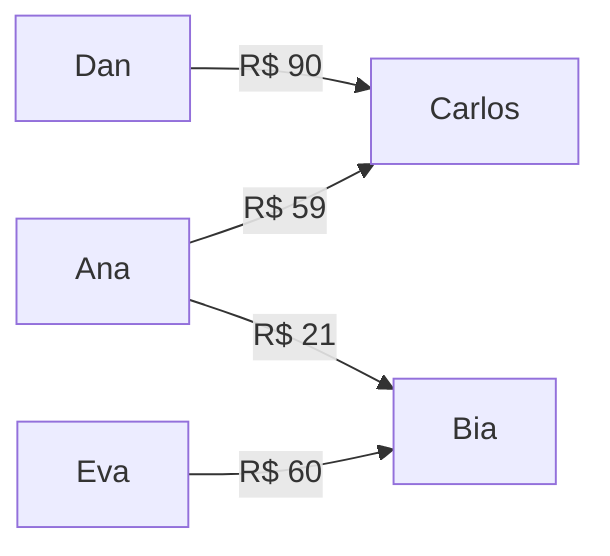

<p align="center">
  
</p>

<p align="center">
  Racha a conta com a galera e liquida via Pix em segundos.
</p>

<p align="center">
  <a href="https://www.dividimos.ai">Web</a> &middot;
  <a href="https://www.dividimos.ai/demo">Demo</a> &middot;
  <a href="https://play.google.com/store/apps/details?id=ai.dividimos.app">Android (WIP)</a>
</p>

<p align="center">
  
  <a href="https://vercel.com/tprei/dividimos"></a>
</p>

---

O Splitwise virou pago. E mesmo quando era grátis, nunca entendeu o Brasil: não gera Pix, não lê NFC-e, não sabe o que é couvert, e cobra em dólar. A gente queria algo que funcionasse do jeito que a galera realmente racha conta aqui &mdash; escaneia o cupom, distribui os itens, gera o QR Code Pix e pronto.

Dividimos é código aberto, feito por quem racha conta pra quem racha conta. Sem assinatura, sem paywall, sem monetização em cima do seu Pix.

## Funcionalidades


```mermaid
flowchart LR
    A[Escaneia cupom / NFC-e] --> B[Distribui itens por pessoa] --> C[Liquida via Pix QR Code]
```

### Entrada de dados

- **Leitura de NFC-e** &mdash; Escaneia o QR da nota fiscal eletrônica e extrai itens, valores e estabelecimento automaticamente
- **OCR de cupom** &mdash; Tira foto do cupom térmico e interpreta abreviações de PDV, formatação brasileira e itens agrupados
- **Entrada por linguagem natural (IA)** &mdash; Digita "jantar 120 dividido em 4" e a IA extrai valor, itens e participantes como rascunho editável
- **Entrada por voz** &mdash; Fala a despesa no celular (reconhecimento nativo) e a IA monta o rascunho
- **Dois modos de conta** &mdash; Itemizada (restaurante com itens por pessoa) ou valor único (Uber, Airbnb, etc.)

### Divisão

- **Divisão flexível** &mdash; Igual, por porcentagem (com sliders visuais) ou valor fixo por pessoa
- **Multi-pagador** &mdash; Registre quem pagou quanto quando mais de uma pessoa cobriu a conta
- **Taxa de serviço** &mdash; Percentual ou valor fixo, distribuído proporcionalmente ao consumo

### Liquidação

- **QR Code Pix** &mdash; Geração de BR Code EMV com Copia e Cola para liquidação instantânea
- **Simplificação de dívidas** &mdash; Minimiza o número de transferências com visualização passo a passo
- **Liquidação com confirmação** &mdash; Devedor registra pagamento, credor confirma. Saldo atualiza atomicamente
- **Cobrar Rápido** &mdash; Gere uma cobrança Pix avulsa (sem grupo) e acompanhe o status no histórico

### Chat e cobrança

- **Conversas 1-a-1** &mdash; Mensagens diretas entre usuários com saldo líquido no cabeçalho e cards de sistema para despesas e liquidações
- **Criação inline** &mdash; Crie rachadinho, cobrança ou liquidação direto na conversa sem sair do chat

### Social


```mermaid
flowchart LR
    A[Criador do grupo] -->|link / QR Code| B[Convidado]
    B -->|aceita convite| A
```

- **Grupos com confirmação mútua** &mdash; Convide por @handle ou link de convite. O membro precisa aceitar
- **Links de convite** &mdash; Gere um link ou QR Code pra compartilhar no WhatsApp, Telegram, etc. Deep link abre direto no app
- **Claim links** &mdash; Adicione convidados sem conta no app. Eles recebem um link pra reivindicar sua parte e pagar via Pix
- **Perfil público** &mdash; `dividimos.ai/u/@handle` é uma página compartilhável que permite iniciar uma conversa
- **Sync em tempo real** &mdash; Broadcasts privados do Supabase Realtime (tópicos `group:` e `chat:`) mantêm todos os participantes atualizados

### App e notificações

- **PWA instalável** &mdash; Instale no navegador com ícone, splash screen e modo offline básico
- **Push notifications** &mdash; Notificações Web Push e nativas (Android) para cobranças, liquidações e convites
- **Onboarding guiado** &mdash; Tour interativo na primeira sessão apresentando saldo, ações rápidas e liquidação

### Segurança

- **Encryption at rest** &mdash; Chaves Pix criptografadas com AES-256-GCM, decriptadas apenas no servidor
- **Acesso só via RPC** &mdash; RLS habilitado em todas as tabelas, sem políticas e sem grants para `anon`/`authenticated`; toda leitura e escrita passa por funções `SECURITY DEFINER` que checam membership no grupo
- **Sem enumeração** &mdash; Descoberta de usuários apenas por @handle exato. Sem busca ou listagem

## Stack

| Camada | Tecnologia |
|--------|------------|
| Framework | Next.js 16 (App Router) |
| UI | React 19, Tailwind CSS v4, shadcn/ui, Framer Motion |
| Estado | Zustand (local-first, persistido em IndexedDB) |
| Backend | Supabase (PostgreSQL + Auth + Realtime; acesso exclusivo via RPCs `SECURITY DEFINER`) |
| Auth | Google OAuth (web), Google Credential Manager (Android nativo) |
| Deploy | Vercel (frontend), Supabase (banco de dados) |
| Mobile | Capacitor 8 (Android; iOS em breve) |
| IA | Parsing de linguagem natural, voz e OCR de cupom |
| Linguagem | TypeScript 5 |

## Estrutura

```
src/
├── app/                    # Páginas (Next.js App Router)
│   ├── page.tsx            # Landing page
│   ├── demo/               # Demo pública (sem auth)
│   ├── auth/               # Google OAuth + onboarding
│   ├── app/                # Shell autenticado (pré-renderizado, servido cache-first pelo service worker)
│   │   ├── bill/new/       # Wizard de criação de conta
│   │   ├── bill/[id]/      # Detalhe + liquidação
│   │   ├── groups/         # Gestão de grupos
│   │   ├── conversations/  # Conversas 1-a-1
│   │   └── profile/        # Configurações + chave Pix
│   └── api/
│       ├── pix/generate/   # Geração de QR Pix (server-side)
│       ├── notify/         # Claim de eventos + fan-out de push
│       └── users/lookup/   # Busca exata por @handle
├── components/
│   ├── bill/               # Steps do wizard + resumo
│   ├── settlement/         # Modal QR, grafo de dívidas
│   └── ui/                 # Primitivos shadcn/ui
├── stores/
│   ├── app-store.ts        # Estado local-first (Zustand + persist/IndexedDB)
│   └── bill-store.ts       # Estado do wizard de despesa
├── lib/
│   ├── crypto.ts           # AES-256-GCM (server-only)
│   ├── pix.ts              # EMV BR Code + CRC16-CCITT
│   ├── currency.ts         # Formatação BRL (centavos inteiros)
│   ├── expense-money.ts    # Dono único do cap e da fórmula de taxa
│   ├── ledger/             # Decodificação do snapshot, saldos e minimização de transferências
│   ├── sync/               # Toda a rede: bootstrap, mutations otimistas, refresh, realtime, auth
│   ├── simplify.ts         # Preview de dívidas do wizard e da demo
│   ├── capacitor/          # Bridge nativo (Android/iOS)
│   └── supabase/           # Clientes browser/server/admin
├── hooks/                  # React hooks
└── types/                  # Tipos do domínio + banco
android/                    # Projeto nativo Android (Capacitor)
public/sw.js                # Service worker (shell /app cache-first)
supabase/
├── schemas/                # Schema declarativo (fonte da verdade)
└── migrations/             # Baseline gerado por scripts/build-baseline.sh

### Criação de conta

1. Escolha o tipo &mdash; itemizada ou valor único
2. Adicione título, estabelecimento, data
3. Adicione participantes por @handle
4. Entre os itens ou o valor total
5. Distribua o consumo ou escolha um método de divisão
6. Selecione quem pagou e quanto
7. Revise e crie

### Liquidação e minimização de transferências

O banco guarda apenas os fatos financeiros e um saldo por participante &mdash; nunca transferências prontas.

- **Fatos** &mdash; `expense_versions` (uma linha por edição, com o `payload` completo e um `change_summary`) e `settlements` (liquidações com confirmação). Nada mais é fato financeiro.
- **Projeção** &mdash; `group_balances` tem uma linha por `(grupo, tipo, participante)` com o `net_cents` assinado: positivo significa que o participante recebe, negativo que deve. Convidados sem conta participam com `kind = 'guest'` e podem carregar saldo até serem reclamados via claim link.
- **Projeção nunca é escrita à mão** &mdash; todo RPC que altera o financeiro (criar, editar, excluir ou restaurar despesa, liquidação, claim de convidado) chama `recompute_group_balances(group)` dentro da mesma transação, reprocessando os fatos do zero. Tudo ou nada: ou o fato e a projeção caem juntos, ou nada cai.
- **Transferências são calculadas na leitura** &mdash; `group_transfers(group)` em SQL e `transfersFromBalances` em TypeScript implementam o mesmo algoritmo guloso de dois ponteiros sobre os saldos (testado em paridade sobre 200 ledgers aleatórios). O conjunto mínimo de transferências Pix sai direto dos saldos, sem tabela intermediária.

---

#### Exemplo completo

Jantar de R$ 350. Carlos pagou R$ 200, Bia pagou R$ 150. Cinco pessoas consumiram:

| Pessoa | Consumo | Deve pra Carlos (57%) | Deve pra Bia (43%) |
|--------|---------|----------------------|-------------------|
| Ana | R$ 80 | R$ 46 | R$ 34 |
| Dan | R$ 90 | R$ 51 | R$ 39 |
| Eva | R$ 60 | R$ 34 | R$ 26 |
| Bia | R$ 70 | R$ 40 | &mdash; |
| Carlos | R$ 50 | &mdash; | R$ 21 |

Somando as dívidas brutas de cada um (o que deve menos o que tem a receber), a projeção fica:

| Pessoa | Saldo |
|--------|-------|
| Dan | -90 (deve) |
| Ana | -80 (deve) |
| Eva | -60 (deve) |
| Bia | +81 (recebe) |
| Carlos | +149 (recebe) |

Carlos e Bia são pagadores mas também consumiram, então aparecem dos dois lados &mdash; o saldo líquido já absorve isso. A essa altura existe um par reverso contábil entre os dois (Bia deve R$ 40 pro Carlos, Carlos deve R$ 21 pra Bia), mas ele nunca vira linha no banco: some no `net_cents` de cada um.

Na leitura, o pareamento guloso cruza o maior devedor com o maior credor:

1. Dan (-90) paga R$ 90 a Carlos (+149) &rarr; Carlos fica +59
2. Ana (-80) paga R$ 59 a Carlos (+59) &rarr; Carlos zerado. Ana fica -21
3. Ana (-21) paga R$ 21 a Bia (+81) &rarr; Ana zerada. Bia fica +60
4. Eva (-60) paga R$ 60 a Bia (+60) &rarr; ambos zerados


```mermaid
graph LR
    D[Dan] -->|R$ 90| C[Carlos]
    A[Ana] -->|R$ 59| C
    A -->|R$ 21| B[Bia]
    E[Eva] -->|R$ 60| B
```

**Resultado: 8 dívidas brutas &rarr; 4 transferências Pix, calculadas na hora da leitura.**

Cada transferência gera um QR Code Pix pra pagar a parte direto. No wizard e na demo, `src/lib/simplify.ts` roda o mesmo pareamento no cliente sobre arestas brutas para alimentar a visualização passo a passo; no banco, o resultado canônico é sempre recalculado a partir dos saldos.

---

## Quick orientation

- `src/app/` — Next.js 16 App Router pages. Main flows: landing (`page.tsx`), demo (`demo/`), auth (`auth/`), app shell (`app/`, prerendered and served cache-first by `public/sw.js`)
- `src/app/auth/` — Google OAuth sign-in, callback route handler, onboarding (handle + Pix key). No phone or 2FA.
- `src/app/app/groups/` — Groups with mutual confirmation (invite/accept flow)
- `src/app/api/pix/generate/` — Server-side Pix Copia e Cola generation (decrypts key server-side)
- `src/app/api/users/lookup/` — Exact @handle lookup for authenticated users
- `src/app/api/notify/` — Claims a `group_events` row once (`notified_at`) and fans out push with `describeEvent` copy and per-user category preferences
- `src/stores/app-store.ts` — Zustand + `persist` over `src/lib/idb-storage.ts`. Holds the bootstrap snapshot, expense lists and details, activity, and conversations. Screens read the store; they never query Supabase.
- `src/lib/sync/` — All network access. `client` (typed RPC caller), `bootstrap` (initial snapshot), `refresh` (`refreshGroup`), `realtime` (private `group:`/`chat:` topics), `auth` (session listener), `mutations`/`mutations-group` (optimistic patch, per-entry rollback, reconcile with `refreshGroup`)
- `src/lib/ledger/` — Wire decoding (`decode.ts`), activity/chat copy (`describeEvent` in `event-copy.ts`), debt rows for the UI (`debt-rows.ts`), balance delta application (`apply.ts`), minimized transfers (`transfers.ts`: `transfersFromBalances`, `netAndMinimize`), and the `*.integration.test.ts` RPC suites
- `src/lib/simplify.ts` — Debt simplification for the wizard/demo preview. `computeRawEdges` generates proportional edges, `simplifyDebts` reduces them with step recording for visualization. Canonical group transfers come from the database at read time (`group_transfers`).
- `src/lib/crypto.ts` — Server-only AES-256-GCM encryption for Pix keys. Never import from client components
- `src/lib/pix.ts` — EMV BR Code generation with CRC16-CCITT, plus key validation and masking
- `src/lib/currency.ts` — All money is integer centavos. `formatBRL` for display, `parseSafeMinorUnitCents` for input
- `src/lib/expense-money.ts` — Sole owner of `MAX_EXPENSE_CENTS` and the service-fee formula
- `src/hooks/use-auth.ts` — Client-side hook reading the signed-in user from the app store
- `src/components/bill/` — Expense wizard components (type selector, item card, payer step, single amount step, summary, handle-based participant addition)
- `src/components/settlement/` — Pix QR modal, debt graph SVG, simplification viewer and toggle
- `src/components/shared/user-avatar.tsx` — Circular avatar with Google photo or initials fallback
- `src/types/ledger.ts` — Wire/domain types from the RPCs: `Me`, `GroupSnapshot`, `BalanceRow`, `Transfer`, `ExpensePayload`, `ExpenseVersion`. `src/types/index.ts` — UI domain types: `User`, `Expense`, `GroupMember`, `DebtEdge`. `User` has handle, email, pixKeyHint (never raw key). `src/lib/sync/errors.ts` — `LedgerError` with typed codes (`stale_version`, `nudge_cooldown`)
- `supabase/schemas/` — Declarative SQL: tables, grants, RPCs, realtime, triggers. Source of truth; `supabase/migrations/` holds only the generated baseline
- `supabase/config.toml` — Local Supabase project config. `supabase/seed.sql` — dev seed data

## Local development setup

```bash
./scripts/dev-setup.sh       # auto-detects Docker → local Supabase, else remote
npm run dev                  # start dev server
```

**With Docker** (full local Supabase): the script runs `supabase start` and writes `.env.local`.

**Without Docker** (remote Supabase): set `SUPABASE_URL`, `SUPABASE_ANON_KEY`, and `SUPABASE_SERVICE_ROLE_KEY` env vars before running the script, or it writes placeholder values (public pages only).

**Schema**: `supabase/schemas/*.sql` is the declarative source of truth; `supabase/migrations/20260906000000_ledger_baseline.sql` is its generated concatenation. After editing a schema file, run `./scripts/build-baseline.sh` and commit both — CI fails if the baseline is stale. `supabase db reset` replays the baseline on a fresh local database.

**Without any env vars**: the middleware gracefully degrades — `/` and `/demo` render, protected pages redirect to `/`.

### Remote Supabase (no Docker)

When Docker is not available, use a remote Supabase project. Set the required env vars before running the setup script:

```bash
export SUPABASE_URL=https://<project-ref>.supabase.co
export SUPABASE_ANON_KEY=<your-anon-key>
export SUPABASE_SERVICE_ROLE_KEY=<your-service-role-key>

./scripts/dev-setup.sh       # detects env vars, writes .env.local
npm run dev
```

These can also be provided as Fly secrets if running on Fly.io — the script reads them automatically.

### Programmatic login (dev only)

Requires two conditions: `NODE_ENV=development` (or `test`) **and** `DEV_LOGIN_SECRET` set to a non-empty string. The caller must pass the same value in the `x-dev-login-secret` header.

```bash
curl -X POST http://localhost:3000/api/dev/login \
  -H 'Content-Type: application/json' \
  -H 'x-dev-login-secret: your-local-secret' \
  -d '{"email": "alice@test.dividimos.local"}'
```

The endpoint auto-creates the user if not found. The response sets session cookies. Production never sets `DEV_LOGIN_SECRET`, so the route returns 404 even if `NODE_ENV` is somehow misconfigured.

## Commands

```bash
npm run dev                  # Start dev server
npm run build                # Production build (verifies types)
npm run lint                 # ESLint (--max-warnings 0)
npm run test                 # Run unit tests once
npm run test:watch           # Run unit tests in watch mode
npm run test:integration     # Run integration tests (requires supabase start)
npm run test:all             # Run unit + integration tests
npm run test:synthetic       # Run Playwright synthetic E2E tests
./scripts/dev-setup.sh       # One-command local setup
./scripts/build-baseline.sh # Regenerate the SQL baseline from supabase/schemas/
supabase db push --linked    # Apply the baseline to a linked remote database
```

## CI
CI runs on every pull request and on push to `main` across several workflows in `.github/workflows/`:

- `ci.yml` — `npm test` (unit), `npx tsc --noEmit` (type check), `npm run lint`.
- `integration.yml` — `npm run test:integration` against a fresh local Supabase instance.
- `synthetic.yml` — `npm run test:synthetic` (Playwright) against local Supabase + the dev server, sharded.
- `migrations.yml` — replays the baseline on a fresh database, fails if the baseline is stale relative to `supabase/schemas/`, and rejects renamed or deleted migration files. Triggered when `supabase/schemas/**`, `supabase/migrations/**`, or `scripts/build-baseline.sh` changes.
- `android.yml` — signed Android release AAB via Capacitor, on push to `main`.

### Android build secrets (`.github/workflows/android.yml`)

Triggers on push to `main`. Builds a signed release AAB using Capacitor's native Android project.

**Required GitHub secrets**:
- `ANDROID_KEYSTORE_BASE64` — Base64-encoded release keystore (`.jks`)
- `KEYSTORE_STORE_PASSWORD` — Keystore password
- `KEYSTORE_KEY_ALIAS` — Key alias name
- `KEYSTORE_KEY_PASSWORD` — Key alias password
- `GOOGLE_SERVICES_JSON` — *(optional)* Base64-encoded `google-services.json` for FCM/Google Sign-In

**versionCode strategy**: Uses `github.run_number` (auto-incrementing). For Play Store releases, consider switching to tag-based versioning.

**Build output**: Signed AAB uploaded as artifact (`app-release-<run_number>`), retained for 7 days.

## Testing

Dividimos has three test layers: **unit**, **integration**, and **synthetic (E2E)**. `TESTING.md` is the detailed guide for all three. Summary of configuration and conventions:

Unit tests use Vitest with React Testing Library. Tests are colocated with source files using `.test.ts`/`.test.tsx` suffix.

- **Configuration**: `vitest.config.mts` with happy-dom environment and tsconfig paths.
- **Test setup**: `src/test/setup.ts` provides jest-dom matchers and a Framer Motion mock.

Integration tests run against a real local Supabase instance and cover the ledger RPC layer (`src/lib/ledger/*.integration.test.ts`, 131 tests).

- **Configuration**: `vitest.integration.config.mts` with node environment, 30s timeout, sequential execution.
- **Test setup**: `src/test/integration-setup.ts` — connects with service role key, cleans up test users after each run.
- **Helpers**: `src/test/integration-helpers.ts` — `createTestUser`, `createTestUsers`, `authenticateAs`, `createGroup`, `createGroupWithMembers`, `createExpense`, `withPg` (direct `pg` access), `expectRpcError`. `src/test/fixtures.ts` provides payload/object builders.
- **Running locally**:

```bash
supabase db reset
npm run test:integration
```

- **Writing integration tests**: use `.integration.test.ts` suffix, wrap in `describe.skipIf(!isIntegrationTestReady)` so they are skipped when env vars are absent. SQL behavior is covered entirely by these TypeScript suites.

**Schema changes with semantic logic must be covered by integration tests.** Any change to `supabase/schemas/*.sql` that adds or modifies an RPC, realtime topic, trigger, or constraint needs behavior coverage in `*.integration.test.ts` — happy path, denial for non-members, and the edge cases the SQL specifically guards (locks, validation, membership checks). The coverage can extend an existing test file or live in a new one; what matters is that an integration test exercises the change. Pure structural changes (adding an index, renaming a column with no semantic change) are exempt. The baseline-replay CI job only proves the SQL applies cleanly; it does not exercise behavior.

## Key concepts

**Authentication**: Google OAuth via Supabase Auth. No phone or 2FA. On first login, a trigger auto-creates a user profile with handle derived from email. Users complete onboarding by confirming handle and setting their Pix key.

**Pix key security**: Keys are encrypted with AES-256-GCM (`src/lib/crypto.ts`) before storage. Raw keys never reach the client. QR codes are generated server-side via `POST /api/pix/generate`. The `pix_key_hint` column stores a masked display version. Supported key types: `cpf`, `email`, `phone`, `random`.

**User discovery**: No search functionality. Users add others by exact @handle to prevent enumeration. The `lookup_user_by_handle` RPC matches the full handle exactly and exposes only id, handle, name and avatar.

**Groups**: Persisted in Supabase. Invite by @handle → member must accept (mutual confirmation). Only `accepted` members appear in expense creation and can view group data — enforced inside every RPC by membership checks.

**Local-first client**: Screens read the Zustand store (`src/stores/app-store.ts`, persisted to IndexedDB via `src/lib/idb-storage.ts`) and never query Supabase directly. All network lives in `src/lib/sync/`: a bootstrap snapshot on sign-in, optimistic mutations that roll back per entry on failure and reconcile with `refreshGroup`, and realtime broadcasts on private `group:`/`chat:` topics. `/app/**` is a prerendered static shell served cache-first by `public/sw.js`.

**Expense model (Splitwise-inspired)**: Every expense belongs to a group. Two types: `single_amount` (one total split among participants) and `itemized` (line items assigned per person). The wizard step array is computed dynamically from expense type.

**Expense lifecycle: Active ⇄ Deleted**:
1. **Active**: `create_expense` inserts version 1; `edit_expense` appends a new `expense_versions` row (full `payload` + `change_summary`) and bumps `current_version_no`. Mutations send `expected_version_no`; a mismatch is rejected with `stale_version` instead of silently overwriting a concurrent edit (optimistic concurrency — the client surfaces a "reload and retry" error).
2. **Deleted**: `delete_expense` soft-deletes (`status = 'deleted'`); `restore_expense` brings it back. Every version stays in the history — nothing is destroyed.

**Ledger facts and projection**: `expense_versions` (one row per edit) and `settlements` are the only financial facts. `group_balances` is a projection — one row per `(group, kind, participant)` with a signed `net_cents` (positive = the participant is owed; zero rows are never stored). Guests are participants with `kind = 'guest'` and can carry a balance until claimed. Balances are never written directly: every mutating RPC calls `recompute_group_balances(group)` inside the same transaction, and all access goes through `SECURITY DEFINER` RPCs that check membership first.

**Settlements (two-step confirmation)**: A debtor creates a pending settlement (`record_settlement`). The creditor confirms it (`confirm_settlement`), which applies the delta to the balances toward zero. A confirmed settlement can still be voided (`void_settlement`).

**Minimized transfers at read time**: `group_transfers(group)` in SQL and `transfersFromBalances` in TypeScript compute the minimum set of transfers from the balances with the same greedy two-pointer algorithm — largest debtor pays largest creditor — parity-tested over 200 random ledgers. `src/lib/simplify.ts` (`computeRawEdges`, `simplifyDebts`) powers the wizard/demo preview only.

**Notifications (event-driven)**: Every financial or chat action writes a `group_events` row that drives the activity feed, chat system cards and push. Clients POST the event id to `/api/notify`, which claims it once (`notified_at`) and fans out per kind with `describeEvent` copy and per-user category preferences. Nudges go through `send_nudge`, which re-checks the actual debt and enforces a 24h cooldown per target (`nudge_cooldown`).

**Money**: Always integer centavos in the store, types, and database, capped at `MAX_EXPENSE_CENTS = 99_999_999` per expense. Never floating point for arithmetic; `src/lib/expense-money.ts` is the sole owner of the product cap and fee formula. `formatBRL` converts to display strings. All item/share/payer/fee equality is exact (no cent tolerance).

**Fee distribution**: Service fee is stored as integer basis points (`service_fee_bps` on the expense version, 0–10000), computed as nonnegative half-up rounding of `subtotal * basisPoints / 10_000` and distributed proportionally to item consumption. Fixed fees are cents, divided equally among all participants.

**Demo page**: Public at `/demo`, no auth. Pre-computed settlement showcase with interactive QR codes.

For contributor workflow and code-review rules, see `CONTRIBUTING.md`. For agent rules, see `AGENTS.md`.


## Licença

Privado. Todos os direitos reservados.
