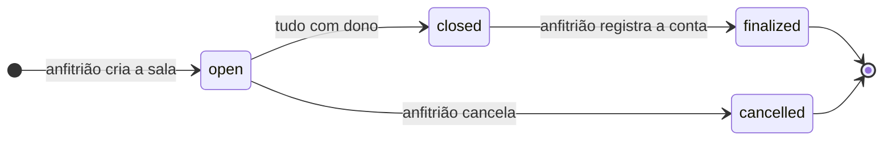
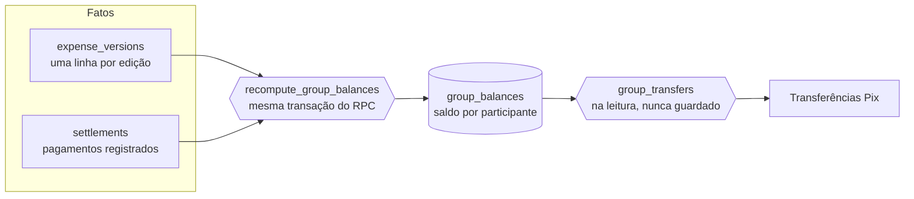
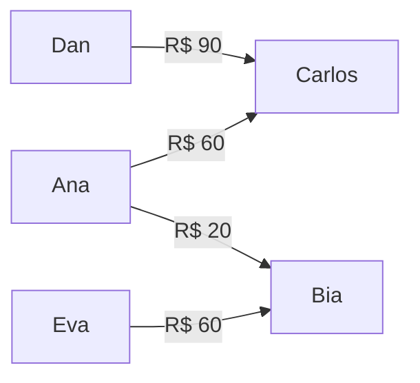
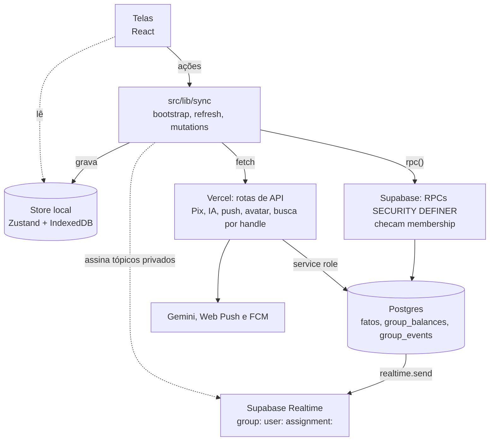
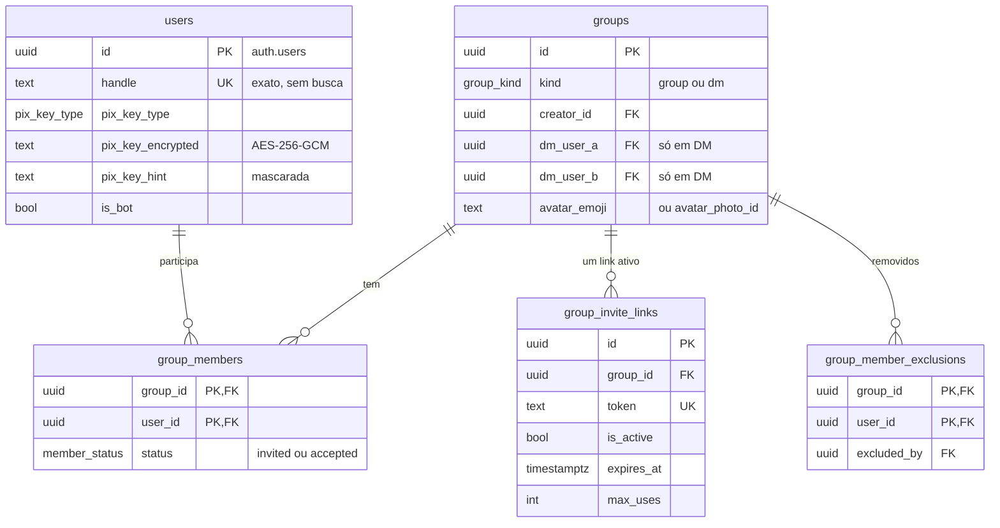
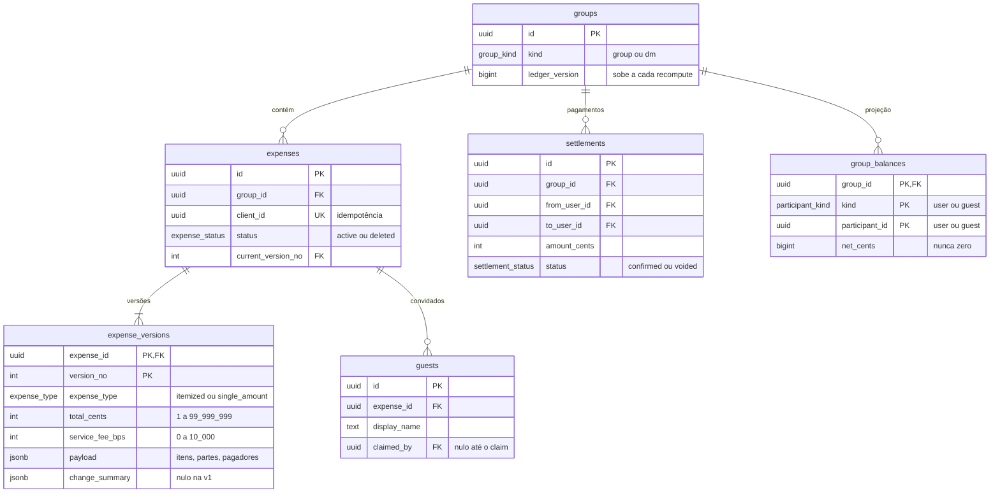
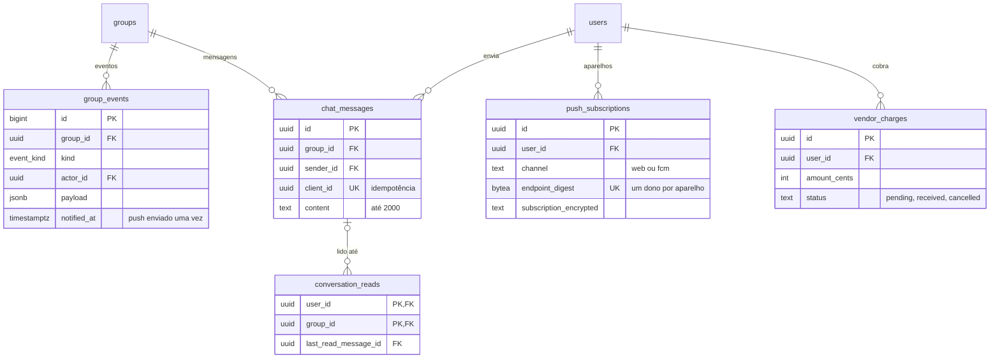
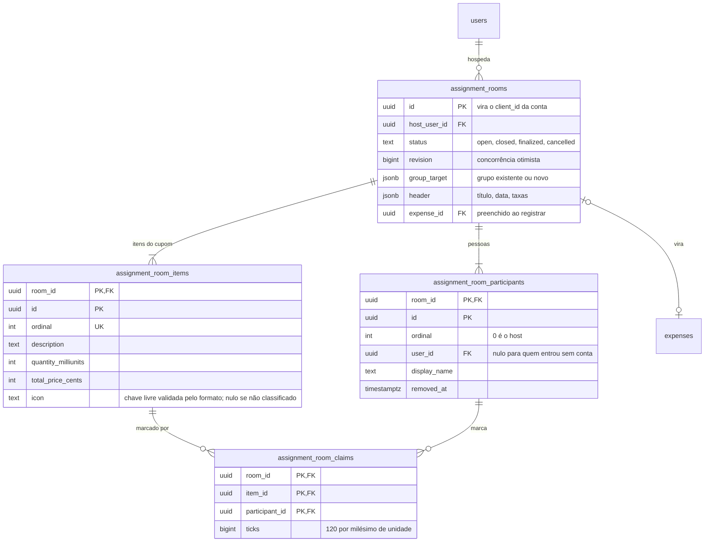
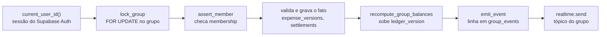

<p align="center">
  
</p>

<p align="center">
  Lê a nota, cada um marca o que comeu, e a galera paga no Pix pelo app do banco.
</p>

<p align="center">
  <a href="https://www.dividimos.ai">Web</a> &middot;
  <a href="https://play.google.com/store/apps/details?id=ai.dividimos.app">Android (WIP)</a>
</p>

<p align="center">
  <a href="https://github.com/tprei/dividimos/actions/workflows/ci.yml"></a>
  <a href="https://github.com/tprei/dividimos/actions/workflows/android.yml"></a>
  <a href="https://vercel.com/tprei/dividimos"></a>
</p>

---

O Splitwise virou pago. E mesmo quando era grátis, nunca entendeu o Brasil: não gera Pix, não lê cupom fiscal, não sabe o que é couvert, e cobra em dólar. A gente queria algo que funcionasse do jeito que a galera racha conta aqui: tira foto do cupom, cada um marca o que consumiu, o app gera o QR Code Pix e pronto.

Dividimos é código aberto, feito por quem racha conta pra quem racha conta. Sem assinatura, sem paywall, sem monetização em cima do seu Pix.

[Como funciona](#como-funciona) &middot; [Funcionalidades](#funcionalidades) &middot; [Como o saldo fecha](#como-o-saldo-fecha) &middot; [Arquitetura](#arquitetura) &middot; [Modelo de dados](#modelo-de-dados) &middot; [Desenvolvimento local](#desenvolvimento-local)

## Como funciona

<p align="center">
  
</p>

Não tem cupom? Dá pra falar a conta ou digitar do jeito que vier. A divisão pode ser feita por quem criou a conta, no wizard, ou por cada pessoa no próprio celular, numa sala de itens.

## Funcionalidades

### Entrada de dados

- **Foto do cupom.** A IA lê a foto do cupom fiscal ou da NFC-e impressa: itens, quantidade, preço unitário, total da linha e a taxa de serviço, quando ela vem impressa em percentual. O app confere a soma em centavos antes de abrir a revisão.
- **Por voz.** Em **Falar conta**, você diz "Uber com João, 25 reais" e recebe um rascunho editável. No Android usa o reconhecimento de fala nativo; no navegador, a Web Speech API.
- **Por texto, no chat.** O modo IA da conversa entende "pizza 80 com João" e monta a conta.
- **Dois tipos de conta.** **Valor único** (um total pra dividir: Uber, Airbnb, mercado) ou **Vários itens** (cada um paga o que consumiu).
- **Contatos do celular.** Adicione gente direto da agenda no Android e nos navegadores com Contact Picker. Os contatos não saem do aparelho.

A permissão de IA é pedida no aparelho antes do primeiro uso — escanear nota, falar conta ou modo IA no chat — e fica salva por conta neste dispositivo; dá pra revogar em Configurações, e o servidor não exige essa permissão nas rotas de IA.

| Tipo | Passos do wizard |
|------|------------------|
| Valor único | Participantes &rarr; Valor e divisão &rarr; Quem pagou |
| Vários itens | Participantes &rarr; Itens &rarr; Quem consumiu &rarr; Quem pagou |

Participantes junta nome da conta, data, grupo e quem participa. Depois de escanear, a revisão da nota oferece **Dividir manualmente** (vai pro wizard de vários itens) ou **Criar sala de divisão**.

Na revisão, os ícones acompanham os itens e o total da linha fica separado da quantidade e do preço de cada unidade. Toque no item para editar: a quantidade fica ao lado do nome, e o campo **Valor total** continua sendo o total da linha.

### Sala de itens

A sala é o jeito de dividir um cupom sem passar o celular de mão em mão. O anfitrião escaneia, cria a sala e mostra o QR Code. Cada pessoa entra pelo próprio celular e marca o que consumiu.

- **Entra quem tem o link.** Quem tem conta entra com o próprio nome. Quem não tem digita um nome e vincula a conta depois. Cabem até 50 pessoas.
- **Na conversa direta também.** Escanear com uma DM selecionada cria a sala na conversa. Só vocês dois entram: o link ou QR recusa qualquer outra pessoa. Ao registrar, a conta entra na própria DM.
- **Convite que explica a sala.** Antes de entrar, a tela mostra em três passos como funciona: escolher o que consumiu, ver a parte calculada e acertar pelo Pix. Ela não mostra nada da sala antes de a pessoa entrar.
- **Frações de item.** Dá pra marcar o item inteiro, metade, um terço ou uma quantidade exata. Cada item mostra quanto ainda resta até a sala ficar com **Tudo com dono**.
- **O anfitrião divide junto.** Ao abrir um item, escolhe **Igual** para dividir entre todos ou só algumas pessoas, ou **Ajustar** para mudar proporções e unidades. Os anéis nos avatares mostram cada parte. **Salvar divisão** envia as mudanças de uma vez; se alguém mudar o item enquanto ele edita, **Atualizar** recarrega a divisão antes de salvar.
- **Ao vivo.** Cada marcação aparece pra todo mundo na hora.
- **O anfitrião fecha e registra.** Ele fecha a sala, revisa, escolhe quem pagou e registra a conta num grupo existente ou num grupo novo. Quem entrou com conta recebe convite pro grupo. Quem entrou sem conta vira convidado e pode reivindicar a parte depois.
- **Volta pra sala pela tela inicial.** **Suas salas** reúne as salas que você abriu e ainda não registrou e as salas abertas por outras pessoas nos seus grupos e conversas, da mais nova pra mais antiga. Cada linha mostra quem abriu, onde e quantos itens foram atribuídos; toque nela pra abrir. As suas salas fechadas aparecem como **Em revisão**. Vale também pra sala aberta fora de um grupo.
- **A sala acompanha a conta.** Depois de registrada, a conta mostra a sala em **Por item**, **Por pessoa** e **Histórico**, e edições na conta chegam em quem está com a sala aberta.


```mermaid
stateDiagram-v2
    direction LR
    [*] --> open: anfitrião cria a sala
    open --> closed: tudo com dono
    closed --> finalized: anfitrião registra a conta
    open --> cancelled: anfitrião cancela
    finalized --> [*]
    cancelled --> [*]
```

### Divisão

- **Por item ou pela conta toda.** Igual, porcentagem (com sliders) ou valor fixo por pessoa.
- **Ajuste que se resolve.** Mudou a parte de alguém, o resto se redistribui. O centavo que sobra vai pros primeiros da lista.
- **Quantidade quebrada.** Até três casas decimais por item: 1,5 kg de picanha, meia pizza.
- **Vários pagadores.** Registre quem pagou quanto quando mais de uma pessoa cobriu a conta.
- **Taxa de serviço e couvert.** A taxa de serviço em percentual é distribuída na proporção do consumo. Taxas fixas, como couvert, são divididas igualmente.

### Liquidação

- **QR Code Pix.** BR Code EMV com Copia e Cola, gerado no servidor com a chave de quem recebe. Dá pra pagar só uma parte.
- **Poucas transferências.** **Quem paga quem** cruza o maior devedor com o maior credor até zerar o grupo, com no máximo uma transferência a menos que o número de pessoas com saldo.
- **Registrar pagamento.** Quem pagou ou quem recebeu registra, e o saldo atualiza na hora. Errou? **Desfazer** no feed, no chat ou no detalhe do pagamento.
- **Lembrar.** Um toque manda um push pra quem te deve. Um lembrete por pessoa a cada 24h no grupo, e só se a dívida com você existir.
- **Cobrar rápido.** Cobrança Pix avulsa, sem grupo: digita o valor, compartilha o QR e marca **Pagamento recebido** quando cair. O histórico fica em **Cobranças**.

### Grupos, convites e convidados

- **Confirmação mútua.** Convide por `@handle`. A pessoa já pode entrar nas contas, mas só vê saldos e conversa do grupo depois de aceitar. Um grupo novo sai com no máximo 50 convites de uma vez.
- **Só quem tem perfil.** Só dá pra convidar, chamar ou colocar numa sala quem já completou o perfil. Quem entra numa sala antes disso entra como convidado.
- **Recusar não apaga conta.** Recusar um convite não apaga as contas dos outros: a sua parte vira um convidado com o seu nome e quem pagou pode editar ou mandar o link de claim. Se você aparece como quem pagou, a conta é anulada.
- **Link e QR de convite.** Um link ativo por grupo, com validade e limite de usos opcionais. No Android, o link abre direto no app. Dá pra disparar o convite no WhatsApp pra vários contatos de uma vez.
- **Convidados sem conta.** Coloque alguém na conta só pelo nome. Um link ou QR de claim guarda a parte até a pessoa criar conta, e aí o saldo passa pra ela.
- **Leitor de convite.** **Entrar em sala** abre um leitor que reconhece QR de sala, de grupo, de perfil e de convidado.
- **Página do grupo.** Avatar com emoji ou foto, **Gastos do grupo** com o total e a parte de cada um, e as abas **Saldos**, **Contas** e **Membros**.
- **Sair e remover.** Só sai do grupo quem está com saldo zerado. O criador remove membros, e quem foi removido não volta sozinho por link.
- **Arquivar só pra você.** Em **Grupos** e **Conversas**, deslize uma linha para a esquerda ou toque na pequena seta à direita para abrir suas ações e arquivar quando seu saldo estiver zerado. A seta também funciona pelo teclado; com movimento reduzido, as ações aparecem sem deslizar a linha. **Arquivadas** fica no topo da lista, mostra a quantidade e as conversas não lidas e abre na mesma página (`?view=archived`). Desarquive pela linha, pelo aviso no grupo ou pelas configurações, sem confirmação. Um novo saldo pendente traz o grupo de volta; mensagens não desarquivam.
- **Saldos de quem saiu.** Apagar, editar ou restaurar uma conta, ou desfazer um pagamento, é recusado quando mudaria o saldo de quem já saiu do grupo para outro valor diferente de zero. Para mexer nisso, convide a pessoa de volta, acertem com ela no grupo e ela sai de novo com saldo zerado. Recusar esse convite também só funciona com saldo zerado. Mudanças que levam o saldo dela a zero continuam permitidas. Saldos antigos desse tipo aparecem nos saldos do grupo e no início com o nome, o avatar e a indicação **saiu do grupo**, sem ações de Pix, pagamento ou lembrete.
- **Excluir grupo.** Só aparece para o criador quando ninguém tem saldo pendente e o grupo nunca compartilhou histórico financeiro. Depois disso, arquivar é o jeito de tirar o grupo da frente.
- **Bloquear pessoa.** Bloquear alguém corta o contato direto entre vocês: conversa 1-a-1 nova ou existente, convites de grupo novos, lembretes e push dessa pessoa param de chegar pra você, ela não pode te nomear numa sala de itens, e as mensagens dela nos grupos que vocês compartilham deixam de aparecer pra você. O bloqueio vale até você desbloquear; despesas, saldos e membros dos grupos que vocês dividem não mudam, e a outra pessoa não recebe aviso. Entre vocês, também param de valer um convite que já estava pendente, um link de convite de grupo criado por um dos dois e o resgate da parte de um convidado numa conta criada pelo outro; convites e links de outros membros continuam funcionando. Pelo link de uma sala, a pessoa bloqueada entra como convidada, sem vínculo com a conta. Recusas de conversa anteriores continuam valendo mesmo depois do desbloqueio. Bloqueie em **Bloquear pessoa** no perfil (`/u/<handle>`) e desbloqueie ali ou em Configurações > **Pessoas bloqueadas**. Enquanto você bloqueia alguém, o perfil dessa pessoa não mostra **Dividir uma conta** nem **Enviar mensagem**.

### Conversas

- **Conversas 1-a-1.** Mensagens diretas com o saldo entre vocês no topo e cards de sistema para contas e pagamentos. Conversa nova também precisa de aceite. Quem recusa uma conversa não recebe convite de novo da mesma pessoa até puxar a conversa.
- **Ações sem sair do chat.** **Nova cobrança** e **Dividir conta** (igual, % ou fixo) direto na conversa. O botão **Pagar** ou **Cobrar** abre o Pix com o saldo entre vocês e registra o pagamento.
- **Denunciar.** Mensagens de outras pessoas têm um menu com **Denunciar mensagem**; perfis têm **Denunciar pessoa**. A denúncia vai pra moderação e a pessoa denunciada não fica sabendo.
- **Perfil público.** `dividimos.ai/u/<handle>`, com QR Code pra compartilhar. Quem abre pode **Dividir uma conta** ou **Enviar mensagem**.

### Atividade e notificações

- **Feed de atividade.** Tudo que aconteceu nos seus grupos, agrupado por dia.
- **Push.** Web Push e notificação nativa (Android e iOS) para contas, pagamentos, lembretes e mudanças no grupo. Cada categoria liga e desliga nas configurações. No iOS, o token APNs vira um token FCM via Firebase Messaging antes de chegar ao servidor, que recebe o mesmo `{ token, channel: "fcm" }` do Android em `/api/push/subscribe`. Trocar de conta no aparelho destrói o token local (a linha do dono anterior para de receber); o registro da conta nova espera essa limpeza terminar e, se a exclusão do token FCM falhou, tenta de novo antes de pedir token novo. O consentimento é por conta e fica salvo antes de qualquer registro. O toque numa notificação só abre destinos conhecidos (`/app`, conta, conversa ou grupo). Enquanto o app não confirmou a sessão desta abertura, o destino fica guardado e abre quando a conta carrega, ou quando a leitura falha por outro motivo e os dados salvos continuam na tela; sem sessão, ele volta pelo login com `?next=`, e trocar de conta descarta o destino guardado.
- **Histórico de edições.** Cada edição de conta vira uma versão nova, com o resumo do que mudou. Excluir uma conta é reversível.
- **Busca.** Grupos e contas são buscados no aparelho; pessoas, também pelo `@handle` exato no servidor.

### Conta

- **Excluir a conta.** Em Configurações, “Excluir sua conta do Dividimos” abre um diálogo de consequências com confirmação explícita. Enquanto houver saldo em qualquer grupo, a exclusão é recusada e o app lista os grupos pra acertar. Confirmada, a conta é anonimizada, o acesso é encerrado e o aparelho é limpo; quem entrou com Apple também tem a autorização revogada na Apple ID antes do acesso cair. A página pública `dividimos.ai/excluir-conta` explica o passo a passo sem precisar entrar.

### App

- **Perfil no início.** O avatar fica no canto superior direito do cartão de saldo. Tocar nele abre seu perfil; **Compartilhar perfil** mostra o QR Code para outras pessoas abrirem seu perfil público.
- **Abre sem esperar a rede.** As telas leem um store local salvo em IndexedDB. O service worker serve o app do cache e mostra uma página offline quando não há conexão. A página offline (`public/offline.html`) é a mesma página do boteco do Android (`native-shell/offline.html`), só que "Tentar novamente" e a volta da conexão recarregam a página que a pessoa tentou abrir.
- **Troca de aba na hora.** Tocar numa aba da barra de navegação já marca a aba. Se a tela demora mais de 120 ms pra chegar (rede lenta ou instável), o esqueleto dela aparece no lugar da tela anterior até a rota carregar. Cada aba registra o seu esqueleto em `navItems` no `app-shell.tsx`.
- **PWA, Android e iOS.** Instalável no navegador. Os apps Android e iOS usam Capacitor e carregam o site hospedado em `https://www.dividimos.ai`. O Android tem login Google nativo, câmera, fala e contatos. O iOS tem login com a Apple e com o Google nativos, câmera e fala; a importação de contatos não existe no iOS.
- **Foto da notinha.** Ao cancelar a câmera nativa, uma nota ilustrada acompanha as opções **Tirar foto**, **Escolher da galeria** e **Voltar**. A mesma linguagem aparece na leitura e nos erros da câmera; no navegador, o enquadramento ocupa a tela e mantém galeria e captura no rodapé, respeitando a área segura do aparelho.
- **Tema.** Claro, escuro ou o do sistema.
- **Apresentação na primeira visita.** Quem abre `/auth` pela primeira vez no aparelho vê três slides animados (ler a notinha, marcar quem comeu o quê, cobrar por Pix) antes do login. Links com destino, como convites, e a volta de um login que falhou vão direto pro login. Em telas largas, a apresentação roda em loop ao lado do login.
- **Tour guiado.** Na primeira sessão, um tour apresenta **Seu saldo**, **Ações rápidas**, **Quem deve o quê** e a navegação.
- **Bots verificados.** Contas de plataforma ganham o selo **Bot verificado**, e grupos só de bots ganham selo dourado. Só o servidor liga essa marca.

### Segurança

- **Chave Pix cifrada.** AES-256-GCM em repouso, decifrada só no servidor. O cliente só vê a chave mascarada. É o `complete_onboarding` que garante o formato `iv:tag:ciphertext` em base64 (até 256 caracteres) e a dica mascarada em até 80. As inscrições de push e o token de revogação do Entrar com Apple também ficam cifrados; o token Apple só serve pra revogar a autorização na exclusão da conta.
- **Pix só pra quem tem a receber.** `/api/pix/generate` só usa a chave de outra pessoa se ela for credora de quem pede numa transferência do grupo, e até o valor devido. As recusas de autorização voltam todas com o mesmo 403, pra ninguém descobrir quem tem chave ou quem deve a quem.
- **Acesso só via RPC.** RLS habilitado em todas as tabelas, sem políticas e sem grants para `anon`/`authenticated`. O navegador só chama funções `SECURITY DEFINER`, que checam membership (ou o token da sala, pra quem entrou sem conta). Só as rotas do servidor usam a service role.
- **Sem enumeração.** Usuários são encontrados só por `@handle` exato, por uma rota do servidor com rate limit. Alguns @ oficiais (suporte, admin, dividimos...), parecidos com eles (pix1, the_admin...) e nomes com esses termos no meio não estão disponíveis: tentar usar um deles no perfil devolve "Esse @ já está em uso.", e quem já tem um desses continua com ele. O @ automático de quem entra vem do nome, não do e-mail; se o nome já estiver em uso, entra um sufixo aleatório.
- **Bloqueio sem exposição.** Uma ação que o bloqueio recusa falha com o mesmo erro genérico das outras recusas, sem revelar a direção do bloqueio; erros de estado (já é membro, sem dívida) continuam aparecendo como sempre. A lista de bloqueados só é legível pelo próprio autor do bloqueio; os mensageiros internos de contato e de elegibilidade de push não podem ser chamados pelo navegador.
- **Tokens guardados como hash.** Os tokens de claim, de entrada na sala e de membro da sala ficam no banco só como SHA-256. Claim e entrada valem 7 dias; o de membro vale 30 dias e renova com o uso.
- **Rate limit que falha fechado.** Contadores no Postgres limitam IA, Pix, push e busca por usuário. Se o limitador cai, a rota responde 503 em vez de liberar.
- **Conta excluída não volta.** Depois que a exclusão da conta grava o marcador, qualquer RPC comum dessa identidade falha com `account_deleted`, o registro de push não recria inscrição para o perfil apagado — nem disputando com a própria exclusão em transação — e uma conta apagada não registra credencial Apple nova.
- **Textos legais junto com o código.** A Política de Privacidade fica em `src/app/privacy/page.tsx` (`/privacy`), os Termos de Uso em `src/app/terms/page.tsx` (`/terms`) e as instruções públicas de exclusão em `/excluir-conta`. Mudou o que sai do aparelho, um provedor, uma permissão, o consentimento, a retenção ou a exclusão de dados? Atualize esses textos e a declaração Data safety do Google Play no mesmo PR. O aviso de aceite no login fica em `src/app/auth/auth-panel.tsx`.

## Como o saldo fecha

O banco guarda os fatos financeiros e um saldo por participante. Nunca transferências prontas.


```mermaid
flowchart LR
    subgraph fatos[Fatos]
        ev["expense_versions<br/>uma linha por edição"]
        st["settlements<br/>pagamentos registrados"]
    end
    rc{{"recompute_group_balances<br/>mesma transação do RPC"}}
    gb[("group_balances<br/>saldo por participante")]
    gt{{"group_transfers<br/>na leitura, nunca guardado"}}
    pix["Transferências Pix"]
    ev --> rc
    st --> rc
    rc --> gb --> gt --> pix
```

- **Fatos.** `expense_versions` (uma linha por edição, com o `payload` completo e um `change_summary`) e `settlements` (pagamentos registrados). Nada mais é fato financeiro.
- **Projeção.** `group_balances` tem uma linha por `(grupo, tipo, participante)` com o `net_cents` assinado: positivo recebe, negativo deve. Saldo zero não vira linha. Convidados sem conta entram com `kind = 'guest'` e carregam saldo até alguém reivindicar.
- **A projeção nunca é escrita à mão.** Todo RPC que mexe no dinheiro (criar, editar, excluir ou restaurar conta, registrar ou desfazer pagamento, claim de convidado, recusar convite com contas no meio) chama `recompute_group_balances(group)` na mesma transação e refaz os saldos a partir dos fatos. Ou o fato e a projeção entram juntos, ou nada entra.
- **Transferências saem na leitura.** `group_transfers(group)` em SQL e `transfersFromBalances` em TypeScript rodam o mesmo pareamento guloso de dois ponteiros sobre os saldos, com teste de paridade em 200 ledgers aleatórios.

#### Exemplo

Jantar de R$ 350. Carlos pagou R$ 200, Bia pagou R$ 150, e cinco pessoas consumiram.

| Pessoa | Pagou | Consumiu | Saldo |
|--------|------:|---------:|--------------------:|
| Carlos | 200 | 50 | +150 (recebe) |
| Bia | 150 | 70 | +80 (recebe) |
| Dan | 0 | 90 | -90 (deve) |
| Ana | 0 | 80 | -80 (deve) |
| Eva | 0 | 60 | -60 (deve) |

Sem simplificar, cada consumidor deve a cada pagador na proporção do que ele pagou (57% Carlos, 43% Bia). Isso dá 8 dívidas cruzadas, incluindo Carlos e Bia devendo um pro outro. O saldo de cada um é só o que pagou menos o que consumiu, então essas dívidas cruzadas nunca viram linha no banco.

Na leitura, o pareamento ordena devedores e credores uma vez e cruza o maior devedor com o maior credor:

1. Dan (-90) paga R$ 90 a Carlos (+150). Carlos fica com +60.
2. Ana (-80) paga R$ 60 a Carlos. Carlos zera, Ana fica com -20.
3. Ana paga R$ 20 a Bia (+80). Bia fica com +60.
4. Eva (-60) paga R$ 60 a Bia. Todo mundo zera.


```mermaid
graph LR
    D[Dan] -->|R$ 90| C[Carlos]
    A[Ana] -->|R$ 60| C
    A -->|R$ 20| B[Bia]
    E[Eva] -->|R$ 60| B
```

**8 dívidas cruzadas viram 4 Pix.** Cada transferência abre um QR Code com o valor certo, e todas saem dos saldos na hora da leitura.

## Arquitetura


```mermaid
flowchart TB
    telas["Telas<br/>React"] -->|ações| sync["src/lib/sync<br/>bootstrap, refresh, mutations"]
    telas -.->|lê| store[("Store local<br/>Zustand + IndexedDB")]
    sync -->|grava| store
    sync -->|fetch| api["Vercel: rotas de API<br/>Pix, IA, push, avatar, busca por handle"]
    sync -->|"rpc()"| rpc["Supabase: RPCs SECURITY DEFINER<br/>checam membership"]
    sync -.->|assina tópicos privados| rt["Supabase Realtime<br/>group: user: assignment:"]
    api -->|service role| pg[("Postgres<br/>fatos, group_balances, group_events")]
    rpc --> pg
    pg -->|realtime.send| rt
    api --> ext["Gemini, Web Push e FCM"]
```

- **Local-first.** Telas leem o store (`src/stores/app-store.ts`) e nunca chamam o Supabase. Toda a rede mora em `src/lib/sync/`: um snapshot no login (`bootstrap_overview`), mutations otimistas que desfazem por entrada se o RPC falhar, e `refreshGroup` pra reconciliar.
- **O banco decide.** Validação, membership, dinheiro e concorrência (`expected_version_no`, `stale_version`) ficam nos RPCs. As rotas de API do Next.js existem só pro que precisa de segredo: chave Pix, Gemini, push, avatar e busca por `@handle`.
- **O banco avisa.** Os RPCs (e um trigger em `expenses`, pras salas) chamam `realtime.send` em tópicos privados. Nenhuma tabela está na publicação do Realtime. A autorização do tópico é checada na entrada do socket, não a cada evento: depois de remover um membro, o socket antigo pode continuar conectado. Por isso os tópicos do grupo não levam mensagens nem resumos de salas; os RPCs enviam esses dados só aos tópicos individuais dos membros aceitos no momento da escrita.

| Tópico | Eventos | Quem escuta e o que faz |
|--------|---------|-------------------------|
| `group:<id>` | `ledger`, `chat_activity` | Membros aceitos na entrada do socket. Dispara um `refreshGroup`; no `ledger`, só se a `ledger_version` ou o evento for novo. Sem conteúdo de chat ou de sala. |
| `user:<id>` | `membership`, `message`, `assignment_room`, `blocks_changed` | O próprio usuário. Convite ou DM novo dispara um novo bootstrap; bloquear ou desbloquear em outro aparelho também, pra atualizar a lista de bloqueados. Mensagens entram na conversa aberta, resumos de salas entram no store; na reconexão, o cliente reconcilia conversas abertas e salas. Os RPCs só enviam o conteúdo aos membros aceitos. |
| `assignment:<sala>:<chave>` | `assignment`, `access_changed` | Quem tem o link da sala, com ou sem conta. A chave é aleatória e troca quando alguém é removido. Refaz a leitura da sala quando a `revision` sobe. |

- **Notificações.** Todo RPC financeiro ou de membros grava uma linha em `group_events`. Ela alimenta o feed, os cards do chat e o push: o cliente que agiu manda o id pra `/api/notify`, que reivindica a linha uma vez (`notified_at`) e dispara Web Push (VAPID) e FCM respeitando as categorias de cada pessoa.
- **IA.** `/api/receipt/ocr`, `/api/voice/parse` e `/api/chat/parse` chamam Gemini 2.5 Flash-Lite com saída em JSON Schema. O texto do usuário entra delimitado como dado, e o resultado passa pelos mesmos decoders de dinheiro do resto do app antes de virar rascunho.
- **Ícones dos itens.** Na mesma chamada do cupom, o Gemini escolhe pra cada item uma das chaves conhecidas de `ITEM_ICON_HINTS` em `src/lib/item-icons.ts` (cerveja, pizza, coxinha...). O banco não fecha a lista: aceita qualquer chave no formato `^[a-z][a-z0-9_]{0,31}$` e a guarda sem alterar, e o cliente só mostra imagem pras chaves que conhece, deixando as outras em branco. Por isso adicionar um ícone é incluir a chave e a dica em `ITEM_ICON_HINTS` e o arquivo `public/item-icons/<chave>.svg`, sem migration. O `icon` é opcional no item do `payload` e em `assignment_room_items`; item sem chave também fica sem ícone.

## Modelo de dados

São 20 tabelas no schema `public`, todas com RLS e sem acesso direto. Os diagramas mostram as colunas que importam pra entender o domínio. O schema completo está em `supabase/migrations/` e os tipos gerados em `src/types/database.ts`.

#### Pessoas, grupos e convites

Conversas 1-a-1 são linhas de `groups` com `kind = 'dm'` e o par `(dm_user_a, dm_user_b)` único. Por isso chat, eventos e saldos funcionam igual em grupo e em DM.


```mermaid
erDiagram
    users ||--o{ group_members : "participa"
    groups ||--o{ group_members : "tem"
    groups ||--o{ group_invite_links : "um link ativo"
    groups ||--o{ group_member_exclusions : "removidos"

    users {
        uuid id PK "auth.users"
        text handle UK "exato, sem busca"
        pix_key_type pix_key_type
        text pix_key_encrypted "AES-256-GCM"
        text pix_key_hint "mascarada"
        bool is_bot
    }
    groups {
        uuid id PK
        group_kind kind "group ou dm"
        uuid creator_id FK
        uuid dm_user_a FK "só em DM"
        uuid dm_user_b FK "só em DM"
        text avatar_emoji "ou avatar_photo_id"
    }
    group_members {
        uuid group_id PK, FK
        uuid user_id PK, FK
        member_status status "invited ou accepted"
    }
    group_invite_links {
        uuid id PK
        uuid group_id FK
        text token UK
        bool is_active
        timestamptz expires_at
        int max_uses
    }
    group_member_exclusions {
        uuid group_id PK, FK
        uuid user_id PK, FK
        uuid excluded_by FK
    }
```

#### Núcleo financeiro


```mermaid
erDiagram
    groups ||--o{ expenses : "contém"
    expenses ||--|{ expense_versions : "versões"
    expenses ||--o{ guests : "convidados"
    groups ||--o{ settlements : "pagamentos"
    groups ||--o{ group_balances : "projeção"

    groups {
        uuid id PK
        group_kind kind "group ou dm"
        bigint ledger_version "sobe a cada recompute"
    }
    expenses {
        uuid id PK
        uuid group_id FK
        uuid client_id UK "idempotência"
        expense_status status "active ou deleted"
        int current_version_no FK
    }
    expense_versions {
        uuid expense_id PK, FK
        int version_no PK
        expense_type expense_type "itemized ou single_amount"
        int total_cents "1 a 99_999_999"
        int service_fee_bps "0 a 10_000"
        jsonb payload "itens, partes, pagadores"
        jsonb change_summary "nulo na v1"
    }
    guests {
        uuid id PK
        uuid expense_id FK
        text display_name
        uuid claimed_by FK "nulo até o claim"
    }
    settlements {
        uuid id PK
        uuid group_id FK
        uuid from_user_id FK
        uuid to_user_id FK
        int amount_cents
        settlement_status status "confirmed ou voided"
    }
    group_balances {
        uuid group_id PK, FK
        participant_kind kind PK "user ou guest"
        uuid participant_id PK "user ou guest"
        bigint net_cents "nunca zero"
    }
```

#### Conversas, eventos e push


```mermaid
erDiagram
    groups ||--o{ group_events : "eventos"
    groups ||--o{ chat_messages : "mensagens"
    users ||--o{ chat_messages : "envia"
    users ||--o{ push_subscriptions : "aparelhos"
    users ||--o{ vendor_charges : "cobra"
    chat_messages |o--o{ conversation_reads : "lido até"

    group_events {
        bigint id PK
        uuid group_id FK
        event_kind kind
        uuid actor_id FK
        jsonb payload
        timestamptz notified_at "push enviado uma vez"
    }
    chat_messages {
        uuid id PK
        uuid group_id FK
        uuid sender_id FK
        uuid client_id UK "idempotência"
        text content "até 2000"
    }
    conversation_reads {
        uuid user_id PK, FK
        uuid group_id PK, FK
        uuid last_read_message_id FK
    }
    push_subscriptions {
        uuid id PK
        uuid user_id FK
        text channel "web ou fcm"
        bytea endpoint_digest UK "um dono por aparelho"
        text subscription_encrypted
    }
    vendor_charges {
        uuid id PK
        uuid user_id FK
        int amount_cents
        text status "pending, received, cancelled"
    }
```

#### Sala de itens


```mermaid
erDiagram
    users ||--o{ assignment_rooms : "hospeda"
    assignment_rooms ||--|{ assignment_room_items : "itens do cupom"
    assignment_rooms ||--|{ assignment_room_participants : "pessoas"
    assignment_room_items ||--o{ assignment_room_claims : "marcado por"
    assignment_room_participants ||--o{ assignment_room_claims : "marca"
    assignment_rooms |o--o| expenses : "vira"

    assignment_rooms {
        uuid id PK "vira o client_id da conta"
        uuid host_user_id FK
        text status "open, closed, finalized, cancelled"
        bigint revision "concorrência otimista"
        jsonb group_target "grupo existente ou novo"
        jsonb header "título, data, taxas"
        uuid expense_id FK "preenchido ao registrar"
    }
    assignment_room_items {
        uuid room_id PK, FK
        uuid id PK
        int ordinal UK
        text description
        int quantity_milliunits
        int total_price_cents
        text icon "chave livre validada pelo formato; nulo se não classificado"
    }
    assignment_room_participants {
        uuid room_id PK, FK
        uuid id PK
        int ordinal "0 é o host"
        uuid user_id FK "nulo para quem entrou sem conta"
        text display_name
        timestamptz removed_at
    }
    assignment_room_claims {
        uuid room_id PK, FK
        uuid item_id PK, FK
        uuid participant_id PK, FK
        bigint ticks "120 por milésimo de unidade"
    }
```

| Contexto | Tabela | Papel |
|----------|--------|-------|
| Pessoas | `users` | Perfil, `@handle`, chave Pix cifrada e mascarada, preferências de notificação, `is_bot` |
| | `push_subscriptions` | Um dispositivo por linha (`web` ou `fcm`), inscrição cifrada |
| Grupos | `groups` | Grupos e DMs, avatar (emoji ou foto), `ledger_version` |
| | `group_members` | Convite e aceite (`invited`, `accepted`) |
| | `group_member_exclusions` | Quem foi removido e não volta sozinho |
| | `group_invite_links` | Link de convite: um ativo por grupo, validade e limite de usos |
| Dinheiro | `expenses` | Identidade da conta, status, versão atual, chave de acesso do cupom contra duplicata |
| | `expense_versions` | **Fato.** Uma linha por edição, com total, taxas e `payload` |
| | `settlements` | **Fato.** Pagamentos registrados, `confirmed` ou `voided` |
| | `group_balances` | **Projeção.** Saldo líquido por participante, refeito a cada RPC financeiro |
| | `guests` | Convidados sem conta de uma conta, até o claim |
| Sala de itens | `assignment_rooms` | Sala, status, alvo do grupo e revisão |
| | `assignment_room_items` | Linhas do cupom, imutáveis depois de criadas |
| | `assignment_room_participants` | Quem está na sala, com ou sem conta |
| | `assignment_room_claims` | Quanto de cada item cada pessoa marcou |
| Conversas e eventos | `chat_messages` | Mensagens de grupo e DM |
| | `conversation_reads` | Até onde cada pessoa leu |
| | `group_events` | Feed, cards do chat e fila de push |
| Avulsos | `vendor_charges` | Cobrar rápido, fora do ledger de grupo |
| | `rate_limit_counters` | Janelas fixas por bucket e usuário |
| Denúncias | `reports` | Evidência de abuso só para service role, com dedupe por autor e resolução do operador |

Além das tabelas, a view `current_expense_participants` explode a versão atual de cada conta ativa em uma linha por participante; é dela que o recompute tira os saldos. O schema `guest_credentials` guarda os hashes dos tokens de claim e de sala, e o tópico de Realtime de cada sala. O bucket privado `group-avatars` guarda as fotos de grupo, com até 1 MB.

## RPCs

Toda leitura e escrita do app passa por uma função Postgres chamada via `supabase.rpc()`. A migration inicial revoga `EXECUTE` de `public`, `anon` e `authenticated` em todas as funções, e cada RPC ganha seu `GRANT` explícito. São 59 funções pra `authenticated`, 8 abertas também pra `anon` (salas de itens e prévias de convite e de claim), 15 só pra `service_role` (chamadas pelas rotas de API e pela moderação) e o resto são helpers internos e triggers, sem grant nenhum.

Todo RPC que mexe no ledger (contas e liquidações) segue a mesma ordem, na mesma transação:


```mermaid
flowchart LR
    a["current_user_id()<br/>sessão do Supabase Auth"] --> c["lock_group<br/>FOR UPDATE no grupo"]
    c --> b["assert_member<br/>checa membership"]
    b --> d["valida e grava o fato<br/>expense_versions, settlements"]
    d --> e["recompute_group_balances<br/>sobe ledger_version"]
    e --> f["emit_event<br/>linha em group_events"]
    f --> g["realtime.send<br/>tópico do grupo"]
```

- **`SECURITY DEFINER` com `search_path = public`.** A função roda como dona das tabelas, então a checagem de membership dentro dela é a única porta. RLS está ligado sem nenhuma policy.
- **Idempotência.** `create_expense`, `create_expense_with_group` e `send_message` recebem um `p_client_id`, e `record_settlement` um `p_operation_id`. Repetir a chamada devolve o que já foi gravado em vez de duplicar, o que torna seguro o retry do cliente offline.
- **Concorrência otimista.** `edit_expense` recebe `p_expected_version_no`; as mutations da sala recebem `p_expected_revision`. Se alguém gravou antes, o RPC falha com `stale_version` e o cliente refaz a leitura.
- **Erros com código.** Toda falha é `RAISE EXCEPTION` com `ERRCODE = 'P0001'` e uma mensagem estável (`not_a_member`, `stale_version`, `outstanding_balance`, `duplicate_receipt`, `room_closed`...). `codeFromMessage` em `src/lib/sync/errors.ts` converte a mensagem num `LedgerErrorCode` tipado.
- **Respostas decodificadas.** No cliente, `rpc(name, args, decode)` em `src/lib/sync/client.ts` tipa nome e argumentos pelos tipos gerados (`src/types/database.ts`) e passa o JSON de volta por um decoder antes de chegar no store. Resposta fora do formato vira `invalid_wire`.

| Contexto | RPCs | Quem chama |
|----------|------|------------|
| Leitura | `bootstrap_overview`, `get_group_overview`, `get_group_expenses`, `get_expense_context`, `get_settlement`, `get_my_expenses`, `get_activity`, `get_conversation`, `get_conversation_v2`, `get_vendor_charges`, `get_shared_spending` | `src/lib/sync/bootstrap.ts` e `refresh.ts` |
| | `get_my_profile` | `src/lib/auth.ts` |
| Contas | `create_expense`, `create_expense_with_group`, `edit_expense`, `delete_expense`, `restore_expense` | `src/lib/sync/mutations.ts` |
| Liquidação | `record_settlement`, `void_settlement`, `send_nudge` | `mutations-group.ts` |
| Grupos e convites | `create_group`, `invite_member`, `accept_invitation`, `decline_invitation`, `remove_member`, `leave_group`, `delete_group`, `create_invite_link`, `deactivate_invite_link`, `preview_invite_link`, `join_via_link`, `get_or_create_dm` | `mutations-group.ts`, `/join/[token]` |
| Convidados | `create_guest_claim_token`, `revoke_guest_claim_token`, `resolve_guest_claim_token`, `claim_guest` | `mutations-group.ts`, `/claim` |
| Perfil | `complete_onboarding`, `update_profile` | `src/app/auth/onboard/actions.ts`, `mutations-group.ts` |
| Conversas | `send_message`, `mark_read` | `mutations.ts` |
| Cobrar rápido | `record_vendor_charge`, `confirm_vendor_charge`, `cancel_vendor_charge` | `mutations-group.ts` |
| Sala de itens | `create_assignment_room`, `list_open_assignment_rooms`, `list_my_open_assignment_rooms`, `enter_group_assignment_room`, `announce_assignment_room`, `get_assignment_room`, `join_assignment_room`, `refresh_assignment_room_member`, `set_assignment_room_claim`, `remove_assignment_room_participant`, `rotate_assignment_room_join`, `claim_assignment_room_guest`, `close_assignment_room`, `cancel_assignment_room`, `finalize_assignment_room`, `get_assignment_room_completion` | `src/lib/sync/assignment-rooms.ts`; `list_my_open_assignment_rooms` em `refresh.ts` e `bootstrap.ts` |
| Só servidor | `lookup_user_by_handle`, `set_group_avatar`, `claim_push_subscription`, `increment_rate_limit`, `cleanup_expired_rate_limit_counters`, `report_content`, `mark_report_notified`, `resolve_report`, `erase_chat_message` | Rotas de API com service role; `erase_chat_message` também é a operação compartilhada de moderação que apaga o texto de uma mensagem denunciada |

Os helpers internos também moram nas migrations: `recompute_group_balances` e `group_transfers` (a projeção e a minimização), `validate_expense_payload` (a mesma regra de dinheiro de `src/lib/expense-money.ts`), `effective_expense_payload`, os `ledger_*_json` que montam as respostas, e `broadcast_group`/`broadcast_user`/`broadcast_assignment_room` que chamam `realtime.send`. As rotas de API com service role leem algumas tabelas direto (`/api/pix/generate`, `/api/notify`), porque o service role ignora RLS; nenhum código de cliente faz isso.

## Stack

| Camada | Tecnologia |
|--------|------------|
| Framework | Next.js 16 (App Router), proxy em `src/proxy.ts` |
| UI | React 19, Tailwind CSS v4, shadcn/ui, Framer Motion |
| Estado | Zustand 5 (local-first, persistido em IndexedDB) |
| Backend | Supabase: Postgres, Auth, Realtime e Storage, com acesso só via RPCs `SECURITY DEFINER` |
| Auth | Google OAuth (web), Google Credential Manager (Android), Sign in with Apple e Google Sign-In nativos (iOS), todos via `@capgo/capacitor-social-login` no app |
| IA | Gemini 2.5 Flash-Lite via `@google/genai`: cupom, voz e texto |
| Push | Web Push (VAPID) e FCM HTTP v1 |
| Mobile | Capacitor 8 (Android e iOS) |
| Testes | Vitest 4, React Testing Library, fast-check, Playwright |
| Deploy | Vercel (frontend), Supabase em `sa-east-1` (banco) |
| Linguagem | TypeScript 5 |

## Estrutura

```
src/
├── proxy.ts                    # Sessão Supabase, rotas públicas, /manutencao
├── app/                        # Rotas (Next.js App Router)
│   ├── page.tsx                # Landing
│   ├── auth/                   # Login Google, retorno do popup, onboarding (handle + chave Pix)
│   ├── app/                    # Shell autenticado (pré-renderizado, servido cache-first pelo service worker)
│   │   ├── page.tsx            # Início: saldo, ações rápidas, quem deve o quê
│   │   ├── bill/new/           # Wizard de conta
│   │   ├── bill/[id]/          # Detalhe da conta, versões, sala de itens
│   │   ├── bills/              # Contas e cobranças
│   │   ├── charges/            # Histórico do Cobrar rápido
│   │   ├── groups/             # Grupos: saldos, contas, membros, conversa
│   │   ├── conversations/      # Conversas 1-a-1
│   │   ├── activity/           # Feed de atividade
│   │   ├── search/             # Busca: grupos e contas no aparelho, pessoas por @handle
│   │   ├── scan-invite/        # Leitor de QR: sala, grupo, perfil, convidado
│   │   ├── profile/            # Perfil e chave Pix
│   │   └── settings/           # Tema, push, categorias, confirmações
│   ├── room/[roomId]/          # Sala de itens (pública, entra por link)
│   ├── claim/                  # Claim de convidado
│   ├── join/[token]/           # Link de convite de grupo
│   ├── u/[handle]/             # Perfil público
│   ├── manutencao/             # Aviso quando app e banco estão em versões incompatíveis
│   ├── privacy/  terms/        # Páginas legais
│   └── api/
│       ├── pix/generate/       # Copia e Cola com a chave de outra pessoa (só em dívida real)
│       ├── pix/generate-self/  # Copia e Cola com a própria chave (Cobrar rápido)
│       ├── receipt/ocr/        # Foto do cupom → itens (Gemini)
│       ├── voice/parse/        # Fala transcrita → rascunho (Gemini)
│       ├── chat/parse/         # Texto do chat → rascunho (Gemini)
│       ├── notify/             # Claim de group_events + fan-out de push
│       ├── push/               # subscribe, unsubscribe, status
│       ├── groups/[groupId]/avatar/  # Emoji ou foto do grupo
│       ├── users/lookup/       # Busca exata por @handle
│       └── dev/login/          # Login programático (só dev e test)
├── components/                 # UI por domínio (bill, assignment-room, settlement, chat, group, …) + ui/ (shadcn)
├── stores/
│   ├── app-store.ts            # Estado local-first (Zustand + IndexedDB)
│   ├── app-selectors.ts        # Derivados: transferências, dívidas, convites
│   ├── bill-store.ts           # Rascunho do wizard
│   └── assignment-room-store.ts  # Salas abertas e conexão (não persiste)
├── lib/
│   ├── sync/                   # Toda a rede: bootstrap, refresh, realtime, mutations, salas
│   ├── ledger/                 # Decoders, saldos, transferências mínimas, suites de integração
│   ├── push/                   # Web Push, FCM, fan-out por dispositivo
│   ├── capacitor/              # Pontes nativas: login, câmera, fala, contatos, deep link
│   ├── supabase/               # Clientes browser/server/admin e sessão do proxy
│   ├── expense-money.ts        # Dono único do teto e da fórmula de taxa
│   ├── assignment-room-*.ts    # Dinheiro, quantidade, QR e projeção da sala
│   ├── receipt-ocr.ts          # Parser de cupom (voice- e chat-expense-parser.ts seguem o mesmo molde)
│   ├── llm-prompt-safety.ts    # Texto do usuário tratado como dado
│   ├── rate-limit.ts           # Buckets por usuário, falha fechado
│   ├── crypto.ts               # AES-256-GCM (só servidor)
│   ├── pix.ts                  # EMV BR Code + CRC16-CCITT
│   └── currency.ts             # BRL em centavos inteiros
├── hooks/                      # React hooks
├── types/                      # Tipos do domínio e do banco
└── test/                       # Setup e helpers dos testes de integração
e2e/                            # Playwright: synthetic/ (jornadas), flows/, seed-helper.ts
supabase/
├── migrations/                 # Migrations ordenadas, fonte da verdade do banco
├── config.toml                 # Config do Supabase local
├── seed.sql                    # Dados de desenvolvimento
├── migrations-reset-manifest.json  # Autoriza a troca revisada da sequência inicial
└── security-allowlist.json     # Exceções revisadas do verificador de segurança
scripts/                        # dev-setup, cap-dev, verificadores de migration, repórter do ambient
android/                        # Projeto nativo Android (Capacitor)
ios/                            # Projeto nativo iOS (Capacitor, CocoaPods)
public/sw.js                    # Service worker
agent-guidance/                 # Guias para agentes: migrations, TypeScript, stacked diffs, mudanças visuais
```

## Orientação rápida

- `src/app/` é o App Router do Next.js 16. Fluxos principais: landing (`page.tsx`), auth (`auth/`), o shell autenticado (`app/`, pré-renderizado e servido cache-first pelo `public/sw.js`) e os destinos de link públicos `room/`, `claim/`, `join/`, `u/` e `excluir-conta/`.
- **Landing em celulares.** A landing usa a rolagem do documento; só ela libera o viewport fixo do shell. Em telas menores que 760 px ou aparelhos sem hover ou com ponteiro grosso, o cenário fica estático, a mesa fica sem perspectiva 3D, o cabeçalho fica opaco e a troca de tema é direta. O cenário é o mesmo do `/auth` e do onboarding, então lá ele também fica parado nesses aparelhos. As animações decorativas contínuas e a digitação automática ficam só no desktop com hover, ponteiro fino e sem movimento reduzido. Os demos continuam respondendo ao toque; a simulação de voz atualiza o texto quando as palavras ou os segundos mudam, não a cada frame. Cenários fora da tela ou em uma aba oculta pausam as animações.
- `src/proxy.ts` é o proxy do Next 16. Renova a sessão do Supabase via `src/lib/supabase/middleware.ts`, libera as rotas públicas, responde 503 quando a verificação de auth está fora do ar e manda quem está logado pra `/manutencao` quando o banco e o app estão em versões financeiramente incompatíveis.
- `src/app/auth/` faz login com um ID token: redirect de página inteira pro Google na web (`popup/` é a página pra onde o Google volta), `@capgo/capacitor-social-login` com o Google no Android, e com a Apple e o Google no iOS. No iOS, a Apple e o Google recebem o SHA-256 de um nonce novo e o Supabase recebe o nonce cru; só um painel nativo abre por vez, e cancelar o painel não mostra erro. A Apple só manda o nome na primeira autorização: ele fica no `sessionStorage` (`src/lib/pending-sign-in-name.ts`) até o onboarding, que também começa com o nome vazio quando o nome automático é a parte aleatória de um e-mail "Ocultar meu e-mail". Em Ajustes, o app iOS conecta a Apple ou o Google à conta atual com `linkIdentity`, sempre a partir da sessão e do painel do provedor; o app nunca junta contas por nome ou e-mail. `page.tsx` lê o cookie `dividimos_intro_seen` pra decidir se abre na apresentação (`src/components/auth-intro/`) ou no login, e `auth-panel.tsx` é o cartão de login. `continue/` decide se precisa de onboarding, e `onboard/` coleta o handle e a chave Pix. Sem telefone, sem 2FA.
- **Botões de entrada.** `src/components/auth/` desenha Apple e Google com a mesma altura (48 px), raio, largura e borda inferior. A Apple exige o título a 43% da altura, então "Continuar com a Apple" fica em system-ui Medium a 20,64 px. O Google exige Google Sans Medium e o G oficial sem distorção; "Continuar com o Google" usa o modelo de 40 px do Google escalado por igual (16,8 px e G de 24 px). O `layout.tsx` registra a Google Sans sem preload, então o arquivo só baixa onde o botão aparece. As cores seguem as regras da [Apple](https://developer.apple.com/design/human-interface-guidelines/sign-in-with-apple) e do [Google](https://developers.google.com/identity/branding-guidelines).
- `src/app/api/` guarda só o que precisa de segredo: chaves Pix (`pix/generate`, `pix/generate-self`), Gemini (`receipt/ocr`, `voice/parse`, `chat/parse`), push (`notify`, `push/*`), fotos de grupo (`groups/[groupId]/avatar`) e busca por handle (`users/lookup`), além do `dev/login`, que só existe em dev. As outras rotas checam a sessão, e a maioria aplica rate limit por usuário via `src/lib/rate-limit.ts`.
- `src/stores/app-store.ts` é Zustand + `persist` sobre `src/lib/idb-storage.ts`. Guarda o snapshot do bootstrap, grupos, listas e detalhes de contas, pagamentos, atividade, cobranças e conversas. `app-selectors.ts` deriva transferências, dívidas e convites. As telas leem o store; nunca consultam o Supabase.
- `src/lib/sync/` é todo o acesso à rede: `client` (chamada de RPC tipada e `LedgerError`), `bootstrap` (snapshot `bootstrap_overview`), `refresh` (`refreshGroup` e as outras leituras agrupadas), `realtime` (tópicos privados `group:` e `user:`), `auth` (listener de sessão), `mutations` (escritas otimistas de conta, pagamento e chat, com rollback por entrada e reconciliação via `refreshGroup`), `mutations-group` (grupos, convites, perfil, lembretes, claims de convidado, cobranças), `assignment-rooms` e `assignment-room-realtime` (salas e o tópico `assignment:`), mais transportes finos pra Pix, push, parsing com IA e avatar de grupo.
- `src/lib/ledger/` tem a decodificação do que vem da rede (`decode*.ts`), os textos de atividade e chat (`describeEvent` em `event-copy.ts`), as linhas de dívida da UI (`debt-rows.ts`), a aplicação de deltas de saldo (`apply.ts`), as transferências (`transfers.ts`: `transfersFromBalances`) e a maior parte das suites `*.integration.test.ts` dos RPCs.
- `src/lib/assignment-room-*.ts` é a matemática pura da sala: distribuição do dinheiro (`assignment-room-money.ts`), quantidades marcadas em ticks (`assignment-room-quantity.ts`), o QR de entrada (`assignment-room-qr.ts`) e a projeção da sala no cliente (`assignment-room-projection.ts`). `src/components/assignment-room/` desenha a tela de entrada, o quadro, os controles do anfitrião e a revisão.
- `src/lib/receipt-ocr.ts`, `voice-expense-parser.ts` e `chat-expense-parser.ts` chamam o Gemini com JSON Schema. `llm-prompt-safety.ts` trata o texto do usuário como dado e remove caracteres invisíveis; `llm-errors.ts` troca as falhas do provedor por mensagens genéricas em PT-BR. `process-receipt-scan.ts` comprime a foto e confere o dinheiro antes da tela de revisão abrir.
- `src/lib/push/` envia as notificações: `notify-user.ts` distribui por aparelho e limpa inscrições mortas, `web-push.ts` e `fcm.ts` são os dois canais, e `event-notification.ts` escolhe a categoria e o texto.
- `src/lib/crypto.ts` é o AES-256-GCM só de servidor, pra chaves Pix e inscrições de push. Nunca importe em componente de cliente.
- `src/lib/pix.ts` gera o BR Code EMV com CRC16-CCITT, além de validar e mascarar chaves.
- `src/lib/currency.ts` mantém todo o dinheiro em centavos inteiros: `formatBRL` pra exibir, `parseSafeMinorUnitCents` pra entrada. `src/lib/expense-money.ts` é o único dono de `MAX_EXPENSE_CENTS` e da fórmula da taxa de serviço.
- `src/components/bill/` é o wizard de conta (seletor de tipo, participantes, itens, editores de divisão, pagadores, revisão da nota). `src/components/settlement/` tem o modal de QR Pix e o grafo de dívidas. `src/components/shared/user-avatar.tsx` é o avatar redondo com a foto do Google ou as iniciais.
- **Carregamento dos avatares.** `UserAvatar` e `GroupAvatar` mantêm as iniciais até o callback de imagem decodificada do `next/image`, com entrada de 150 ms e sem transição ou pulso quando o movimento reduzido está ativo. Uma imagem já completa no navegador aparece sem transição. Fotos do Google passam pelo otimizador (TTL mínimo de 31 dias) e pelo cache de avatares do service worker (até 300 variantes). Fotos privadas de grupo não passam pelo otimizador nem pelo cache do worker: a API usa `private, no-store` e verifica a participação em cada leitura. O estado visual do componente não é um cache de fotos.
- `src/components/shared/item-icon.tsx` exibe a imagem decorativa das chaves conhecidas em `public/item-icons/` a 24 px (20 px no resumo por pessoa), sem repetir o nome para leitores de tela. Chaves desconhecidas ficam sem imagem; listas sem nenhuma chave conhecida mantêm o layout original e, nas listas mistas, um espaço vazio do mesmo tamanho mantém os nomes alinhados. Para adicionar um ícone, inclua uma chave e sua dica em `ITEM_ICON_HINTS` e o SVG correspondente em `public/item-icons/`, sem migration. As cinco ilustrações brasileiras são originais; a origem e a licença dos demais ícones ficam em `public/item-icons/LICENSE`.
- `src/types/ledger.ts` tem os tipos que vêm dos RPCs (`Me`, `GroupSnapshot`, `GroupMember`, `BalanceRow`, `Transfer`, `ExpensePayload`, `ExpenseVersion`). `src/types/assignment-room.ts` tem os tipos da sala. `src/types/index.ts` tem os tipos de UI (`User`, `Expense`, `DebtEdge`); `User` carrega `pixKeyHint`, nunca a chave crua.
- `supabase/migrations/` guarda as migrations SQL em ordem: tabelas, grants, RPCs, realtime, triggers e mudanças posteriores. `supabase/config.toml` tem a configuração do projeto local e `supabase/seed.sql`, os dados de desenvolvimento.

## Desenvolvimento local

```bash
./scripts/dev-setup.sh       # detecta Docker → Supabase local; sem Docker, remoto
npm run dev                  # sobe o servidor de dev
```

**Com Docker** (Supabase local completo): o script roda `supabase start` e escreve o `.env.local`.

**Sem Docker** (Supabase remoto): defina `SUPABASE_URL`, `SUPABASE_ANON_KEY` e `SUPABASE_SERVICE_ROLE_KEY` antes de rodar o script; sem elas, ele escreve valores de exemplo e só as páginas públicas funcionam.

**Chave de criptografia**: o `PIX_ENCRYPTION_KEY` é reaproveitado entre execuções. O que já está cifrado no banco (chaves Pix e inscrições de push) só abre com a chave que cifrou, então o script nunca gera uma nova por cima de um `.env.local` existente. Se a chave de lá estiver faltando ou malformada, o script para; `--reset-encryption-key` gera outra e abandona o que estava cifrado.

**Parsing com IA**: cupom, voz e chat precisam de `GEMINI_API_KEY`. Sem ela, essas rotas respondem 503 e o resto do app funciona.

**Supabase CLI**: fixada em `devDependencies` e executada de `node_modules/.bin`, na mesma versão que a CI instala. O script se recusa a rodar se a versão não bater, e cada job da CI também confere, então local e CI nunca divergem.

**Migrations**: o SQL em `supabase/migrations/` é a fonte da verdade do banco. Nunca edite, renomeie ou apague uma migration que já entrou na `main` ou foi aplicada num banco compartilhado. Crie uma migration nova com timestamp pra cada mudança e rode `supabase db reset --local` pra repetir o histórico inteiro localmente. As declarações antigas em `supabase/schemas/` e o snapshot `supabase/schema.sql` foram aposentados e não entram no desenvolvimento nem na CI.

**Sem nenhuma variável de ambiente**: o proxy degrada sem quebrar. As páginas públicas abrem, e as protegidas redirecionam pra `/`.

### Supabase remoto (sem Docker)

Sem Docker, use um projeto Supabase remoto. Defina as variáveis antes de rodar o script:

```bash
export SUPABASE_URL=https://<project-ref>.supabase.co
export SUPABASE_ANON_KEY=<sua-anon-key>
export SUPABASE_SERVICE_ROLE_KEY=<sua-service-role-key>

./scripts/dev-setup.sh       # lê as variáveis e escreve o .env.local
npm run dev
```

Em hosts que expõem secrets como variáveis de ambiente, como o Fly.io, o script lê do mesmo jeito.

### Login programático (só em dev)

Precisa de duas condições: `NODE_ENV=development` (ou `test`) **e** `DEV_LOGIN_SECRET` com algum valor. Quem chama manda o mesmo valor no header `x-dev-login-secret`, e só e-mails `@test.dividimos.local` são aceitos.

```bash
curl -X POST http://localhost:3000/api/dev/login \
  -H 'Content-Type: application/json' \
  -H 'x-dev-login-secret: seu-segredo-local' \
  -d '{"email": "alice@test.dividimos.local"}'
```

O endpoint cria o usuário se ele não existir, e a resposta seta os cookies de sessão. Produção nunca define `DEV_LOGIN_SECRET`, então a rota responde 404 mesmo se o `NODE_ENV` estiver errado.

## Comandos

```bash
npm run dev                     # Servidor de dev
npm run build                   # Build de produção (confere os tipos)
npm run lint                    # ESLint (--max-warnings 0)
npm run lint:swift              # swift-format nos fontes Swift do iOS (macOS com Xcode)

npm run test                    # Testes unitários uma vez
npm run test:watch              # Testes unitários em watch
npm run test:integration        # Testes de integração (precisa de supabase start)
npm run test:all                # Unitários + integração
npm run test:soak               # Unitários com as propriedades em 5.000 execuções
npm run test:soak:integration   # Integração com as propriedades em 150 execuções

npm run test:synthetic          # E2E sintético com Playwright (Desktop Chrome)
npm run test:synthetic:mobile   # Mesma suite no iPhone 13 (WebKit) + Pixel 5
npm run test:synthetic:ui       # Suite sintética no modo UI do Playwright (também :headed, :ios, :android)
npm run test:e2e                # Todos os projetos do Playwright (também :ui, :headed, :debug)
npm run test:ambient            # Sondas ambient contra um deploy (Vitest)
npm run test:ambient:web        # Sondas ambient no navegador (Playwright)

npm run check:migrations        # Checagens de segurança das migrations novas nos caminhos passados
npm run db:assert-ref           # Falha se o Supabase não estiver linkado ao projeto de produção
supabase migration new <nome>   # Cria uma migration nova com timestamp
supabase db reset --local       # Repete todas as migrations commitadas

npm run cap:dev:android         # Emulador Android apontando pro servidor de dev
npm run cap:dev:ios             # Simulador iOS apontando pro servidor de dev
npm run cap:sync                # Copia os assets web e os plugins pro projeto nativo
npm run cap:assets              # Regera ícones e splash nativos
npm run icons                   # Regera os ícones do PWA
./scripts/dev-setup.sh          # Setup local num comando
```

## Configuração de produção

O que é preciso configurar pra remontar a produção, sem valores. Os valores ficam só na Vercel, no GitHub e no dashboard do Supabase.

- **Supabase** (região `sa-east-1`). Provedores Google e Apple, `site_url = https://www.dividimos.ai`; a lista de redirects fica em Dashboard > Authentication > URL Configuration. No provedor Google, os Client IDs autorizados incluem o client web e o client iOS. No provedor Apple, os Client IDs incluem o bundle `ai.dividimos.app`; o login nativo por ID token não usa Services ID nem client secret, e o campo de notificações server-to-server fica vazio porque o Supabase não as suporta. "Manual linking" precisa estar ligado em Authentication > Providers para conectar Apple e Google na mesma conta; sem ele, o app mostra que a conexão está indisponível. O Supabase também liga automaticamente identidades com o mesmo e-mail verificado, então quem compartilha com a Apple o mesmo e-mail da conta Google cai na mesma conta. Assinatura de JWT: ES256 em uso; a chave HS256 legada continua ativa porque `e2e/seed-helper.ts` gera sessões HS256 pros testes sintéticos (`mintAccessToken`).
- **Google OAuth**: um client id web no projeto do GCP, usado no login web e no Android, e um client iOS com bundle `ai.dividimos.app`, cujo id vai em `NEXT_PUBLIC_GOOGLE_IOS_CLIENT_ID` (Vercel) e cujo esquema invertido (`com.googleusercontent.apps.<id>`) vai na variável `IOS_GOOGLE_URL_SCHEME` do GitHub para o build iOS.
- **Apple**: o App ID `ai.dividimos.app` com Sign in with Apple, Push Notifications e Associated Domains ligados, e uma key de Sign in with Apple. Dela saem `APPLE_TEAM_ID` (Team ID), `APPLE_SIGN_IN_KEY_ID` (Key ID) e `APPLE_SIGN_IN_PRIVATE_KEY` (o conteúdo da `.p8`). A key não expira: o client secret que fala com a Apple é um JWT ES256 gerado a cada requisição com validade de no máximo 5 minutos, então não existe tarefa de rotação semestral. É essa chave que permite revogar a autorização da Apple quando a conta é excluída; sem ela, a exclusão de quem entrou com a Apple para no meio e pode ser tentada de novo.
- **Firebase**: um app Android e um app iOS (`ai.dividimos.app`) no mesmo projeto, pro FCM. O app iOS do Firebase guarda a key APNs da Apple (Authentication key `.p8`), que serve tanto o ambiente de desenvolvimento quanto o de produção.
- **Variáveis de ambiente na Vercel**: `NEXT_PUBLIC_SUPABASE_URL`, `NEXT_PUBLIC_SUPABASE_ANON_KEY`, `SUPABASE_SERVICE_ROLE_KEY`, `PIX_ENCRYPTION_KEY`, `APPLE_TEAM_ID`, `APPLE_SIGN_IN_KEY_ID`, `APPLE_SIGN_IN_PRIVATE_KEY`, `APPLE_APP_ID_PREFIX`, `FCM_PROJECT_ID`, `FCM_SERVICE_ACCOUNT_EMAIL`, `FCM_PRIVATE_KEY`, `NEXT_PUBLIC_VAPID_PUBLIC_KEY`, `VAPID_PRIVATE_KEY`, `VAPID_SUBJECT`, `GEMINI_API_KEY`, `ALERT_TELEGRAM_BOT_TOKEN`, `ALERT_TELEGRAM_CHAT_ID`, `NEXT_PUBLIC_GOOGLE_IOS_CLIENT_ID`. As três variáveis da key de Sign in with Apple são só de servidor (nunca `NEXT_PUBLIC_`). `DEV_LOGIN_SECRET` nunca é definido em produção.
- **Secrets do GitHub Actions**: `GOOGLE_SERVICES_JSON`, `ANDROID_KEYSTORE_BASE64`, `KEYSTORE_STORE_PASSWORD`, `KEYSTORE_KEY_ALIAS`, `KEYSTORE_KEY_PASSWORD`, `DEV_LOGIN_SECRET` (só pro sintético da CI). Os do iOS ficam no environment `ios-release`; veja [Release do iOS](#release-do-ios-githubworkflowsiosyml).

### Aplicando mudanças no banco

Depois que uma migration revisada chega na `main`, uma pessoa aplica a partir de um checkout linkado à produção:

```bash
npm run db:assert-ref                  # falha se o link não for o projeto de produção; o erro explica como linkar
supabase db push --linked --dry-run    # leia o plano
supabase db push --linked              # aplica
```

`supabase db push` aplica as migrations que ainda não estão no histórico do projeto de destino. Ele não troca um banco existente pela sequência do reset. Pra uma troca intencional de época de migrations, use um projeto Supabase novo ou restaurado e isolado, repita o diretório inteiro de migrations nele, confira o catálogo e a suite de integração, e só então aponte o deploy pra esse projeto. Nunca rode a sequência inicial aposentada e a nova no mesmo banco. Agentes nunca rodam esses comandos.

### Denúncias e moderação

Denúncias de mensagens e perfis chegam no mesmo chat do Telegram usado pelos alertas do ambient. Uma pessoa precisa copiar os valores existentes de `ALERT_TELEGRAM_BOT_TOKEN` e `ALERT_TELEGRAM_CHAT_ID` para as variáveis de ambiente da Vercel e fazer um novo deploy. Nunca use o prefixo `NEXT_PUBLIC_` nessas variáveis. Os secrets do GitHub Actions continuam configurados para o ambient.

A denúncia só aparece como enviada no app depois que o Telegram aceita o aviso e o servidor registra `notified_at`. Se o envio falhar, o app informa o erro e permite tentar de novo usando a mesma denúncia. Uma falha entre o envio e o registro do recebimento pode repetir o aviso no Telegram: confira o id da denúncia, não trate o aviso repetido como uma nova denúncia.

Se o envio falhar por algo temporário (rede, limite ou Telegram fora do ar), o app mantém a denúncia preenchida e oferece reenviar a mesma. Erros definitivos, como mensagem inexistente ou quem denuncia não estar mais no grupo, liberam os campos e não sugerem reenvio.

Revisamos denúncias de abuso e pedidos enviados para `contato@dividimos.ai` em até 7 dias. Verifique a fila diariamente; um aviso no Telegram não substitui a revisão no dashboard.

1. No Supabase Dashboard, abra Table Editor > `public.reports`. Filtre `status = open` e ordene por `created_at`, das mais antigas para as mais novas. Confira também as linhas com `notified_at` vazio: elas foram salvas, mas o app ainda não confirmou a entrega do aviso.
2. Confira `reporter_id`, `target_user_id`, `message_id`, `reason`, `details` e `message_snapshot`. O snapshot é evidência restrita à equipe, não texto para repostar. Ele pode continuar guardado depois que a mensagem original foi apagada ou o perfil foi anonimizado. Não compartilhe o acesso ao dashboard ou ao chat de moderação com usuários comuns.
3. Para apagar o texto de uma mensagem confirmada como abusiva, confira o `message_id` da denúncia e execute no SQL Editor, substituindo o UUID:

   select public.erase_chat_message('UUID-DA-MENSAGEM'::uuid);

   Isso mantém a mensagem como “Mensagem apagada”, preserva o autor e não altera contas, pagamentos nem saldos. Excluir a conta do autor é outro fluxo. Não use DELETE na tabela de mensagens como ferramenta de moderação.
4. Para suspender uma pessoa, confira `target_user_id` e abra Authentication > Users no Supabase. Abra esse usuário e use a ação de banimento, escolhendo a duração conforme o caso. Não use Delete user para suspender. O banimento do Auth pode não invalidar imediatamente um access token já emitido; confira a expiração da sessão antes de afirmar que todo acesso foi interrompido.
5. Registre a decisão pelo SQL Editor:

   select public.resolve_report('UUID-DA-DENUNCIA'::uuid, 'resolved', 'Mensagem removida após revisão.');

   Se a revisão não exigir ação, use `dismissed` e escreva o motivo. A nota é obrigatória. Resolver uma denúncia não apaga uma mensagem nem bane alguém automaticamente; essas ações são separadas e precisam ser verificadas.

As funções de denúncia, confirmação de entrega e resolução não podem ser executadas pelos papéis de navegador. Não exponha a service role no app. Não marque `notified_at` manualmente para esconder uma falha de envio.

### Monitoramento sintético

Validação sintética agendada contra o deploy de produção, a cada 30 minutos (`.github/workflows/ambient.yml`).

- Secrets do repositório no GitHub Actions: `AMBIENT_SUPABASE_URL`, `AMBIENT_SUPABASE_ANON_KEY`, `AMBIENT_SUPABASE_SERVICE_ROLE_KEY`, `AMBIENT_SUPABASE_JWT_SECRET`.
- Variáveis do repositório no GitHub Actions: `AMBIENT_BASE_URL`, `AMBIENT_GOOGLE_CLIENT_ID`.
- A chave JWT HS256 legada continua ativa porque as sessões geradas dependem dela.
- Secrets opcionais: `ALERT_TELEGRAM_BOT_TOKEN` (token do bot que avisa quando o ambient falha; sem ele o aviso no Telegram fica desligado e o repórter só mantém a issue `synthetic-prod`) e `ALERT_TELEGRAM_CHAT_ID` (chat que recebe o aviso quando uma execução fica vermelha ou se recupera).

### Universal links (iOS)

Com a associação no ar, o iPhone abre os links de `https://www.dividimos.ai` direto no app em vez do navegador. O servidor publica a associação em `GET /.well-known/apple-app-site-association` (`src/app/.well-known/apple-app-site-association/route.ts`), sem redirect nem login, espelhando os paths dos intent filters `autoVerify` do Android (`android/app/src/main/AndroidManifest.xml`): `/join/*`, `/claim`, `/u/*` e `/room/*`. Não coloque wildcard genérico nem caminhos de `/auth` ou `/api` nessa lista.

O endpoint só responde 200 com `APPLE_APP_ID_PREFIX` definido na Vercel, com o App ID Prefix de 10 caracteres (`^[A-Z0-9]{10}$`) do App ID `ai.dividimos.app` — o valor de "App ID Prefix" em Identifiers no portal da Apple, que nem sempre é o Team ID. Sem a variável, ou com um valor fora do formato, o endpoint responde 404 e a associação fica desligada em vez de publicar um `appID` falso.

Passo de manutenção (humano): registre o App ID `ai.dividimos.app` com Associated Domains habilitado no portal da Apple, copie o prefixo e defina `APPLE_APP_ID_PREFIX` na Vercel; o deploy seguinte publica a AASA e a Apple passa a validar o domínio de tempos em tempos. O app declara `applinks:www.dividimos.ai` no entitlement `com.apple.developer.associated-domains` e o custom scheme `dividimos` como URL type. O endpoint do Android (`/.well-known/assetlinks.json`) segue igual e não pode ser removido.

### Manifesto de privacidade (iOS)

`ios/App/App/PrivacyInfo.xcprivacy` declara as APIs de motivo obrigatório (required reason APIs) e os tipos de dados que o app coleta. Regras de manutenção:

- **SDK nativo novo (pod) = reauditoria.** SDKs grandes costumam trazer o próprio `PrivacyInfo.xcprivacy` dentro do pod (Firebase, GoogleSignIn, Alamofire...); o que não traz precisa estar coberto pelo manifesto do app. Antes de fechar a auditoria, grep nos fontes do pod por `UserDefaults`, `systemUptime`, `mach_absolute_time`, `volumeAvailableCapacity`, `statvfs`, `activeInputModes`, `creationDate` e `modificationDate` — cada categoria dessas é uma declaração com código de motivo da Apple.
- **Confira o relatório do Xcode antes de subir.** Product > Archive, botão direito no archive > Generate Privacy Report: é o manifesto do app mesclado com o de todos os SDKs. O que aparecer lá de errado vira rejeição ou e-mail do App Store Connect.
- **Novo dado coletado = manifesto e Política de Privacidade juntos.** Os `NSPrivacyCollectedDataTypes` espelham o inventário da política; os da Apple têm que combinar com o que o app realmente processa.
- **Permissões.** O `Info.plist` declara câmera (foto da notinha ou do grupo e QR code de convite), microfone e reconhecimento de fala (conta por voz) e as duas chaves de fotos (`NSPhotoLibraryUsageDescription` e `NSPhotoLibraryAddUsageDescription`). No iOS, escolher uma foto da galeria usa o seletor do sistema pelo `<input type="file">` da WebView, que não pede acesso às fotos; o seletor do `@capacitor/camera` pediria acesso total à biblioteca antes de abrir (`picksGalleryNatively` em `src/lib/capacitor/camera.ts`). O app nunca lê nem grava a galeria por conta própria, mas o plugin recusa qualquer `getPhoto`, inclusive o da câmera, quando falta uma das duas chaves de fotos, então elas existem e o texto delas diz isso. Contatos, localização e rastreamento não existem no iOS e o `scripts/ios-verify-app.sh` recusa essas chaves.
- **Permissão recusada.** O iOS pede cada permissão uma vez só; depois de uma recusa, a única volta é a página do app nos Ajustes. Quando a câmera (notinha ou QR code) ou o microfone e o reconhecimento de fala são recusados, o app diz isso e mostra **Abrir Ajustes**, que navega pra `app-settings:` (`src/lib/capacitor/app-settings.ts`); o Capacitor entrega ao sistema essa URL de fora do app. Android e web mantêm as mensagens de antes.

## CI

Os workflows ficam em `.github/workflows/`. O `CONTRIBUTING.md` detalha cada checagem. Nos PRs, um push novo cancela os runs do push anterior que ainda estão na fila ou rodando (`concurrency` agrupado pelo número do PR); pushes na `main` nunca são cancelados.

| Workflow | Quando | O que checa |
|----------|--------|-------------|
| `ci.yml` | PR, push na `main` | Testes unitários, `tsc --noEmit`, lint, build de produção, testes dos scripts |
| `integration.yml` | PR, push na `main` | `npm run test:integration` contra um Supabase local novo |
| `synthetic.yml` | PR, push na `main` | Sintéticos Playwright contra Supabase local e um build de produção, no Desktop Chrome, iPhone 13 (WebKit) e Pixel 5; dois shards, cada um com os três projetos |
| `migrations.yml` | PR | Segurança das migrations novas, replay num banco independente, verificação da época confiável, suite de contrato de integração, invariantes de segurança do banco e `src/types/database.ts` regerado |
| `migration-history.yml` | PR, push na `main` | Migrations aplicadas ficam congeladas; as novas precisam de timestamp único e posterior |
| `android.yml` | PR que mexe em `android/`, `native-shell/`, `capacitor.config.ts`, `package*.json` ou no próprio workflow; push na `main` | Compilação debug nos PRs, sem secrets; AAB release assinado no push na `main` |
| `ios.yml` | PR que mexe em `ios/`, `native-shell/`, `capacitor.config.ts`, `package*.json`, `scripts/ios-verify-*.sh` ou no próprio workflow; disparo manual na `main` | `swift-format lint --strict` nos fontes Swift, build Release pro simulador com Xcode 26.6 fixo, sem secrets, e checagem do `.app` gerado nos PRs; archive assinado, IPA verificado e upload pro TestFlight no disparo manual, depois da aprovação do environment `ios-release` |
| `soak.yml` | Toda noite | Testes de propriedade do ledger com muitas execuções e seed nova; uma falha abre a issue `soak-failure` com a seed |
| `ambient.yml` | A cada 30 min | Sondas sintéticas contra produção; veja [Monitoramento sintético](#monitoramento-sintético) |
| `retarget-stack.yml` | PR mergeado | Reaponta os PRs filhos de um stack pra base do PR mergeado |

### Secrets do build Android (`.github/workflows/android.yml`)

Pull requests que mexem no Android (mesmos caminhos da tabela acima) só compilam um build debug, sem secrets de assinatura. Pushes na `main` geram um AAB release assinado com o projeto Android nativo do Capacitor. A compilação do PR falha se o manifest mesclado declarar alguma permissão de advertising ID; é o `plugins.SocialLogin.providers` no `capacitor.config.ts` que mantém o SDK do Facebook fora do build.

**Secrets obrigatórios do job de release**:
- `ANDROID_KEYSTORE_BASE64`: keystore de release (`.jks`) em Base64
- `KEYSTORE_STORE_PASSWORD`: senha do keystore
- `KEYSTORE_KEY_ALIAS`: alias da chave
- `KEYSTORE_KEY_PASSWORD`: senha do alias
- `GOOGLE_SERVICES_JSON`: `google-services.json` em Base64, pro FCM e o login Google. O job de release falha sem ele.

**versionCode**: usa `github.run_number` (sempre crescente), com `versionName` `1.0.<run_number>`. Pra publicar na Play Store, vale trocar por versionamento por tag.

**Saída do build**: AAB assinado enviado como artefato (`app-release-<run_number>`), guardado por 7 dias.

### Release do iOS (`.github/workflows/ios.yml`)

O job `release` só roda por **Run workflow** na `main` (`workflow_dispatch`) e espera a aprovação de quem revisa o environment `ios-release`. Os secrets de assinatura existem só nesse environment, então nenhum PR os vê, e o workflow não usa `pull_request_target`. O job falha antes de compilar se faltar qualquer item abaixo, se o perfil não for de App Store, se o perfil for de outro time ou se o projeto deixar de ler as variáveis que o job passa.

**Pré-requisitos (uma pessoa, no Apple Developer e no App Store Connect)**: conta no Apple Developer Program; o App ID `ai.dividimos.app` com Sign in with Apple, Push Notifications e Associated Domains; o app criado no App Store Connect; um certificado Apple Distribution exportado como `.p12`; um perfil de distribuição App Store pro `ai.dividimos.app` com esse certificado; uma API key do App Store Connect com papel Developer, que basta pra enviar builds.

**Configuração do environment `ios-release`** (Settings > Environments, com revisores obrigatórios e só a branch `main`):
- Variáveis: `IOS_TEAM_ID` (Team ID), `APPLE_APP_ID_PREFIX` (prefixo do App ID, o mesmo da Vercel), `IOS_GOOGLE_URL_SCHEME` (client iOS do Google invertido, `com.googleusercontent.apps.<id>`).
- Secrets: `IOS_DISTRIBUTION_CERTIFICATE_P12_BASE64` e `IOS_DISTRIBUTION_CERTIFICATE_PASSWORD`, `IOS_PROVISIONING_PROFILE_BASE64`, `IOS_GOOGLE_SERVICE_INFO_PLIST_BASE64` (o `GoogleService-Info.plist` do app iOS do Firebase), `APP_STORE_CONNECT_API_KEY_ID`, `APP_STORE_CONNECT_API_ISSUER_ID` e `APP_STORE_CONNECT_API_KEY_P8_BASE64`. Gere o Base64 com `base64 -i arquivo | pbcopy`.

**Assinatura**: a configuração Release do alvo usa assinatura manual com `Apple Distribution`, `DEVELOPMENT_TEAM = $(DIVIDIMOS_TEAM_ID)` e `PROVISIONING_PROFILE_SPECIFIER = $(DIVIDIMOS_PROVISIONING_PROFILE)`; as duas variáveis ficam vazias no projeto e o job passa o Team ID e o UUID do perfil, tanto no archive quanto no `ExportOptions.plist`. O certificado entra num keychain temporário com senha aleatória e o perfil vai pra `~/Library/Developer/Xcode/UserData/Provisioning Profiles`. O passo de upload apaga a `.p8` ao terminar, e o último passo apaga keychain, perfil, `.p12`, qualquer `.p8` que tenha sobrado e o plist do Firebase mesmo quando algo falha.

**Versão**: `CFBundleShortVersionString` é o `marketing_version` informado no disparo (`MAJOR.MINOR.PATCH`); `CFBundleVersion` é `<run_number>.<run_attempt>` do workflow, então um novo disparo e um re-run do mesmo job geram builds diferentes e sempre maiores. O job sobrescreve `MARKETING_VERSION` e `CURRENT_PROJECT_VERSION` na linha de comando; os valores do projeto são só de desenvolvimento.

**Verificação antes do upload**: `scripts/ios-verify-release.sh` abre o IPA exportado, roda primeiro as mesmas checagens do `.app` que o PR roda e depois recusa versão diferente da pedida, falta do esquema do Google, `GoogleService-Info.plist` ausente ou de outro bundle, falta do `PrivacyInfo.xcprivacy`, assinatura inválida, `application-identifier` diferente de `APPLE_APP_ID_PREFIX.ai.dividimos.app` (o mesmo App ID do AASA), `aps-environment` que não seja `production`, `get-task-allow`, falta de Sign in with Apple ou do `applinks:www.dividimos.ai`, e perfil vencido, de outro time, com lista de aparelhos (desenvolvimento ou ad hoc) ou que vale pra todos os aparelhos (enterprise).

**Upload**: com `upload` marcado, `xcrun altool --validate-app` e depois `--upload-package --wait` mandam o IPA pro App Store Connect e esperam o processamento, então um erro de validação ou de processamento deixa o job vermelho. O IPA fica 7 dias como artefato. No App Store Connect, responda a declaração de exportação de criptografia do build (o app não declara `ITSAppUsesNonExemptEncryption`) e libere o build pros testadores no TestFlight.

**Archive local**, com o certificado e o perfil instalados no Mac:

```bash
npx cap sync ios   # sem CAPACITOR_DEV, pra empacotar só a URL de produção
xcodebuild -workspace ios/App/App.xcworkspace -scheme Dividimos -configuration Release \
  -destination 'generic/platform=iOS' -archivePath build/Dividimos.xcarchive \
  DIVIDIMOS_TEAM_ID=<TEAM_ID> DIVIDIMOS_PROVISIONING_PROFILE="<nome ou UUID do perfil>" \
  DIVIDIMOS_REQUIRE_FIREBASE=YES GOOGLE_IOS_URL_SCHEME=com.googleusercontent.apps.<id> \
  MARKETING_VERSION=1.0.0 CURRENT_PROJECT_VERSION=<build maior que o último enviado> archive
xcodebuild -exportArchive -archivePath build/Dividimos.xcarchive \
  -exportOptionsPlist <ExportOptions.plist com method app-store-connect> -exportPath build/ipa
scripts/ios-verify-release.sh build/ipa/Dividimos.ipa 1.0.0 <build> <TEAM_ID> <APPLE_APP_ID_PREFIX>
```

Abra o archive no Organizer do Xcode e gere o relatório de privacidade (Generate Privacy Report) antes de cada versão que muda SDKs nativos.

**Quando algo vence**: o certificado Apple Distribution vale um ano e o perfil acompanha o certificado. Quando um deles vencer ou for revogado, gere um novo no Apple Developer (o perfil precisa apontar pro certificado novo), exporte o `.p12`, troque `IOS_DISTRIBUTION_CERTIFICATE_P12_BASE64`, `IOS_DISTRIBUTION_CERTIFICATE_PASSWORD` e `IOS_PROVISIONING_PROFILE_BASE64` no environment e rode o job de novo. Uma API key do App Store Connect revogada se troca gerando outra e atualizando os três secrets `APP_STORE_CONNECT_API_*`. A key APNs do Firebase e a key de Sign in with Apple não vencem.

**Xcode**: as duas jobs usam o Xcode 26.6 da imagem `macos-26`. A partir de abril de 2027, a App Store só aceita builds com o SDK do iOS 27; troque o `xcode-select` do job antes disso.

### Versão mínima do app nativo

O código web verifica a compatibilidade do app instalado antes de liberar as telas, inclusive o login. Os mínimos ficam em `MINIMUM_NATIVE_BUILDS`, em `src/lib/native-version.ts`, separados por plataforma. `0` desliga a verificação daquela plataforma; os dois começam em `0`. Quando o mínimo está ativo, `App.getInfo().build` lê a versão de build no aparelho, sem chamada ao servidor. No Android, esse valor é o `versionCode`, não o `versionName`.

Aumente o mínimo só quando o código web precisar de uma mudança incompatível no app nativo, como um plugin ou uma correção obrigatória da ponte nativa. Primeiro publique e confira a disponibilidade do build compatível na Play Store para todo o público afetado; depois altere `android` para o menor `versionCode` compatível e faça o deploy web. Use um inteiro não negativo e seguro. Não aumente o mínimo por uma mudança só de interface e não bloqueie uma versão cuja substituta ainda está em revisão ou em distribuição parcial.

Build abaixo do mínimo vê “Atualize o Dividimos” e o botão para a Play Store. Abrir ou fechar a loja não libera o app: depois de instalar a atualização, abra o Dividimos de novo. Se a leitura da versão falhar, o app não libera as telas e oferece “Tentar novamente”. Web e PWA não são bloqueados. A verificação roda no aparelho, depois da hidratação: com a regra ativa, uma build desatualizada chega a montar as telas da rota por alguns instantes até a leitura local concluir e o bloqueio assumir. Mantenha `ios: 0` enquanto não houver app iOS publicado e um link real da App Store configurado.

Antes de subir o mínimo, confira um build abaixo, um igual e um acima dele no Android, incluindo a entrada por `/auth` e por link. Em um bloqueio indevido, corrija o mínimo e publique o código web novamente; use `0` para desativar a regra. A mudança vale quando o aparelho carregar o novo código web. A página nativa de falha de conexão não executa essa verificação.

### Ciclo de desenvolvimento mobile

A WebView do Capacitor carrega o servidor de dev rodando, não um export estático, então o `npm run dev` precisa estar de pé em outro terminal.

```bash
npm run cap:dev:android                                  # emulador, host em 10.0.2.2
scripts/cap-dev.sh android --device --run                # aparelho via USB; redireciona a porta 3000 com adb reverse
LAN_IP=192.168.0.14 scripts/cap-dev.sh android --device  # aparelho via Wi-Fi, abre o Android Studio
```

Precisa do JDK 21 e do platform-tools do Android SDK no `PATH`. Inspecione a WebView pelo Chrome do desktop em `chrome://inspect`. Depois de mudar o `capacitor.config.ts` ou o manifest, rode `npx cap sync android` e recompile; compilar não prova que o teclado se comporta.

O app embarca só a `native-shell/offline.html` como fallback. Em builds de produção, o `server.errorPath` do Capacitor mostra a página só em falhas de rede ou erros HTTP 5xx no carregamento completo; páginas 4xx renderizam normalmente. O botão "Tentar novamente" abre `https://www.dividimos.ai/`. Depois de puxar mudanças em `native-shell/` ou `capacitor.config.ts`, rode `npx cap sync android` antes de compilar no Android Studio, porque os assets sincronizados e as flags de providers do SocialLogin ficam fora do Git. A página não tem acesso aos plugins, então o `MainActivity` fecha o app quando o usuário aperta voltar nela; sem isso o voltar recarregaria a página que falhou e cairia de novo no fallback.

No iOS, o projeto fica em `ios/App` e usa CocoaPods, não Swift Package Manager: o hook do `@capgo/capacitor-social-login` só tira o SDK do Facebook do build pelo podspec, e o pacote Swift dele sempre linka esse SDK. O `ios.includePlugins` do `capacitor.config.ts` deixa o `@capacitor-community/contacts` fora do iOS, porque a importação de contatos só existe no Android. Um plugin nativo novo precisa entrar nessa lista.

Pra desenvolver no iOS, instale o Xcode 26 ou mais novo (o build de CI usa o 26.6) e o CocoaPods 1.17.0, a versão gravada no `Podfile.lock` e fixada na CI (`brew install cocoapods` instala a mesma enquanto ela for a atual; senão, `sudo gem install cocoapods -v 1.17.0`), e rode `sudo xcode-select -s /Applications/Xcode.app/Contents/Developer` uma vez. O simulador não precisa de conta da Apple; um iPhone físico precisa de um time de assinatura no Xcode.

```bash
npm run cap:dev:ios                                     # simulador; a WebView abre http://localhost:3000
DEV_SERVER_URL=https://<túnel> scripts/cap-dev.sh ios --device --run  # iPhone, pelo túnel HTTPS
npm run cap:open:ios                                    # abre ios/App/App.xcworkspace no Xcode
```

O simulador divide a rede com o Mac, então usa `localhost`. O iPhone não tem redirecionamento de porta por USB, então o script exige `DEV_SERVER_URL` ou `LAN_IP` com `--device`. Com `LAN_IP`, o servidor de dev precisa do mesmo IP (`LAN_IP=192.168.0.14 npm run dev`): o Next só entrega o hot reload a `localhost` e aos hosts de `allowedDevOrigins` (`next.config.ts`), e sem isso a WebView recarrega sem parar e não responde ao toque. Nenhum dos dois precisa de exceção de ATS, porque o iOS não aplica ATS a `localhost` nem a endereços IP; o `Info.plist` não declara `NSAppTransportSecurity`. Inspecione a WebView pelo Safari do Mac em Desenvolver. O `cap-dev.sh` grava a URL de dev em `ios/App/App/capacitor.config.json`; rode `npx cap sync ios` sem `CAPACITOR_DEV` antes de arquivar, e o `scripts/ios-verify-app.sh` recusa um `.app` com URL de dev, cleartext, ATS aberto, permissão que nenhum recurso pede ou framework desativado.

Em `http://<LAN_IP>` a WebView não é um contexto seguro, então não existem `crypto.subtle` nem `crypto.randomUUID`: o login nativo falha antes de abrir o painel do provedor, e o app logado quebra ao carregar, porque o `bill-store` gera ids com `crypto.randomUUID`. Com `LAN_IP`, só as páginas públicas funcionam. Pra usar o app no iPhone com o servidor de dev, exponha o `npm run dev` e o Supabase local por HTTPS (por exemplo, `cloudflared tunnel --url http://localhost:3000` e outro túnel pra porta 54321), rode `DEV_SERVER_URL=https://<túnel-do-dev> scripts/cap-dev.sh ios --device` e suba o servidor com o mesmo `DEV_SERVER_URL` e `NEXT_PUBLIC_SUPABASE_URL=https://<túnel-do-supabase>`. Desligue os túneis ao terminar: o Supabase local usa chaves de demonstração públicas.

O scheme compartilhado é `Dividimos` (`ios.scheme` no `capacitor.config.ts`). O alvo é só iPhone (`TARGETED_DEVICE_FAMILY = 1`), com iOS 15.0 mínimo, o maior mínimo entre os plugins instalados. `MARKETING_VERSION` e `CURRENT_PROJECT_VERSION` ficam no projeto como valores de desenvolvimento.

```bash
xcodebuild -workspace ios/App/App.xcworkspace -scheme Dividimos -configuration Release \
  -destination 'generic/platform=iOS Simulator' -derivedDataPath build/ios CODE_SIGNING_ALLOWED=NO build
scripts/ios-verify-app.sh build/ios/Build/Products/Release-iphonesimulator/App.app
```

No iOS, o Capacitor só mostra o `server.errorPath` quando o carregamento falha na rede. O `MainViewController` (`ios/App/App/MainViewController.swift`) cancela as respostas 5xx do app hospedado, o que leva à mesma `offline.html` que o Android mostra, e troca os botões do `confirm()` do JavaScript, que o Capacitor escreve em inglês, por Cancelar e OK. Builds de dev não têm `errorPath`, então a página de erro do Next continua aparecendo neles.

O push do iOS usa o Firebase Messaging pelo CocoaPods (`FirebaseMessaging ~> 12.19` no `Podfile`). O `AppDelegate` entrega o token APNs ao Firebase e só repassa o token FCM ao evento `registration` do `@capacitor/push-notifications`; o `Info.plist` desliga o swizzling (`FirebaseAppDelegateProxyEnabled`) e o auto-init (`FirebaseMessagingAutoInitEnabled`), então nenhum token existe antes do consentimento da conta. O plugin local `FcmToken` (`ios/App/App/FcmTokenPlugin.swift`) apaga o token FCM no logout e na troca de conta, como o `unregister()` do Android já faz. O Firebase 12 marca `token(completion:)` e `deleteToken(completion:)` como obsoletos em favor do registro por Installation ID, mas o servidor envia por token FCM (`message.token`), então o app continua nessas APIs e o build mostra dois avisos de depreciação. O Google também anunciou que o Firebase para de publicar versões novas no CocoaPods depois de outubro de 2026; as versões travadas no `Podfile.lock` continuam funcionando, e trocar o projeto inteiro pra Swift Package Manager depende do `@capgo/capacitor-social-login` parar de linkar o SDK do Facebook no pacote Swift.

Pra testar push num iPhone, coloque o `GoogleService-Info.plist` do app iOS do Firebase em `ios/App/App/` (o arquivo fica fora do Git). Sem ele o app compila e roda, mas o registro de push falha com uma mensagem explícita. O build de release exige o arquivo (`DIVIDIMOS_REQUIRE_FIREBASE=YES` no `ios/App/copy-firebase-config.sh`). O `App.entitlements` declara `aps-environment = development`; o export pra App Store troca pra `production` com o perfil de distribuição.

## Testes

O Dividimos tem três camadas de teste: **unitários**, **integração** e **sintéticos (E2E)**. O `TESTING.md` é o guia detalhado das três. Mudanças de UI também exigem verificação visual no navegador; agentes seguem `agent-guidance/VISUAL_CHANGES.md`.

Os testes unitários usam Vitest com React Testing Library e ficam ao lado do código, com sufixo `.test.ts`/`.test.tsx`.

- **Configuração**: `vitest.config.mts` com dois projetos: `node` para `*.test.ts` e `dom` (happy-dom) para `*.test.tsx`, ambos com os paths do tsconfig. Teste que precisa de `window`, `document` ou render do React é `.test.tsx`.
- **Setup**: `src/test/setup.ts` mocka `server-only` e o `localStorage` para os dois projetos; `src/test/setup-dom.ts` traz os matchers do jest-dom, o cleanup do Testing Library e um mock do Framer Motion.
- **Propriedades**: invariantes do ledger e do dinheiro rodam como propriedades do fast-check; `PROPERTY_RUNS` define o número de execuções.

Os testes de integração rodam contra um Supabase local de verdade. As suites de RPC ficam em `src/lib/ledger/*.integration.test.ts`; rotas de API (`src/app/api/**`), o rate limiter (`src/lib/rate-limit*.integration.test.ts`) e invariantes gerais do ledger (`src/test/ledger-invariants.integration.test.ts`) têm as suas.

- **Configuração**: `vitest.integration.config.mts` com ambiente node, timeout de 30s e execução sequencial.
- **Setup**: `src/test/integration-setup.ts` conecta com a service role e apaga os usuários de teste depois de cada execução.
- **Helpers**: `src/test/integration-helpers.ts` tem `createTestUser`, `createTestUsers`, `authenticateAs`, `createGroup`, `createGroupWithMembers`, `createExpense`, `withPg` (acesso direto via `pg`) e `expectRpcError`. `src/test/fixtures.ts` monta payloads e objetos.
- **Rodando localmente**:

```bash
supabase db reset
npm run test:integration
```

- **Escrevendo testes de integração**: use o sufixo `.integration.test.ts` e envolva em `describe.skipIf(!isIntegrationTestReady)` pra pular quando faltarem as variáveis. O comportamento do SQL é coberto inteiro por essas suites em TypeScript.

**Mudança de migration com lógica precisa de teste de integração.** Todo RPC, tópico de realtime, trigger ou constraint novo ou alterado em `supabase/migrations/` precisa de cobertura de comportamento em `*.integration.test.ts`: caminho feliz, recusa pra quem não é membro e os casos de borda que o SQL protege (locks, validação, checagem de membership). O replay e as checagens de segurança provam que o SQL aplica e que as permissões são seguras; não substituem teste de comportamento.

Os testes sintéticos (`e2e/synthetic/*.spec.ts`) percorrem jornadas reais pela UI, rotas de API, auth e banco, com dados semeados por teste via `SeedHelper`.

## Conceitos-chave

**Autenticação**: Supabase Auth com ID token do Google em todas as plataformas e Sign in with Apple no app iOS. Sem telefone, sem 2FA. A identidade é o id do usuário no Supabase, nunca o e-mail: um endereço "Ocultar meu e-mail" da Apple não é comparado com contas existentes, e juntar Apple e Google numa conta só acontece pelo `linkIdentity` da sessão aberta. No primeiro login, o trigger `on_auth_user_created` cria o perfil com um handle derivado do nome. O onboarding termina quando a pessoa confirma o handle e cadastra a chave Pix.

**Segurança da chave Pix**: as chaves são cifradas com AES-256-GCM (`src/lib/crypto.ts`) antes de gravar, e a chave crua nunca chega no cliente. O Copia e Cola é gerado no servidor por `POST /api/pix/generate` (chave de outra pessoa, só numa transferência real de `transfersFromBalances` e até o valor devido) e `POST /api/pix/generate-self` (a sua própria chave). A coluna `pix_key_hint` guarda a versão mascarada pra exibir. Tipos de chave: `cpf`, `email`, `phone`, `random`.

**Descoberta de usuários**: sem listagem. A pessoa é adicionada pelo `@handle` exato, pra evitar enumeração. `GET /api/users/lookup` chama o RPC `lookup_user_by_handle`, que só a service role executa, casa o handle completo de quem já fez onboarding e expõe só id, handle, nome, avatar e a marca de bot.

**Exclusão de conta**: `POST /api/account/delete` recebe exatamente `{ "confirmation": "EXCLUIR" }` de uma sessão válida (o id vem do token, nunca do corpo). Antes de qualquer escrita, uma conta ligada à Apple sem token de revogação guardado recebe 409 `apple_reauthorization_required`; no app iOS, o cliente abre o painel da Apple, envia o código novo pra `/api/auth/apple/credential` e repete a exclusão, e fora do iPhone a tela explica que a exclusão precisa ser confirmada no app. Depois o servidor chama `delete_account` como service role: com saldo em qualquer grupo devolve 409 com a lista de grupos; committed a anonimização, revoga a autorização da Apple (se houver token), encerra a identidade no Auth com soft delete e responde 200. Se a Apple não responder ou a key estiver mal configurada, responde 503 `apple_revoke_failed` e guarda o token pro retry; só um token que não decifra mais com a chave atual é descartado. Se o Auth falhar depois do commit, responde 503 `auth_delete_failed` — a conta já está anonimizada e o retry completa só o encerramento. Toda resposta sai com `Cache-Control: private, no-store`. No onboarding, "Usar outra conta" usa a mesma exclusão: uma conta ainda não concluída é descartada em vez de ficar presa à identidade Apple ou Google que a criou.

**Grupos e DMs**: convite por `@handle`, e o membro precisa aceitar (confirmação mútua). Membros aceitos e convidados podem estar numa conta, mas só os aceitos leem saldos, contas e chat do grupo; quem está convidado recebe um snapshot reduzido. Todo RPC garante isso checando membership. Uma conversa 1-a-1 é uma linha de `groups` com `kind = 'dm'`, então chat, eventos e saldos funcionam igual nos dois.

**Exclusão no aparelho**: quando a exclusão da conta é confirmada pelo servidor, o cliente limpa tudo o que é daquela conta: o store em IndexedDB, os rascunhos de conta (chave viva e arquivada), as preferências de confirmação, o tour de onboarding e o consentimento de push daquela conta. Se alguma limpeza falha, o app abre a página pública de exclusão com um aviso para limpar os dados do app no aparelho, em vez de fingir que apagou.

**Cliente local-first**: as telas leem o store Zustand (`src/stores/app-store.ts`, salvo em IndexedDB via `src/lib/idb-storage.ts`) e nunca consultam o Supabase direto. Toda a rede mora em `src/lib/sync/`: um snapshot de bootstrap no login, mutations otimistas que desfazem por entrada se falharem e reconciliam com `refreshGroup`, e broadcasts de realtime nos tópicos privados `group:`, `user:` e `assignment:`. `/app/**` é um shell estático pré-renderizado, servido cache-first pelo `public/sw.js`. No logout, o cliente apaga o cache do shell (e o de avatares) via `clearSessionCaches` em `src/lib/platform/session-caches.ts`, então reabrir o app sem sessão passa pelo servidor, que redireciona pra `/auth`, ou, offline, pela página offline.

**Modelo de conta (inspirado no Splitwise)**: toda conta pertence a um grupo. Dois tipos: `single_amount` (um total dividido entre os participantes) e `itemized` (itens atribuídos por pessoa). Os passos do wizard saem do tipo da conta.

**Ciclo de vida da conta: ativa ⇄ excluída**:
1. **Ativa**: `create_expense` grava a versão 1; `edit_expense` acrescenta uma linha em `expense_versions` (`payload` completo + `change_summary`) e sobe o `current_version_no`. As mutations mandam `expected_version_no`; se não bater, o RPC recusa com `stale_version` em vez de sobrescrever uma edição concorrente, e o cliente mostra um erro de "recarregue e tente de novo".
2. **Excluída**: `delete_expense` faz soft delete (`status = 'deleted'`); `restore_expense` traz de volta. Todas as versões continuam no histórico; nada é apagado.

**Fatos e projeção do ledger**: `expense_versions` e `settlements` são os únicos fatos financeiros. `group_balances` é uma projeção com uma linha por `(grupo, tipo, participante)` e `net_cents` assinado (positivo = a pessoa tem a receber; saldo zero não vira linha). Todo RPC que mexe no ledger chama `recompute_group_balances(group)` na mesma transação. Veja [Como o saldo fecha](#como-o-saldo-fecha).

**Pagamentos**: quem pagou ou quem recebeu registra o pagamento (`record_settlement`), que leva os dois saldos em direção a zero na hora e é idempotente por `operation_id`. Qualquer um dos dois pode desfazer (`void_settlement`), e os saldos voltam.

**Transferências na leitura**: `group_transfers(group)` em SQL e `transfersFromBalances` em TypeScript tiram as transferências dos saldos com o mesmo algoritmo guloso de dois ponteiros (maior devedor paga maior credor), com teste de paridade em 200 ledgers aleatórios. Usa no máximo uma transferência a menos que o número de saldos diferentes de zero; é uma heurística, não um mínimo garantido.

**Salas de itens**: uma sala prepara um cupom escaneado. O anfitrião cria a sala com os itens e um token de entrada; quem tem o link entra (`join_assignment_room`, logado ou como convidado com nome) e recebe um token de membro. As marcações ficam em ticks (120 por milésimo de unidade), então metade, um terço e quantidades exatas dividem sem arredondar. Cada marcação manda a `revision` esperada do item, e as ações do anfitrião mandam a da sala, então uma corrida falha com `stale_version`. `close_assignment_room` exige todos os itens com dono. `finalize_assignment_room` refaz o payload canônico a partir das marcações, exige que o payload do cliente seja idêntico, convida pro grupo de destino quem entrou com conta e cria a conta usando o id da sala como `client_id`. Quem entrou sem conta reivindica a parte depois com `claim_assignment_room_guest`.

Quando a sala aponta pra um grupo existente, quem já é membro aceito do grupo não precisa do link: `list_open_assignment_rooms` lista as salas abertas do grupo, e `enter_group_assignment_room` confere se a pessoa é membro e emite o mesmo token de membro que o link emite. O link com QR continua valendo pra quem está de fora.

Uma sala também pode apontar pra uma DM. Ela nasce só com o anfitrião (`create_assignment_room` recusa outro participante com `invalid_argument`), e o link (`join_assignment_room`) aceita apenas as duas pessoas da conversa entrando com a própria conta; visitante anônimo, terceira conta ou par bloqueado recebem `dm_room_pair_only`. `enter_group_assignment_room` e `list_open_assignment_rooms` funcionam igual aos grupos, `list_hosted_assignment_rooms` usa o nome da outra pessoa como `groupName`, e `finalize_assignment_room` registra a conta na própria DM.

Cada sala de grupo existente tem um resumo único (`assignment_room_summary_json`, com progresso de itens e avatares de quem já marcou): as entradas de `list_open_assignment_rooms` e o evento `assignment_room_opened` servido pelo novo `get_conversation_v2` carregam esse resumo, e toda mutação da sala o publica como evento `assignment_room` no tópico `group:<id>`, então o card do chat e a lista de contas abertas mostram o progresso ao vivo.

O anfitrião anuncia a sala com `announce_assignment_room`, que grava o evento `assignment_room_opened` (um por sala, idempotente) e dispara o push "abriu a conta" pros membros aceitos, menos quem abriu.

**Notificações (por eventos)**: toda ação financeira ou de membros grava uma linha em `group_events`, que alimenta o feed de atividade, os cards de sistema do chat e o push. O cliente manda o id do evento pra `/api/notify`, que reivindica a linha uma vez (`notified_at`) e distribui por tipo, com o texto de `describeEvent` e as categorias de cada pessoa. Lembretes passam por `send_nudge`, que confere se o alvo deve pra quem lembra em `group_transfers` e aplica um intervalo de 24h por quem lembra e alvo no grupo (`nudge_cooldown`), contando só os lembretes entregues. O evento `assignment_room_opened` de salas de itens é invisível pro feed: builds instalados decodificam eventos contra uma lista fechada, então `get_activity` e `get_conversation` o excluem e ele não acende o sino de atividade (o `lastEventId` continua contando pra disparar o refresh); quem tem o build novo fica sabendo pela tela do grupo.

**Dinheiro**: sempre centavos inteiros no store, nos tipos e no banco, com teto de `MAX_EXPENSE_CENTS = 99_999_999` por conta. Nunca ponto flutuante em conta; `src/lib/expense-money.ts` é o único dono do teto e da fórmula da taxa. A descrição de cada item tem o mesmo teto dos dois lados (240 caracteres, `MAX_EXPENSE_SOURCE_ITEM_DESCRIPTION_CODE_POINTS`). `formatBRL` converte pra exibição. Toda igualdade de item, parte, pagador e taxa é exata (sem tolerância de centavo).

**Distribuição da taxa**: a taxa de serviço é guardada em pontos-base inteiros (`service_fee_bps` na versão da conta, de 0 a 10.000), calculada com arredondamento half-up não negativo de `subtotal * basisPoints / 10_000` e distribuída na proporção do consumo de itens. Taxas fixas são em centavos, divididas igualmente entre todos os participantes.

Fluxo de contribuição e regras de revisão estão no `CONTRIBUTING.md`. Regras pra agentes, no `AGENTS.md`.

## Licença

Privado. Todos os direitos reservados.
